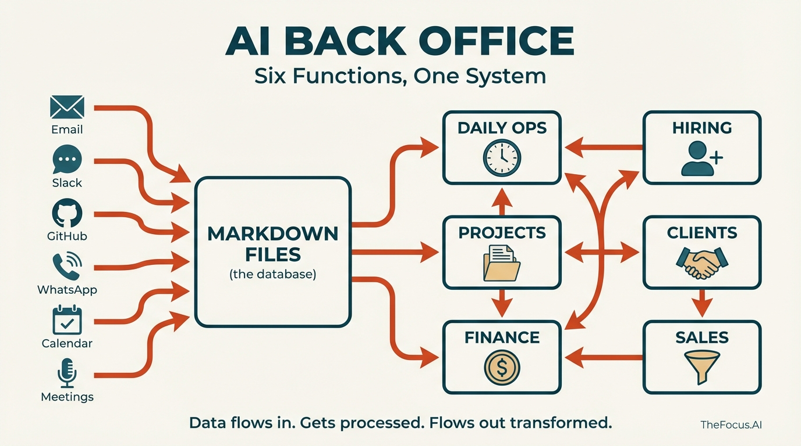
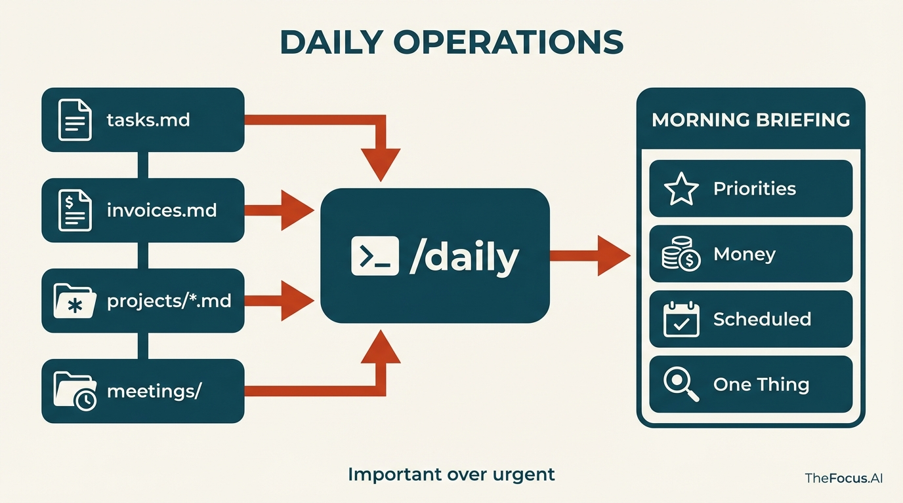
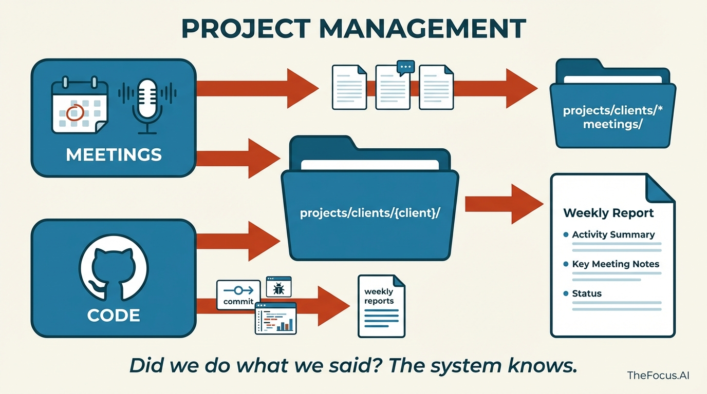
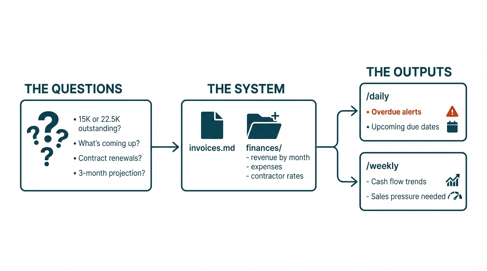
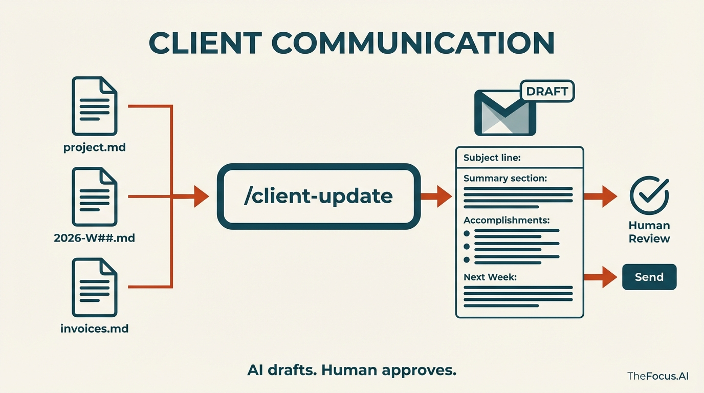
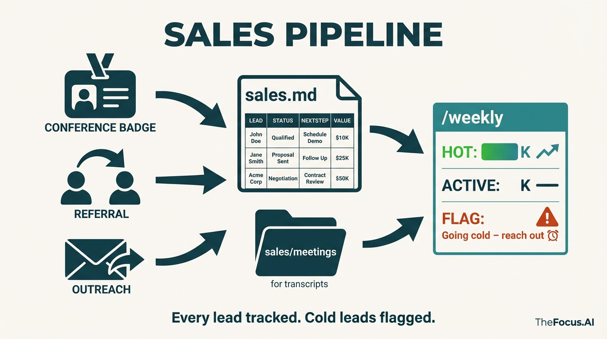

### The Challenge

Running a consulting firm means running two businesses: the work you do for clients, and the operations that keep the lights on.

Most consultants handle operations the same way: a CRM for sales, a project management tool for delivery, a spreadsheet for invoicing, a folder somewhere for hiring. Maybe an HR platform. Maybe a newsletter tool. Each system has its own login, its own data model, its own way of doing things.

The result is fragmentation. The sales call transcript lives in one place. The project scope lives in another. The invoice status lives in a third. When a client asks "where do we stand?" you're alt-tabbing through five applications trying to assemble context.

**The specific pain points we faced:**

- **Morning chaos** — Starting each day by checking Slack, email, calendar, project boards, and invoice spreadsheets separately. No unified view of what actually mattered.
- **Hiring bottlenecks** — 50 applications arrived over a weekend. Each deserved evaluation. The good candidates were emailing for updates while we were still reviewing the first ten.
- **Status report procrastination** — The weekly client update kept slipping. It wasn't hard work, just friction-heavy. Pull up the project, check commits, review meetings, write something coherent, make it look professional.
- **Invoice follow-up failures** — Knowing money was outstanding but losing track of which invoices, how overdue, and who to nudge.

We needed operations that ran themselves — or at least ran with minimal human overhead.

### Our Approach

Rather than buying more SaaS tools, we built an AI-powered operations layer using Claude Code and markdown files.

**The key insight:** Most operational "software" is just structured data plus views plus workflows. A CRM is contacts + deals + "remind me to follow up." A project tracker is tasks + status + "what's blocked?" An invoice system is amounts + dates + "who hasn't paid?"

Markdown files can hold all that data. Claude can read it, understand it, and act on it.

We built six commands that orchestrate everything:

| Command | What It Does |
|---------|--------------|
| `/sync` | Pull data from GitHub, Granola meetings, email, newsletters |
| `/daily` | Generate morning briefing from all sources |
| `/weekly` | Full operational review + dashboard regeneration |
| `/client-update` | Draft branded status emails per client |
| `/talent-search` | Search evaluated candidates by skills |
| `/push` | Commit and sync changes |

The entire system runs locally. No cloud databases. No API costs beyond Claude. No vendor lock-in.



---

## Daily Operations: Important Over Urgent

Morning. Kids need to get to school. There's a Slack notification from a client. Email shows three unread threads. The calendar has a call at 10.

It's easy to confuse urgent with important. The Slack message feels urgent — someone's waiting. But the real priority might be the invoice from two weeks ago that nobody's followed up on. Or the candidate who interviewed on Monday and hasn't heard back. Or the proposal that's been "almost done" for six days.

`/daily` fixes that:



Every morning, Claude reads everything: project files, recent commits, meeting transcripts, outstanding invoices, the task backlog. It doesn't just tell you what's happening. It tells you what matters.

```
BRIEF - Tuesday, Jan 28

STATE OF AFFAIRS:
Active week. Three clients with deliverables due.

🔥 TODAY'S PRIORITIES:
1. Wobblefish Analytics — Event handler PR needs review before demo
2. Invoice — Mongoose & Associates $7,500 overdue (14 days)
3. Hiring — Moonbeam Fluffington trial week 2, check in today

💰 MONEY:
- Outstanding: $22,500 awaiting payment
- Ready to invoice: Wobblefish Phase 2 milestone

📅 SCHEDULED:
- 10:00 AM — Velvet Hamster Capital follow-up
- 2:00 PM — Penguin Overlord demo review

🎯 ONE THING:
If you do nothing else: Follow up on Mongoose & Associates invoice.
```

The briefing surfaces what you'd otherwise forget. The invoice that's 14 days outstanding. The client who hasn't heard from you in two weeks. The hire decision that needs to happen by Friday.

Important over urgent. One command, full context. Then start working.

---

## Project Management: Connecting Conversations to Execution

Great, now how do we need all those files up to date?  We can pull down the code, but the real project knowledge isn't in the code. It isn't only in the scopes, or the requirements or the documentation -- though of course we put all that into the system.  But the real knowledge is in the conversations.

"We agreed to push the deadline to the 15th." "Barnaby mentioned they're prioritizing the mobile app now." "Reginald said he needs the assessment before the board meeting."

Those details live in meeting transcripts. Without a system to make that oral tribal understand goes away.



Granola runs during every client call. (Gemini reports also get sucked in through an email bridge.). It captures the transcript, the summary, the action items. `/sync` exports those to the right project folder automatically. A call with Barnaby goes to `projects/clients/wobblefish/meetings/`. An interview goes to `hiring/meetings/`.

Now comes the connection: what we agreed to in the meeting versus what actually shipped.

GitHub shows both. Commits tell you what code changed. Issues tell you what got closed. When the weekly report runs, it synthesizes everything:

```markdown
# Wobblefish Analytics - Week 04 (Jan 20-24, 2026)

## Activity Summary

### wobblefish-core - 8 commits
- Add event handlers for earnings calls
- Fix timezone issues in backfill pipeline
- Update Gemini prompt coverage tests

### Key Meeting: Jan 22 with Barnaby Thunderclap
- Agreed to prioritize event handlers before Feb demo
- Barnaby raised backfill performance concerns
- Issue #47 (event handler architecture) closed Friday

## Status
**Active** - On track for Feb demo. Backfill addressed.
```

The conversation and the execution in one place. Did we do what we said we'd do? It's certainly enough to jog your memory.

When `/daily` runs, action items from yesterday's call show up in this morning's priorities. When an issue gets closed, it can reference the meeting where the work was agreed to.

Nothing disappears. The meeting becomes part of the project record — connected to the code that fulfilled it.

---

## Finance: Visibility

$15,000 outstanding. Or was it $22,500?  What's coming up?  Which contract needs to be renewed, how is things projecting out a few months from now, what should our sales pressure really be?

Cash flow is kick.  You do the work, then you wait to get paid. The gap between "invoice sent" and "payment received" is where small firms bleed.



`invoices.md`. A markdown file with two tables — Outstanding and Paid.

**Outstanding:**

| Client | Invoice | Amount | Sent | Due | Status |
|--------|---------|--------|------|-----|--------|
| Mongoose & Associates | #47 | $7,500 | Jan 3 | Jan 17 | Overdue |
| Wobblefish Analytics | #52 | $15,000 | Jan 20 | Feb 3 | Sent |

**Paid (2026):**

| Client | Invoice | Amount | Paid | Description |
|--------|---------|--------|------|-------------|
| Periwinkle Dynamics | #11 | $10,000 | Jan 28 | Feb hosting |
| Spatula Networks | #31 | $8,000 | Jan 21 | Phase 4 |

And how do you make it?  It comes straight out of the scoping process, once an SOW is approved you simply tell the system that the client project has kicked off, and it scans through the PDF to figure out the invoicing schedule for you and updates the index.md file.

The `finances/` directory tracks the rest: revenue by month, expenses, contractor rates. `/weekly` calculates totals and shows cash flow trends. No spreadsheet formulas. Claude reads the markdown and does the math.

The goal isn't sophisticated accounting. It's visibility. Know what's owed. Know what's overdue. Act on it before it becomes a problem.

---

## Hiring: 50 Applications in One Weekend

A project was slipping, the client starting to grumble a little bit.  OK, lets bring someone with the right set of skills to get the job done.  I asked the system to compare what was in the scope with what was in the code base, what issues we were seeing out of github issues, and had it write a job description tailored for our problem.  Posted it to a few places, and got a 50 applications over the weekend.

Each one deserves a real evaluation, or at the very least a response. Check their GitHub — is there actual code? Look at LinkedIn — what's their experience? Read the portfolio — can they ship? Does their rate fit? Are they in a workable timezone?

That's 20-30 minutes per candidate. Times 50. At some point you start going "on instinct" since its sort of numbing. The good candidates email asking for updates while you're still reviewing the first ten.


`/sync` with email pulls the applications as `.eml` files into `hiring/applications/`. Claude processes each one:

1. **Parse** — Extract contact info, stated skills, rate, availability
2. **Research** — Check GitHub repos. Check LinkedIn. Check portfolio.
3. **Evaluate** — Score against requirements with evidence
4. **Rate** — Yes / Maybe / No with reasoning
5. **Draft response** — Personalized email based on the evaluation

> **Cornelius McWaffles** — Junior Full-Stack Developer
>
> **Rating: Yes**
>
> | Skill | Evidence |
> |-------|----------|
> | TypeScript | 12 repos, consistent usage |
> | React/Next.js | Portfolio site built with Next 14 |
> | Tailwind | Used in 8 projects |
>
> **Strengths:** Exact tech stack match. Active GitHub (47 contributions last month). EST timezone.
>
> **Concerns:** No production experience. Repos are mostly tutorials/clones.
>
> **Recommendation:** Schedule screening call. Verify he can work independently.

The response drafts are tailored. A "Yes" gets an enthusiastic scheduling email. A "Maybe" gets specific questions. A "No" gets a polite decline that acknowledges something real about their application — not a form letter.

One candidate looked perfect on paper — lots of "front end" in their profile. Claude flagged that the "front end" was actually Streamlit dashboards over Python. Not a frontend developer. The draft response thanked them for applying but noted we were looking for frontend-specific experience.

The interview transcripts go into `hiring/meetings/`. The candidate folder has everything: application, evaluation, interview notes, decision.

And here's where it gets interesting: a few weeks later, a different project needed a different skillset — someone with ML video processing experience. Instead of posting another job, `/talent-search` scans through all 48 evaluated candidates. "Who mentioned PyTorch? Who has video experience? Who's still available?" The system remembers everyone who applied. The talent pool becomes searchable institutional memory.

Hiring at scale without an HR team. The AI does the research and drafts the responses. The human reviews and sends.

---

## Client Communication: The Status Email I Kept Putting Off

"I should send Barnaby an update."

That thought appears on Tuesday. By Friday, it's still on the list. The client hasn't complained, so it doesn't feel urgent. But the relationship quietly erodes. They wonder what's happening. They feel out of the loop.

Writing status emails takes effort. Pull up the project file. Check what got done this week. Look at the invoices. Remember what was discussed in the last call. Synthesize it into something coherent. Make it look professional.

That's 30 minutes per client. Six clients. Three hours of email writing, if you actually do it.



`/client-update wobblefish` does it in seconds.

The command reads the project file, the latest weekly report, the recent meeting transcripts, and the invoice status. It drafts a branded HTML email — TheFocus.AI colors, clean formatting, professional layout. Then it creates a Gmail draft.

> **Subject:** Wobblefish Analytics Weekly Status - Week of Jan 20-24
>
> ⚠️ **Outstanding Invoice:** $15,000 - Phase 2 Milestone - Due Feb 3
>
> **Executive Summary:** Strong progress on event handlers. On track for Feb demo.
>
> **What We Accomplished:**
> - Event Processing: 8 commits adding earnings call handlers
> - Infrastructure: Backfill performance improvements
> - Testing: 42 Gemini prompt tests now passing
>
> **Key Meeting Notes (Jan 22):**
> - Prioritizing event handlers before demo
> - Barnaby's backfill concerns addressed in Friday's fix
>
> **Next Week:** Complete event handler coverage, begin demo setup, performance testing.

The draft sits in Gmail. Review it. Tweak if needed. Hit send.

The system tracks what was sent:

| Date | Type | Subject | Status |
|------|------|---------|--------|
| Jan 24 | Status | Week 04 Update | Sent |
| Jan 17 | Status | Week 03 Update | Sent |
| Jan 10 | Invoice | Phase 2 Milestone | Paid Jan 15 |

The command knows context. It won't suggest sending an update if one went out yesterday. It highlights unpaid invoices without being aggressive about it.

Client communication happens consistently because the friction disappeared. The AI drafts. The human approves.

---

## Sales Pipeline: Leads from Everywhere

Met Gertrude at the AI Engineering conference. Exchanged cards. She said to follow up after the holidays.

Bartholomew came through a referral. Had a discovery call. Said he'd think about it.

Cold outreach hit three prospects last month. Two replied. One went quiet.

Where does all this live? In your head. In scattered email threads. In calendar entries that don't explain the context.



`sales.md` fixes this:

**Active Leads:**

| Lead | Source | Status | Next Step | Value |
|------|--------|--------|-----------|-------|
| Gertrude @ Mystical Spoon Corp | AI Eng Conf | Proposal sent | Follow up Mon | $40K |
| Bartholomew Snickerdoodle | Referral | Discovery done | Send scope | $25K |
| Mongoose & Associates | Cold outreach | First call | Schedule demo | $15K |

Every lead has a row. Every row has a next action. The pipeline is visible.

But the real data is in the conversations. What did Gertrude say about her timeline? What's Bartholomew's actual budget? What objections came up?

Meeting transcripts go into `sales/meetings/`. The discovery call with Gertrude, the intro with Bartholomew — all captured, organized, searchable.

`/weekly` reviews the pipeline:

```
SALES PIPELINE: $80K total

🔥 HOT:
- Gertrude @ Mystical Spoon Corp — $40K, proposal sent, follow up Monday

📋 ACTIVE:
- Bartholomew Snickerdoodle — $25K, needs scope document
- Mongoose & Associates — $15K, cold (8 days no response)

⚠️ FLAG:
- Mongoose going cold. Reach out or close.
```

The system flags leads going cold. "No activity on Mongoose prospect in 14 days." That's the nudge to reach out before the opportunity disappears.

Sales isn't separate from operations. It's another data stream flowing through the same system — meetings captured, actions tracked, follow-ups surfaced.

---

## Technical Implementation

### Architecture: Files as Database

The entire system runs on a simple principle: **markdown files are the database, Claude is the query engine.**

```
operations/
├── projects/
│   ├── clients/
│   │   ├── wobblefish/
│   │   │   ├── index.md          # Project overview, scope, status
│   │   │   ├── meetings/         # Granola transcripts
│   │   │   └── weekly-reports/   # Auto-generated summaries
│   │   └── mongoose/
│   └── internal/
├── hiring/
│   ├── applications/             # Raw .eml files
│   ├── evaluations/              # AI-generated assessments
│   └── meetings/                 # Interview transcripts
├── finances/
│   ├── invoices.md               # Outstanding + paid tables
│   ├── 2026-revenue.md           # Monthly breakdown
│   └── contractors.md            # Rates and payments
└── sales/
    ├── sales.md                  # Pipeline table
    └── meetings/                 # Discovery call transcripts
```

No migrations. No schema changes. No ORM. When you need a new field, you add it to the markdown. Claude adapts instantly.

### The Plugin Stack

All integrations come from the [TheFocus.AI Plugin Marketplace](https://github.com/The-Focus-AI/claude-marketplace) — open source Claude Code plugins that we maintain:

| Plugin | Purpose |
|--------|---------|
| **granola-skill** | Export meeting transcripts with speaker identification |
| **google-skill** | Gmail drafts, Google Docs, Calendar integration |
| **nano-banana** | AI image generation for dashboards and infographics |
| **buttondown-skill** | Newsletter analytics and draft creation |
| **chrome-driver** | Web automation for research and data extraction |
| **embeddings-search** | Semantic search across all markdown files |

### Key Technical Decisions

**1. Markdown over databases.** Traditional ops software locks data in proprietary formats. Markdown is portable, version-controlled, and human-readable. When Claude hallucinates, you can read the source file and catch it.

**2. Local-first execution.** Everything runs on your machine via Claude Code. No cloud infrastructure. No API costs beyond Claude. No vendor dependency.

**3. Pull architecture.** External data (GitHub commits, meeting transcripts, emails) gets pulled into the local file system. This creates a complete audit trail and works offline.

**4. Prompt-as-workflow.** Each command (e.g., `/daily`) is a carefully crafted prompt that knows which files to read, what patterns to look for, and how to format output. The "business logic" lives in natural language.

---

## Results

**Within the first week:**

- **10+ hours/week** of manual operations work eliminated
- **Morning briefings** synthesized from GitHub, meetings, invoices, and calendar in under 30 seconds
- **Client status emails** that took 30 minutes now generated in seconds, ready for review

**After 3 weeks of active use:**

- **6 active clients** tracked with weekly reports auto-generated from commit activity and meeting transcripts
- **50 job candidates** researched, evaluated, and contacted — what would have taken 25+ hours done in one weekend
- **$150K+ in invoices** tracked with payment status and automated follow-up reminders
- **Zero context lost** — every meeting, every decision, every conversation searchable and connected

The system scales without adding headcount. It handles operational volume that would otherwise require a dedicated operations person.

---

## Get This For Your Business

This isn't a product you buy — it's a system we build with you.

**The Setup Process:**

1. **Kickoff** — Map your operational workflows, identify data sources, design your folder structure
2. **Configuration** — Install and configure plugins from the TheFocus.AI Marketplace for your specific integrations
3. **Command Development** — Build your custom `/daily`, `/weekly`, and domain-specific commands
4. **Integration** — Connect to your actual data, refine prompts, train on your terminology
5. **Handoff** — Documentation, walkthrough, and ongoing support

You'll have a working `/daily` briefing after the first session. The system grows from there.

**What You Get:**

- Custom Claude Code commands tailored to your operations
- Folder structure designed for your specific workflows
- Configured plugins for your data sources (GitHub, Google Workspace, meetings, etc.)
- Markdown templates for tracking projects, finances, hiring, and sales
- Documentation so you can extend the system yourself

**Best fit for:** Solo consultants, small agencies, professional services firms, and anyone drowning in operational overhead who wants AI assistance without SaaS subscription bloat.

**Investment:** Hands-on setup engagement priced based on complexity of your operational workflows.

---

### Ready to Automate Your Back Office?

[Book a consultation](/contact) to discuss your operational workflows and see if this approach fits your business. We'll map your current pain points and show you exactly what an AI-powered operations system would look like for your specific situation.
