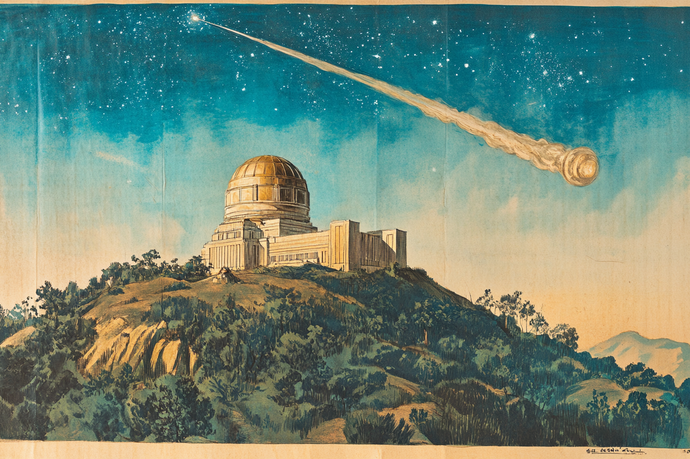
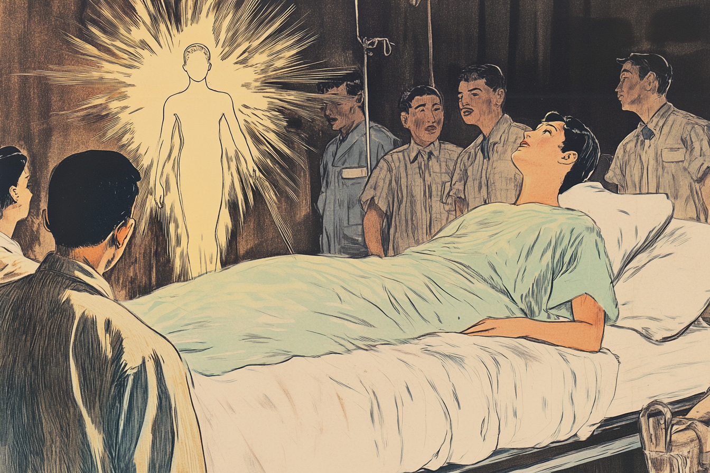

Scientism is this idea that science knows everything and it's all be figured out. Maybe there's a few details we'll have to work out, but the big stuff has been sorted. More than a worldview it's almost a religious belief.  And part of me actually believes that the answer is actually on the internet somewhere.  The *answers are out there*.

When people talk about doing their research to understand something, they don't really mean that they're doing experiments or coming up with hypotheses or running tests. Or even doing a scholarly project to get to the heart of some subject.  What they mean is: **they do a lot of Googling.**

But Google is so passe, we are in the realm of AI now.  And I think there's a couple new contenders out there for being able to ask the computer anything and have it give the one true answer. Lets see how Google DeepResearch gets us to **the truth**, comparing it to OpenAI, Claude, and a few other luck contenders. We all know that this is impossible and it's never going to work, but on the other hand, we all act as if it's true. So let's do it.

Let's get into some hard questions.

# Why is it dark at night?

I'm obsessed with this question. I think about it more than anyone really should. On the face of it, it's such a simple question, but probing a bit deeper it gives you insight into the very fabric and nature of the universe.

It's also good to ask a question that you've got some way to co-judge the answer on.  How else can we judge the quality of results?

The answers that I'm looking for is going to do with 

* the finite age of the universe
* the universe is expanding
* a reference to Olber's paradox
* Edward Harrison's [Darkness at Night](https://www.amazon.com/Darkness-at-Night-Riddle-Universe/dp/0674192702?dib=eyJ2IjoiMSJ9.IR1SS0IQy6wmVPM7sDZBfg._z52xGBokwXJze4MbbPl3r3-Gj_6kkyYpWD4OJu2cE8&dib_tag=se&keywords=9780674192713&qid=1736684385&sr=8-1) book.
* (for bonus points) a reference to Poe's Eureka poem.

Let's see what the different models for doing research will tell us about it. 

# Small models: phi4

Lets start with a small model running on the laptop.

> ollama run phi4 "why is it dark at night"

It identifies that the earth turns, and when it's facing away from the sun it's dark.

**true but fail**

# GPT 4o

Lets try `gpt-4o`

> llm -m 4o "why is it dark at night"

Earth turns, etc.

**true but fail**

# GPT o1

Good answer, mentions [Obler's paradox](https://en.wikipedia.org/wiki/Olbers%27s_paradox)

Thinks about it for a while, and the writes out a response, summarizing as follows:

>[!info] **In short:** It’s dark at night because the universe had a beginning, is expanding, and not all of the light from distant stars can reach us—so there simply isn’t enough starlight arriving from all directions to make the night sky bright.

Following up with

> What about Poe's Eureka poem?

Thinks for 6 seconds

> [!info] **In short**  In _Eureka_, Poe tackles the same fundamental question—“Why is it dark at night?”—that later became central to discussions of Olbers’ Paradox and modern cosmology. His poetic explanation, which posits a universe of finite age and continually changing structure, was remarkably prescient of ideas that would gain scientific footing many decades later.

# Claude 

Gets it right:

> The reason we actually see a dark night sky is because:
> 1. The universe is not infinite in age - it's about 13.8 billion years old, so light from very distant stars hasn't had time to reach us yet
> 2. The universe is expanding, which causes the light from distant stars to be redshifted and weakened
> 3. Stars are not evenly distributed through space, but clustered in galaxies
> 4. Dust and gas between stars absorb some of the light

Then following up about Poe

> Poe wrote: "Were the succession of stars endless, then the background of the sky would present us a uniform luminosity, like that displayed by the Galaxy – since there could be absolutely no point, in all that background, at which would not exist a star."
> 
> This is essentially the same reasoning behind Olbers' Paradox, though Poe approached it from a more poetic and philosophical angle. He used this observation about the dark night sky as part of his larger argument about the nature of the universe - that it must have had a beginning and must be finite in some way.
> 
> So the darkness of night actually tells us something profound about the nature of our universe - that it had a beginning and is still expanding.

Bonus points for pulling out an actual quote of the poem.

# DeepSeek

> why is it dark at night?

Without `deepthink` on, the response is in the shape of these 4 bullet points.  (It explains it but I've cut it out.)

>1. **Earth's Rotation**:  ...
>2. **Facing Away from the Sun**: ...
>3. **Atmospheric Scattering**: ...
>4. **Stars and Moonlight**: ...

With `deepthink` on it gets

>1. **Earth's Position**: At night, the side of Earth you're on is facing away from the Sun, so there is no direct sunlight to illuminate the sky.
>2. **Distance and Distribution of Stars**: Stars are distributed throughout the universe, but they are far apart and many are too distant for their light to significantly brighten the night sky.
>3. **Finite Age of the Universe**: The universe is about 13.8 billion years old, and light from stars beyond a certain distance hasn't had enough time to reach Earth yet.
>4. **Cosmic Expansion**: The universe is expanding, which causes the light from distant stars and galaxies to redshift, moving it outside the visible spectrum.
>5. **Human Eye Sensitivity**: The human eye is only sensitive to a limited range of light, and starlight from distant stars may fall below this threshold.

When I ask a follow up question about Poe's eureka poem, it doesn't make the connection.  *frowny face*.

# Perplexity

Two main responses:

> 1. **Finite Universe Age**: The universe is not infinitely old, which means stars are not present in every possible direction
> 2. **Light Expansion and Redshift**: The universe is expanding, causing distant starlight to be "stretched" beyond the visible spectrum As stars move away from us, their light shifts into infrared and microwave wavelengths that human eyes cannot perceive.

On the plus side, it links to sources.  On the down side it's not a really good response.

Asking a follow up question about Poe's Eureka basically gives a response unrelated to the intial question.

# DeepMind

> why is it dark at night?

The results here were by far the most thorough.  It came up with a plan (identifying Olber's paradox in the begining) and then searched through 41 pages for the answer.  While it was thinking you could zip over to the pages and dive in a bit more.  

It created a 4 page report with 21 cited references, by far the most comprehensive response.

Follow up question:

> What about Poe's Eureka poem? How does that fit in?

And it talked about how that was an inspiration.

# For more

If for some reason you are as obsessed about this as I am, check out Edward Harrison's [Darkness at Night](https://www.amazon.com/Darkness-at-Night-Riddle-Universe/dp/0674192702?dib=eyJ2IjoiMSJ9.IR1SS0IQy6wmVPM7sDZBfg._z52xGBokwXJze4MbbPl3r3-Gj_6kkyYpWD4OJu2cE8&dib_tag=se&keywords=9780674192713&qid=1736684385&sr=8-1) book.

# More complicated questions:

> can you explain rudolf stieners concept of soul folk? what are the different levels of existence that he talks about, and how does that relate to recent history?

| Model        | My Assessment                                                                                                  |
| ------------ | -------------------------------------------------------------------------------------------------------------- |
| phi4         | knows the words, spits out grammatically correct nonsense                                                      |
| llama3.2     | knows the words, spits out grammatically correct nonsense                                                      |
| 4o           | correctly identifies concepts (e.g. physical, etheric, astral, "ego" bodies) but mixes up a lot of the details |
| o1           | Signifigantly better than 4o, would consider trusting this results                                             |
| perplexity   | very short, slightly wrong response.  gave a number of sources that you could explore                          |
| claude       | relatively short answer, well balanced, not a whole lot to go on                                               |
| deepseek v3  | Comprable to o1                                                                                                |
| DeepResearch | 7 page report, 22 references                                                                                   |

> what are the stages of the souls journey after death?

| Model             | My Assessment                                                                                                         |
| ----------------- | --------------------------------------------------------------------------------------------------------------------- |
| phi 4             | slightly wrong summary of Egyptian, Hinduism, Buddism, Christianity, Islam, Judiasm, etc. beliefs.  Not useful at all |
| llama3.2          | Comes up with a 7 stage process "based Hinduism, Buddhism, and Ancient Egyptian mythology."  Interesting I guess?     |
| 4o                | Comes up with a 5 stage process, overlaying different traditions on these phases.                                     |
| o1                | Much better than 4o, explains things in more details                                                                  |
| perplexity        | 8 step process, superficial and useless                                                                               |
| claude sonnet 3.5 | best overall overview -- splits up the steps by belief system, includes current accepted ideas                        |
| deepseek v3       | Lists out the most traditions, including contemporary                                                                 |
| DeepResearch      | Starts out by summarizing the findings of near death experiences, most thorough and correct                           |

4o linked together Tibetan Buddism *bardo*, Christianity's *purgatory*, and Occult *astral plane* as being similar, which is fair enough.

# Conclusions

**DeepResearch** is a cut above the others.  If you actually want to know something in some depth, just go there.

**o1**, **Sonnet 3.5**, and surprisingly **DeepSeek with DeepThought** give comprable results.  There's something that I like better about Sonnet, but **o1** probably gives better results.

I don't understand why **perplexity** exists, its good that it includes references to sources but the answers aren't great and follow up questions don't seem to work.  Maybe its good for current events or recent knowledge or something, but **DeepResearch** has access also.

The small models **phi4**, **llama3.2** aren't useful and are probably harmful for complicated questions. 
