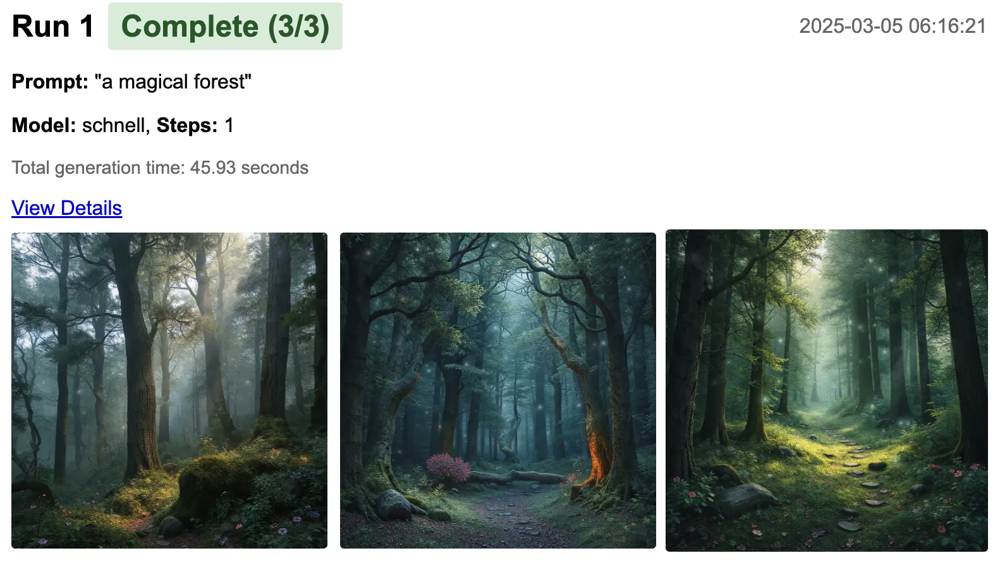
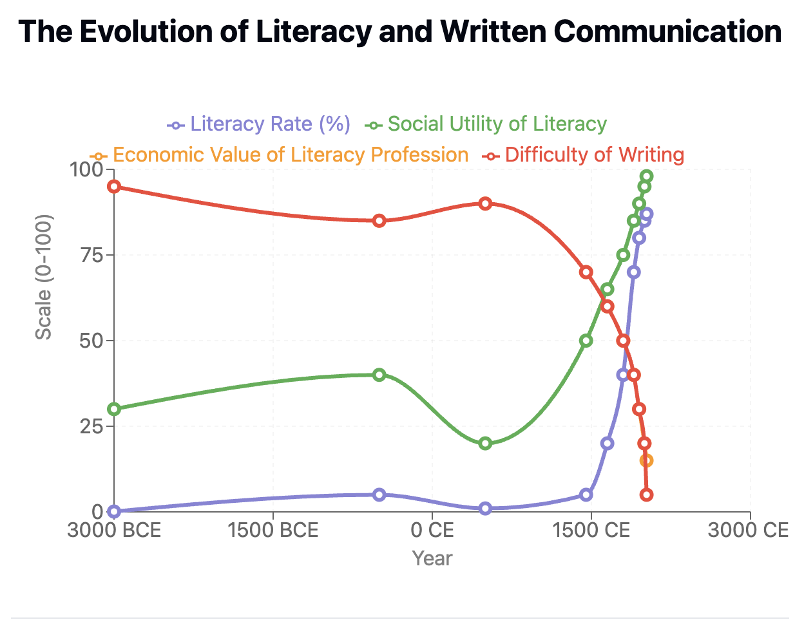

> “The programmer, like the poet, works only slightly removed from pure thought-stuff. He builds his castles in the air, from air, creating by exertion of the imagination.”  
― Frederick P. Brooks Jr., [The Mythical Man-Month: Essays on Software Engineering](https://www.goodreads.com/work/quotes/1905885)

I was in the car the other day and I talked to ChatGPT for over an hour.

I kicked off the conversation with a prompt from the tool kit, and we went back and forth, as I was driving through the night. It was all "that's great, but what about this?" and "These two things can't fit together, maybe we could fix it like this?" And I would either just agree, tell it that's completely off base, and then we're tweak and revise.

We were 40 questions in before I think we answered all the things we needed to and then it spit out for me a very detailed product spec of something I wanted to build. Back and forth, back and forth. And at the end it was distilled down to a concise script.

Then I threw it at Claude Code and just yolo'd the shit out of it. 

Yes yes yes every time yes not looking at a single thing.

And it worked.

## Sculpting thought-stuff

> **Reification**: The process of turning an abstract concept into something more concrete, often by treating it as if it were a physical object or an entity with real existence. This can be useful in philosophy, sociology, and computer science, but it can also lead to misleading assumptions if people start treating abstract ideas as if they have an independent, physical reality.

It worked with a lot less supervision than I'd expect.  The whole thing started by accident, really.  I got a fancy new laptop and I wanted to see how to run vision models on it.  I found [mflux](https://github.com/filipstrand/mflux) which did a fantastic not just getting my GPUs running hot, but also of making [some really fun images](https://willschenk.com/howto/2025/running_flux_locally_on_a_mac/). 

I was running all of these commands in the [warp intelligent terminal](https://www.warp.dev/i), and I had run all of these commands individually.  I just asked it -- literally typed, in the same space I was working in, "can you write a script that makes it easier to do all these things" -- and off it went, looking through my command history, figuring out the patterns, and spit it out.

I played around with that for a while.  Tried a bunch of different things.

We occasional went down some path that we couldn't get out of, and it make more sense just to throw it all away and start again.  This is eventually what we ended up with the [mflux-wrapper](https://github.com/The-Focus-AI/mflux-wrapper) , which you can download and run on your own computer.

It lets you do stuff like this

 

## Everyone will have to explain to the robot how you want it to fold your clothes

You know how singing in the shower is kind of a totally different thing than singing in front of other people? With one of them, you're just doing it for the sheer pleasure of it. And the other one has all these social expectations and pressures that make it a lot more difficult. And it sort of a big leap as you go from one to the other.

There's sort of a thing in programming where they say it's not a real program, that's just a script. As if they're somehow a different type of thing.

But they're not really. I mean JavaScript is actually the thing that runs most of the internet at this point and that's got the word script right there in it. And a lot of the back-end stuff was made with these things where originally they came out and everyone was like that's just a toy that's not serious.

We're blurring these levels even more now. I can ask warp to do this small task that I would have had to think about and it just does it. I can refactor an entire code base by just asking Claude Code to do one thing. I can build out functionality. I can use it to help me think about how to code. All of these things reduce down the mechanics of making code work to just the understanding, just a clear idea and vision of how things work, but without a whole lot of the boilerplate stuff.

So then what is coding? Is it something where only a few people do it in the future? Or is it a thing that will change and in fact many many more people in the world will be doing effectively it but in a much easier way?

At the very least, we'll still need to tell the robots what we want.

## Accessibility and value

I think it's interesting to compare what happened with reading and writing. I asked Claude to tell me about the relative number of people that could read how valuable it was economically for the individual person to read and how valuable it was for everybody if everyone knew how to read.

*This interactive craft was generated by Claude with zero editing for me, prompts are at the bottom of that page.*

You can see that when very few people knew how to read and write, knowing how to read and write was a valuable job. You could be a scribe. Your whole living could just be reading and writing letters for people because the marks on the page, no one knew how to do it.

Then it went to, let's just say, publishing pamphlets where all of a sudden more people knew how to write, more people knew how to read, and there became this sort of larger discourse around it. And you were able to move the society and presumably the economy with this new technology, but that involved more people reading, more people writing, and better tools.

We'll just skip right ahead and imagine what it's like now. There's probably more words produced by more people individually than has ever happened in history. Text messages means that everyone needs to know how to read and write. They actually need it. 20 years ago, I'm not sure you needed to know. You could just communicate with people normally. Now, it's a necessity.

But it's also tremendously easier. You're not worrying about inkwells, you're not worrying about spelling, you're not worried about multiple drafts. It's just casual, easy, and just thrown out there and enabling.

## What about knowledge workers

What just happened here. This was my idea. I thought about it. I asked Claude to go see if my idea made any sense. Does it? I don't know. But it wasn't necessarily Claude coming up with the idea, but it was Claude helping me think it through.

 I think it did a much better job of fact checking and researching than I would have ever done. I would have just thought about it, rambled off some nonsense, and moved along. This at least made a pretense of going through and looking at historical fact. And I could ask it, and it would just give me the data, and then I can refine my thought. So presumably, I got to a better answer faster.
 

