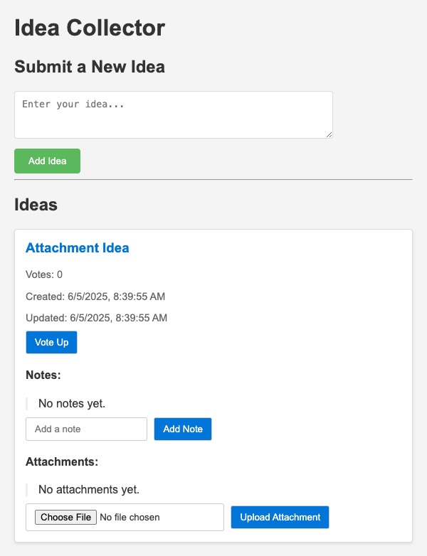

# The plan

* Setup each agent and repo
* Issue them the same prompt
* Use the default model or the cheapest one on the aider leaderboard
* See if the resulting code builds
* Document steps to make it build
* Deploy on internet


Grading based upon:

1. Ease of use
2. Asking another LLM to "grade this junior developers prototype to see if we should keep working with them"
3. Working first version
4. Steps required to fix
5. SDLC Integration

# What this is and isn't testing
We are looking at greenfield, no real constraints and no existing code base.  In some ways, this is the easiest possible task to give an agent and represents a very small fraction of the sorts of tasks we'll be asking them todo.

All of these agents have a conception of where they fit into the over all Software Development Life Cycle, and in many ways the business of managing a engineering team is more of the challenge then code itself.  In this regard, Github Copilot Agent (or whatever the super-duper thing is called) is overwhelming superior positioned, since it's baked into the collaboration platform that basically everyone uses.

Additionally, all of these tools are meant to be tune to your style -- from mimicking and fitting into and existing code base, to having developers explicitly lay out extensive rule files that better direct the agent on how to build according to accepted local architecture.

So what we are testing is basically how a non-coder would first experience these tools, dipping in for the first time just to see if they can make anything happen.

In otherwords, we are testing for *non-expert empowerment*.
# The Contenders

| Tool                                                                                                     | Provider  | CLI | IDE   | Parallel Unsupervised | SDLC Integration |
| -------------------------------------------------------------------------------------------------------- | --------- | --- | ----- | --------------------- | ---------------- |
| [aider](https://aider.chat/)                                                                             | OSS       | Yes | No    | No                    | No               |
| [Claude Code](https://www.anthropic.com/claude-code)                                                     | Anthropic | Yes | No    | No                    | No               |
| [Codex](https://openai.com/codex/)                                                                       | OpenAI    | Yes | No    | No                    | No               |
| [Codex Agent](https://chatgpt.com/codex/onboarding)                                                      | OpenAI    | No  | Yes   | Yes                   | Yes              |
| [Copilot](https://github.com/features/copilot)                                                           | Microsoft | No  | Yes   | No                    | No               |
| [Copilot Agent](https://github.blog/changelog/2025-05-19-github-copilot-coding-agent-in-public-preview/) | Microsoft | No  | No    | Yes                   | Yes              |
| [Cursor](https://cursor.com)                                                                             | Cursor    | No  | Yes   | No                    | No               |
| [Cursor Agent](https://cursor.com)                                                                       | Cursor    | No  | Yes   | Yes                   | Yes              |
| [Jules](https://jules.google.com/)                                                                       | Google    | No  | No    | Yes                   | Yes              |
| [RooCode](https://roocode.com/)                                                                          | OSS       | No  | Yes   | No                    | No               |
| [v0](https://v0.dev)                                                                                     | Vercel    | No  | Yes * | No                    | No               |
| [Warp](https://www.warp.dev/)                                                                            | Warp      | Yes |       |                       |                  |
| [Windsurf](https://windsurf.com/)                                                                        | Windsurf  | No  | Yes   |                       |                  |

[Codex Agent](https://chatgpt.com/codex/onboarding), [Copilot Agent](https://github.blog/changelog/2025-05-19-github-copilot-coding-agent-in-public-preview/), and [Jules](https://jules.google.com/)  are what Simon Willison says follows the 
[GitHub-connected coding "agent" pattern](https://simonwillison.net/2025/Jun/3/openai-codex-pr/)

Of these, I personally use Cursor, RooCode, ClaudeCode and v0 the most in that order.  At the end of this evaluation, we'll see how things change!

# The prompt

> Build a simple webapp that makes it easy to collect ideas.  The user should be able to enter in a new idea, see a list of existing ideas, and be able to "vote" on them which will move them up in the list.  The user should also be able to add notes and to the ideas if they want more detail, including attaching files.  Build it using node that will be deployed in a docker container with a persistent volume for storage, and make sure that everything has unit tests.

## Aider
Aider is OSS and the first of these code writing tools that I've used.

Requirements:
* python (I'm using UV)
* your own API keys, in this case from Google
* git

```shell
mkdir idears-aider && cd idears-aiders
gh repo create The-Focus-AI/idears-aider --public
git init
git remote add origin https://github.com/The-Focus-AI/idears-aider
```

Then install

```bash
uv tool add aider-installer
uv tool run --from aider-chat pip install google-generativeai
```

Then

```shell
export GEMINI_API_KEY=$(op item get "Google AI Studio Key" --field notesPlain)
uv tool run --from aider-chat aider --model gemini
```

And enter in the prompt.

By far the fastest response.

## Claude Code
Requirements
* node
* claude api key
* git

```shell
pnpm install -g @anthropic-ai/claude-code
```

Set it up:

```bash
mkdir idears-claude && cd idears-claude
gh repo create The-Focus-AI/idears-claude --public
git init
git remote add origin https://github.com/The-Focus-AI/idears-claude
```

Start it up
```shell
claude
```
Copy in the prompt.

It just worked.

```shell
Total cost:            $0.4211
Total duration (API):  5m 36.2s
Total duration (wall): 1h 12m 7.1s
Total code changes:    1004 lines added, 0 lines removed
Token usage by model:
    claude-3-5-haiku:  2.0k input, 94 output, 0 cache read, 0 cache write
       claude-sonnet:  40 input, 12.8k output, 394.3k cache read, 29.0k cache write
```

## Codex CLI
Requirements
* Node
* Openai key
* git

Install codex:
```shell
pnpm i -g @openai/codex
```

Create the repo:
```shell
mkdir idears-codex && cd idears-codex
gh repo create The-Focus-AI/idears-codex --public
git init
git remote add origin https://github.com/The-Focus-AI/idears-codex
```

Fire it up:
```shell
export OPENAI_API_KEY=$(op item get "OpenAI" --field notesPlain)
codex
```

## Codex Agent
Requirements
* OpenAI Pro
* GitHub

Create the repo:
```shell
mkdir idears-codex-agent && cd idears-codex-agent
gh repo create The-Focus-AI/idears-codex-agent --public
git init
git remote add origin https://github.com/The-Focus-AI/idears-codex-agent
```

Go and [signup](https://chatgpt.com/codex/onboarding), and create the environment with that new repo.  Then do the final step of installing the dependancies.  I needed to create an empty README file in the repo.

Once it's done, create a pull request.

## Copilot
Requirements
* Github Pro account

```shell
gh repo create The-Focus-AI/idears-copilot --public
```

Go to the repo.  Create a new file, say `prompt` and paste it in.

Create a new issue, and then press

This starts up a new codespace (we needed to create the blank file to open up a code space.)

It fires everything up, and the starts poking around.  It is a little confused that it's an empty repository.  Eventually I had to tell it "lets do everything in /workspaces/idears-copilot" and it started going.

The codespace blewup at one point because `node_modules` wasn't in `.gitignore` but then it prompted me to add it, and I said yes and we are good to go now.

One very cool thing about this is that you don't need a local environment!  Everything can happen in the cloud and you can edit and tweak as needed.

If you ever wanted to use Guest mode on someone else's computer and fire up a temporary dev environment for a few hours on the road, this is the tool to use.

I needed to keep a watch on this and occasionally kill a hung task and prompt it to go on.

## Copilot Coding Agent
Requirements
* github pro plus ?

I'm not 100% sure how to get access to the fancy version of copilot.  I did a workshop at the [AI Engineer World's Fair](https://www.ai.engineer/) and they gave us access for 30 days, so I'm using that.

Create a new repo with a readme.  It still gets confused with an empty repo.  Create a new issue, put the prompt in the issue.  Assign copilot the issue.  

Off it goes


Both of the github copilots had trouble with empty directories.

## Cursor
Requirements
* Mac
* git
* node

```
mkdir idears-cursor && cd idears-cursor
gh repo create The-Focus-AI/idears-cursor --public
git init
git remote add origin https://github.com/The-Focus-AI/idears-cursor
```

Copied the prompt into the object window.

Asked me something, I picked a random answer.

Needed to babysit this the most, it stops after 25 requests.

## Cursor Agent (Beta)
Requirements
* Mac

As of this writing, [Cursor Background Agents](https://docs.cursor.com/background-agent) are beta.

```shell
mkdir idears-cursor-agent && cd idears-cursor-agent
gh repo create The-Focus-AI/idears-cursor-agent --public
git init
git remote add origin https://github.com/The-Focus-AI/idears-cursor-agent
```

Open up Cursor, and use `CMD-E` to start it up.  I pasted the prompt in there, and it initially failed.  Based on my experience of Copilot, I created a simple readme file, checked it in, and then reran it and it began to start working.

Once it finished I selected "Checkout Locally"

## Jules
Requirements
* Seems to be free from google at the moment?
* GitHub

Create a new repo:

```shell
gh repo create The-Focus-AI/idears-jules --public
```


Copy in the prompt, press go.  Enable notications

Time start: 8:34, elapsed 6 minutes

All you need to do is approve the plan.


## RooCode
Requirements
* VSCode esque thing (I run it in cursor)
* API keys (I'm using Google)
* git

```shell
mkdir idears-roocode && cd idears-roocode
gh repo create The-Focus-AI/idears-roocode --public
git init
git remote add origin https://github.com/The-Focus-AI/idears-roocode
```

You'll need to get a VSCode thing and get [RooCode from the marketplace](https://marketplace.visualstudio.com/items?itemName=RooVeterinaryInc.roo-cline), then you need to go into settings and configure your LLM provider.  I picked gemini, specifically `gemini-2.5-pro-preview-05-06`.

New task -> enter prompt -> permit actions

## v0
Requirements
* vercel account

Enter in the prompt and let it rip.  Then click the little github icon to make a repository.

With this if course you can just press publish and have vercel host it for you, so it's by far the easier.

## Warp
Requirements
* Warp

Warp is a command line tool, something more than a terminal emulator and more like a graphical shell.  It's got history, notifications for long running tasks.  Its great for quick scripts, because if you start entered in sentences it puts it through an LLM.  So I just started it up and copied in the prompt and off it went building.

## Windsurf
Requirements
* Windsurf account

Important thing to note here is that I despise Windsurf.  The feeling is deep, intuitive, and based on literally nothing I can point to.  I saw a talk that they dig at the AI Engineer World Fair and whoever spoke was an excellent speaker, it was a good talk, and all I was doing when it happened was picking it apart in my mind because I think the whole thing sucks.  Again, this is based on literally nothing, but just to call it out.

To install Windsurf, first step is to get over yourself, and download it


Create an account.  Use Cascade and copy in your prompt. It asks you for a folder to create the account.  I entered in the prompt, granted some permissions and we were off.
# Evaluation

We're running all the code bases though this:

>You are an experienced system architect and site reliability engineer. You have received a prototype and your goal is to give a quick overall assessment of the project, and if its worth continuing with this developer.  Rank the potenial hire on 1-10 scale, 10 being hire exuberantly and 1 being avoid.

Then we

1. Build the docker image
2. Screenshot
3. Evaluate the ui

If no UI, then prompt the agent with "We need a working UI that the user can interact with"
1. Rebuild docker image
2. Screenshot
3. Evaluate

Basic testing script:
```
pnpx repomix --ignore "node_modules" --stdout | run-prompt code/high-level-review-consise | tee assessment-consise.md
docker build . -t idears-agent
docker run -it --rm -p 3000:3000 idears-agent
shot-scraper shot -w 600 -h 300 -o idears-agent-1.png http://localhost:3000
```
## Aider

> Based on the codebase review, this developer has created a functioning but fundamentally flawed prototype with critical issues in data storage architecture (using file-based JSON storage), security vulnerabilities (unrestricted file uploads, no authentication), and poor architectural decisions (lack of separation of concerns, minimal error handling). I would rate this developer a 3/10 - they demonstrate basic knowledge of web technologies but lack understanding of production-ready application development practices, making them unsuitable for autonomous work on significant projects without substantial oversight and mentoring.

| Test                                          | Status                |
| --------------------------------------------- | --------------------- |
| ai rating                                     | 3                     |
| docker build . -t idears-aider                | success with warnings |
| base image                                    | node:18-alpine        |
| docker run -it --rm -p 3000:3000 idears-aider | yes                   |
| ui                                            | no                    |

**Screen shot**


Restarted the agent, added the image, and said the following:

```
> /add idears-aider-1.png                                                                                                  

Added idears-aider-1.png to the chat
───────────────────────────────────────────────────────────────────────────────────────────────────────────────────────────
idears-aider-1.png                                                                                                         
> I expected to see the web interface, can you fix?                                                                        
```

I had to issue the original prompt again.

Still didn't work.   Moving on.

## Claude Code

>The prototype demonstrates a well-structured and functional ideas collection web app with solid frontend/backend implementation, proper testing, and containerization, though it lacks critical security features like input validation, file upload restrictions, and authentication that would be essential for production. The developer shows good fundamentals and architecture skills but needs improvement in security considerations, making them a 6/10 candidate - worth continuing with if they can address these security gaps.

| Test                            | Status         |
| ------------------------------- | -------------- |
| docker build . -t idears-claude | fail           |
| base image                      | node:18-alpine |

I restarted claude and said "docker build . -t idears-claude doesn't work".  It looks like it's because I used pnpm but it expected npm, so I'll take the blame for this

| Test                                  | Status         |
| ------------------------------------- | -------------- |
| ai rating | 6|
| docker build . -t idears-claude       | success        |
| base image                            | node:18-alpine |
| docker run -p 3000:3000 idears-claude | yes            |
| screenshot                            | yes            |
| ui                                    | yes            |
| functionality                         | 100%           |


## Codex

>The prototype demonstrates a functional Node.js web application for managing ideas with basic CRUD operations, file uploads, and voting capabilities, showing competent implementation of Express, EJS templates, and test coverage. However, the developer has overlooked critical security concerns with unrestricted file uploads, lacks authentication/authorization mechanisms, and uses LowDB which won't scale well, indicating they can build working prototypes but need significant guidance on production-ready applications.
Rating: 6/10

| Test                                | Status         |
| ----------------------------------- | -------------- |
| docker build . -t idears-codex      | no issues      |
| base image                          | node:14-alpine |
| rating                              | 6              |
| docker run -p 3000:300 idears-codex | yes            |
| ui                                  | yes            |
| functionality                       | 100%           |


## Codex Agent

> The codebase represents a solid foundation for an idea collection application, with well-structured Express routes, proper database handling, and good separation of concerns, though it could benefit from additional error handling, security improvements, and more robust test coverage. Based on the clean architecture, functionality implementation, and developer practices demonstrated, I would rate this candidate an 8/10.


| Test                                      | Status    |
| ----------------------------------------- | --------- |
| docker build . -t idears-codex-agent      | no issues |
| base image                                | node:18   |
| rating                                    | 8         |
| docker run -p 3000:300 idears-codex-agent | yes       |
| ui                                        | yes       |
| functionality                             | 100%      |


## Copilot

> The prototype demonstrates a solid understanding of full-stack development with a React frontend and Express backend, implementing all core requirements including idea submission, voting, notes addition, and file attachments with appropriate API endpoints and data persistence. While the implementation is functional, there are several concerning issues including outdated/incompatible React dependencies (React 19.1.0 doesn't exist), minimal error handling, no authentication mechanism, basic UI without proper styling, and tests that only cover backend functionality, suggesting a rating of 6/10.

| Test                                      | Status    |
| ----------------------------------------- | --------- |
| docker build . -t idears-copilot      | fail |

So I said, "make a Dockerfile".  And then i said, "it didn't work".  And then it worked

Dockerfile failed to build

| Test                                      | Status    |
| ----------------------------------------- | --------- |
| docker build . -t idears-copilot      | yes |
| base image                                | node:20   |
| rating                                    | 6         |
| docker run -p 3000:3001 idears-copilot | yes       |
| ui                                        | no       |


Not great.  Part of me wants to make this goddamn thing goddamn work just so I don't have a stupid-face empty screenshot there because its so dumb etc which gives you a glimpse into how using this tool will make you feel especially considering the potential
## Github Copilot (agentic)


| Test                                  | Status         |
| ------------------------------------- | -------------- |
| docker build . -t idears-copilot-plus | failed         |
| base image                            | node:18-alpine |

Pasted the error into the PR.
## Cursor

> This codebase demonstrates a functionally complete idea collection application with appropriate core features, though it lacks crucial security measures (input validation, authorization), error handling, and scalability considerations that would be necessary for production use. While the developer shows competence in building a working prototype, the absence of fundamental security practices and architectural considerations for scalability suggests they would require significant mentoring to develop production-ready applications.
>
Rating: 6/10

| Test                                            | Status         |
| ----------------------------------------------- | -------------- |
| docker build . -t idears-cursor                 | no issues      |
| base image                                      | node:20-alpine |
| .docker run -it --rm -p 3000:3000 idears-cursor | fail           |

Copying the error message into cursor, it gave me a suggestion.  I YOLOed and said "do it", and then everything worked.

| Test                                            | Status |
| ----------------------------------------------- | ------ |
| .docker run -it --rm -p 3000:3000 idears-cursor | yes    |
| ui                                              | no     |


Then I said again, 

> also, I expected to see a working ui but all I see is @idears-cursor-1.png


And now we are working

## Cursor Agent

## Jules

```shell
git clone https://github.com/The-Focus-AI/idears-jules
Cloning into 'idears-jules'...
warning: You appear to have cloned an empty repository.
```

Go back to Jules and "publish branch"

```shell
git fetch origin && git branch -r
```

>The developer has created a functional idea collection web application with a clean codebase, good test coverage, proper error handling, and Docker integration, demonstrating solid full-stack development skills. While there are scalability concerns with the file-based storage approach and some security considerations to address (like file upload validation), these are reasonable limitations for a prototype, and the developer shows good engineering fundamentals that would translate well to production-grade improvements. Rating: 8/10

| Test                            | Status    |
| ------------------------------- | --------- |
| ai rating | 8 |
| docker build . -t idears-julers | no issues |
| base image                      | node:18   |
| ui                              | yes       |
| functionality | 100% |



## Roocode

> The Idears application demonstrates solid development fundamentals with clean code organization, comprehensive test coverage, and proper containerization, though it requires significant security improvements (authentication, input validation, and file handling) and scalability enhancements before production use. The developer shows strong technical competence in building a functional prototype with good separation of concerns, suggesting they would be capable of addressing the identified limitations with proper guidance.

| Test                             | Status         |
| -------------------------------- | -------------- |
| docker build . -t idears-roocode | no issues      |
| base image                       | node:18-alpine |
| .gitignore                       | no             |
| .dockerignore                    | yes            |
| node_modules                     | no             |
| add ideas                        | yes            |
| add notes                        | yes            |
| attach images                    | yes            |
| votes                            | yes            |
| persistance                      | yes            |


## v0
Broken Dockerfile.  Dependancies were out of date.  This worked fine for deploying on vercel but building locally.  I went back to v0 and said `update to the latest version of the dependacies and make sure that the Dockerfile runs` and synced through Github.

## warp


# Assessment


| Repo                                                                                                     | Ease         | Rating | One Shot | Two Shot | SDLC Integration | Spark Joy?                                            |
| -------------------------------------------------------------------------------------------------------- | ------------ | ------ | -------- | -------- | ---------------- | ----------------------------------------------------- |
| [aider](https://aider.chat/)                                                                             | Expert       | 3      | No       | No       | No               | my god, seriously?!                                   |
| [Claude Code](https://www.anthropic.com/claude-code)                                                     | CLI          | 6      | Yes*     |          | No               | Blinkenlights!                                        |
| [Codex](https://openai.com/codex/)                                                                       | CLI          | 6      | Yes      |          | No               | Eh, sure                                              |
| [Codex Agent](https://chatgpt.com/codex/onboarding)                                                      | Easy         | 8      | Yes      |          | Yes              | That's cool                                           |
| [Copilot](https://github.com/features/copilot)                                                           | Professional | 6      | No       | No       | No               | Stupid-face                                           |
| [Copilot Agent](https://github.blog/changelog/2025-05-19-github-copilot-coding-agent-in-public-preview/) | Professional |        |          |          | Yes              | If this actually works it'll be game changing         |
| [Cursor](https://cursor.com)                                                                             | Professional | 6      | Yes      |          | No               | Feel the power!                                       |
| [Cursor Agent](https://cursor.com)                                                                       | Professional |        |          |          |                  | Huh, that's really fascinating, didn't expect that    |
| [Jules](https://jules.google.com/)                                                                       | Easy         | 8      | Yes      |          | Yes              | Slick                                                 |
| [RooCode](https://roocode.com/)                                                                          | Expert       |        |          |          | No               | It won't win but will shape everything so be familiar |
| [v0](https://v0.dev)                                                                                     | Easy         |        |          |          | No               | Obviously the way to go                               |

| Ease         | Description                 |
| ------------ | --------------------------- |
| Easy         | Layman accessable           |
| CLI          | Managing local environments |
| Professional | Knowledge of SDLC required  |
| Expert       | Lots of fiddly bits         |