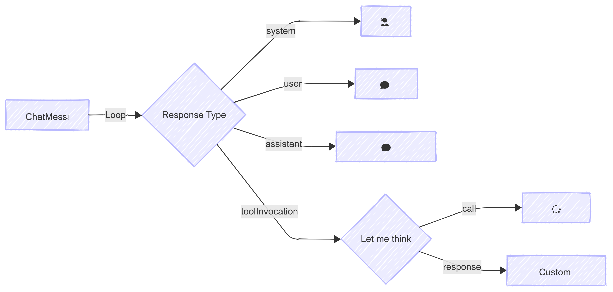

There's a new interface in town, where you get into a thoughtful, curious place, and the computer is there to assist you.

Lets actually talk with our data -- not go through some SQL query thing, or be confronted by a wall of text, but be able to go back and forth and go do whatever rabbit holes we want.

# Freestyling a structured answer

The question is how do you make the data useful? Having the data is sort of the key thing, but in some principal sense it's enough, but it's not really enough.

What sorts of questions do you want to ask? What sorts of things are interesting? What are the different ways you want to sort and filter it? How do you want to see it?

Because you want to ask questions and then you want to get answers. So you need to kind of teach the models what sorts of things it can ask questions about. You describe the data that you want, that you have, what's in there, and then you can make tools that exist on top of it to return a structured answer to a structured question.

# Tools and Rich Data Components

Tools are one way to do this and we're going to use tools in the sense of being able to ask a data source a question. We're not going to really have these tools do anything. That's not really the relevant part. But the part we're going to focus on is being able to describe the data that you have in words and domain concepts that people can ask questions about and explore and sort of brainstorm around.

Let's take the example of Tezlab. We track your electric vehicle. I'm in Rivian right now but obviously Tesla is a major part of it. I want to know things like how much did I drive last week or is there something happening with the weather that's doing something weird? If I want to drive to Nova Scotia right now how would I do that?


# Know your data




# MCP Server

```
Implement a new endpoint which is /v2/car_score/details. This is a GET request, and its purpose is get the car score of the active car.

First write subclass of apiclient that makes the call, and store it in logs folder.

Be sure to make the request before you make any times. Only make the types after you read in the json
file that was written out in the logs file.

Then look at the result to create a new type in types.ts.

Then update the api call to return the object cast into that new type.

Add a new command to the cli that lets the user run it.

Finally, add a new mcp command that exposes this functionality to other AI agents.

Always write tests and run them until everything is resolved.
```

# Client


```typescript
import { StdioClientTransport } from "@modelcontextprotocol/sdk/client/stdio.js";

```

```typescript
export async function POST(req: Request) {
  const tezlabTransport = new StdioClientTransport({
    command: "/Users/wschenk/.local/share/mise/installs/node/23.9.0/bin/node",
    args: ["/Users/wschenk/The-Focus-AI/tezlab-cli/dist/mcp-server.js"],
  });
  const tezlab = await experimental_createMCPClient({
    transport: tezlabTransport,
  });

  const tezlabTools = await tezlab.tools();

  const weatherTransport = new StdioClientTransport({
    command: "/Users/wschenk/.local/share/mise/installs/node/23.9.0/bin/node",
    args: ["/Users/wschenk/The-Focus-AI/mcp/build/weather.js"],
  });
  const weather = await experimental_createMCPClient({
    transport: weatherTransport,
  });

  const weatherTools = await weather.tools();

  const tools = {
    ...tezlabTools,
    ...weatherTools,
    ...localTools,
  };
```


Copy over the types:

And then 


```typescript
    case "car-score":
      return <CarScoreTool toolInvocation={toolInvocation} />;
```

And inside of `CarScoreTool` you can parse out the response like so:

```typescript
  const [carScore, setCarScore] = useState<CarScoreDetails | null>(null);

  useEffect(() => {
    if (state === "result" && "result" in toolInvocation) {
      setCarScore(
        JSON.parse(toolInvocation.result.content[0].text) as CarScoreDetails
      );
    }
  }, [state, toolInvocation]);
```