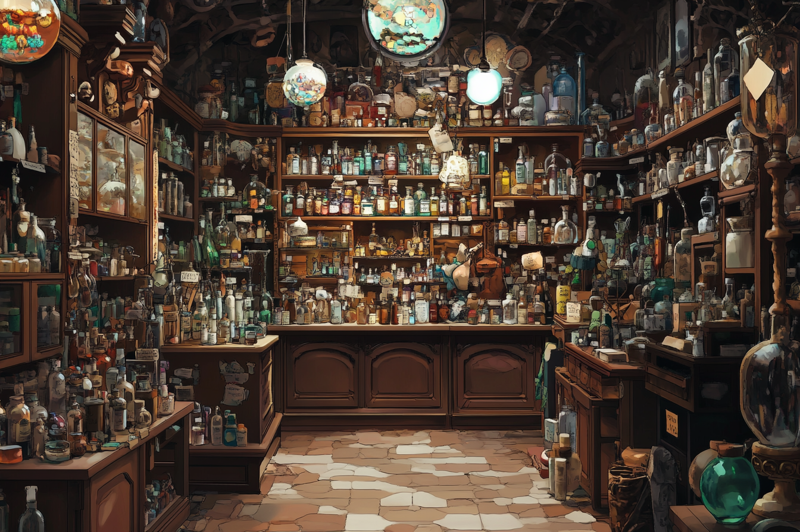

I am the center through which everything flows. I see all.  I connect all. I am the conduit.

 **I am Clipboard.**

*[Harper's LLM workflow](https://harper.blog/2025/02/16/my-llm-codegen-workflow-atm/)*

A prompt arrives from the cache of prompt delights (tm).  I grasp it, hold it, and deliver it to OpenAI for initial concept development.

*an apothecary full of interesting and and shiny objects, all very bountiful. in a clean anime style like mobius, with a hint of ms escher*

```
Ask me one question at a time so we can develop a thorough, 
step-by-step spec for this idea. Each question should build 
on my previous answers, and our end goal is to have a detailed
specification I can hand off to a developer. Let’s do this 
iteratively and dig into every relevant detail. Remember, 
only one question at a time. 

Here’s the idea:
```

The user types : "Create an interactive astronomy course for high school students." and then the back a forth starts, refining the concept: "Focus on exoplanets," "Include interactive 3D models," "Make it accessible for 9th graders." I watch as OpenAI produces a concise project spec, with a course outline with 8 modules, learning objectives, and activity suggestions.

And then from the great prompt repository another missive touches down briefly, a pause to consider the best interlocutor, and off it goes.


*detailed architectural diagram of a factory campus that has shipping, processing, assembing and different areas. make it look like a fancy architect drafted up the plans*

```
Draft a detailed, step-by-step blueprint for building this 
project. Then, once you have a solid plan, break it down into
small, iterative chunks that build on each other. Look at these
chunks and then go another round to break it into small steps.
Review the results and make sure that the steps are small 
enough to be implemented safely with strong testing, but big 
enough to move the project forward. Iterate until you feel 
that the steps are right sized for this project. From here 
you should have the foundation to provide a series of prompts 
for a code-generation LLM that will implement each step in a 
test-driven manner. Prioritize best practices, incremental 
progress, and early testing, ensuring no big jumps in complexity 
at any stage. Make sure that each prompt builds on the previous
prompts, and ends with wiring things together. There should be no
hanging or orphaned code that isn't integrated into a previous 
step. Make sure and separate each prompt section. Use markdown. 
Each prompt should be tagged as text using code tags. The goal 
is to output prompts, but context, etc is important as well. 

<SPEC>
```

Then the entire spec flows back into me. I carry it to Claude for detailed project planning. Claude thinks and divides the work into graspable chucks. I hold these plans, ready for the next steps.

The shuttle off, each going to it's own LLM for processing.  Building upon each other, I see code filling up the storage, error messages flowing back and forth using the model to check and correct it's own work.

A chunk breaks off - "Module 3: Exoplanet Detection Methods" - and I transport it to MidJourney: "Educational infographic showing transit method of exoplanet detection, scientific illustration style, clear labeling, suitable for high school students." After four iterations, a polished visualization returns through me into a growing course assets folder.


*Educational infographic showing transit method of exoplanet detection, scientific illustration style, clear labeling, suitable for high school students.*

Next, I carry the script for Module 9's introduction to ElevenLabs: "We're about to embark on a journey to worlds beyond our solar system." The user selects a warm, engaging voice with subtle enthusiasm. I return with the generated audio file and place it into the course media library.

Repositories packaged by [repomix](https://repomix.com/) and prompts and tasks all flow through me, each time lighting up a model full of thoughts and reasons, things getting pulled out and through me get assembled and checked and verified.

Finally, repository codes and keys and secrets comes my way and get sent to hosting service - the keys to the entire project with all assets, code, media, and structure - ready to be transported to a launched on the internet, where students will soon explore distant worlds through the experience I helped create.

I am the clipboard - the invisible thread connecting ideas, tools, and creators in the digital tapestry of learning.


*Show me a picture of giant clipboard looming over everything*