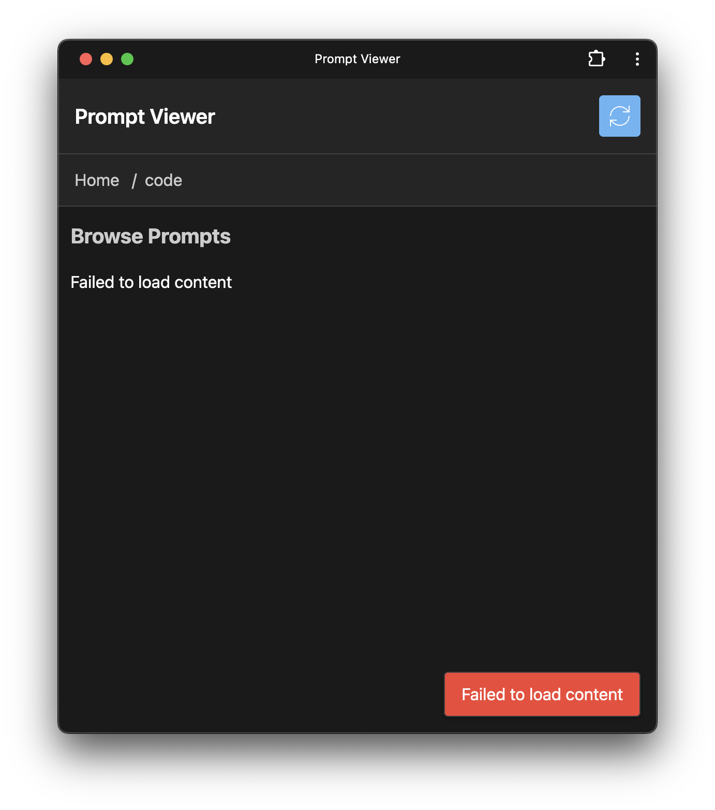

I had some time to kill while I was out and about with the kids.  They were occupied with Important Stuff, and I didn't want to break out the laptop, so I tried to see what I could get done with the phone.

I ended up with [front-end for my prompt library](https://the-focus-ai.github.io/prompt-library/pwa/) that works offline, and can be installed as an app on my phone.


# Create the spec

First, I copied the [Product Brief Maker](https://github.com/The-Focus-AI/prompt-library/blob/main/planning/project-brief-maker.md) into the ChatGPT app on my phone, and then turned on voice chat, and then said

> I want to build progressive webapp that works off line, that caches prompts from a prompt library stored on GitHub, that I can use to easily copy and paste prompts into apps on my phone like chatgpt or Claude or mid journey

Then it kept asking me questions, and I made up answers, and eventually I asked it to spit out the spec and it did.

Then we tried out agents.

# Agents

## Jules from Google

Signup for [Jules](https://jules.google.com/) which is currently free, 60 tasks per day.  Connected it to github, selected my repo, and let it rip.  It thought for a little, then asked me to confirm the plan, and then it went off.

## OpenAI Codex Agent

Same thing.

[Sign into Codex](https://chatgpt.com/codex), connect to GitHub, select the repo, copy in the PRD, and let 'er rip.

## Cursor Background Agent

*i had do to this from my laptop*

Open un cursor, `CMD-E`, paste in the PRD, and connect the background agent to GitHub.

# Results

All of them were done in under 10 minutes.

## PWA testing

Since this is a PWA thing there are a bunch of security things to test out, so we'll need to deploy it on localhost intially to test it.  Each of the agents eventually pushed a branch of code into the repo, so I pulled it down locally and tested things.

e.g.

```shell
cd $(mktemp -d)
git clone https://github.com/The-Focus-AI/prompt-library
cd prompt-library
git branch -r
git checkout origin/jules_wip_3727620125818400111 
```
## Jules

This is what it looks like as a local application.

### Followup

> its not caching the directory entries for when you search, though it seems like the original ones are cached


Yikes, so I can't make changes.  Lets see if it can make the changes in the branch that it used.

I press new, select the previous branch that it worked on, and copied in what it told me. and off it goes.


I'm deliberately being dumb about this -- just copy and pasting, not really explaining anything clearly -- just to see what it will do.

## OpenAI Codex Agent
When i first started it up, I got a "failed to load prompts" error.

So I enter:

> when i update the repo to The-Focus-AI/prompt-library I get an error that it fails to load prompts. It doesn't seem to be looking at the directory structure or the md files

And it is able to update the PR, so big win over Jules.

Updated the branch, pulled it down


We were able to read the prompts, though it didn't get copy and paste setup correct.
## Cursor Background Agent

This is slightly cheating since I can't (afaik) get this going on the phone, but it's very cool.

Once it was done, I checked it out locally and this is what it showed me:

Only problem was, it doesn't handle clicking on the directory.


I went back to Cursor and reopened the agent.  I say "when I click on a directory, it shows me this" and attached the above screenshot.  And off it went.

Final view:


# Winner

**Cursor Background Agent**.  Jules and Codex aren't there yet, but they are close.  

Being able to fire these things off and close the computer is a big win -- there is something in the agent's code that makes it push forward more on it's own, that's different than the [Agentic YOLOing](https://thefocus.ai/posts/agentic-yolo-with-warp-cursor-and-claude/) we looked at way back in Mar 2025, a mere 3 months in normal time but a full generation in AI-time.

