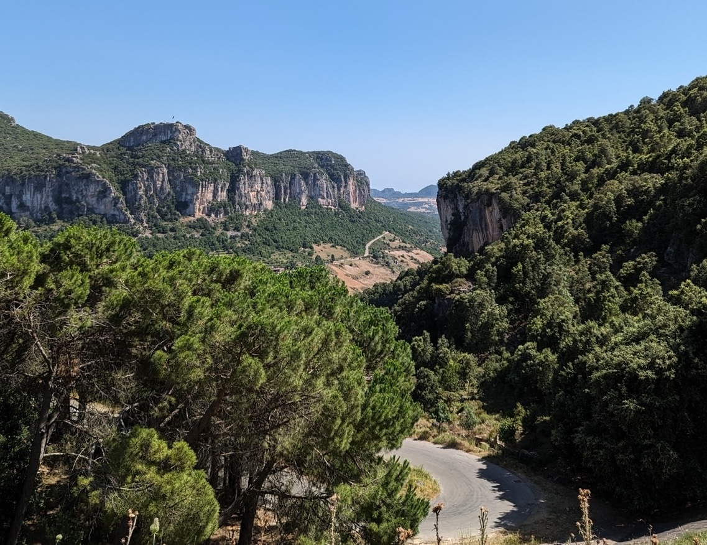
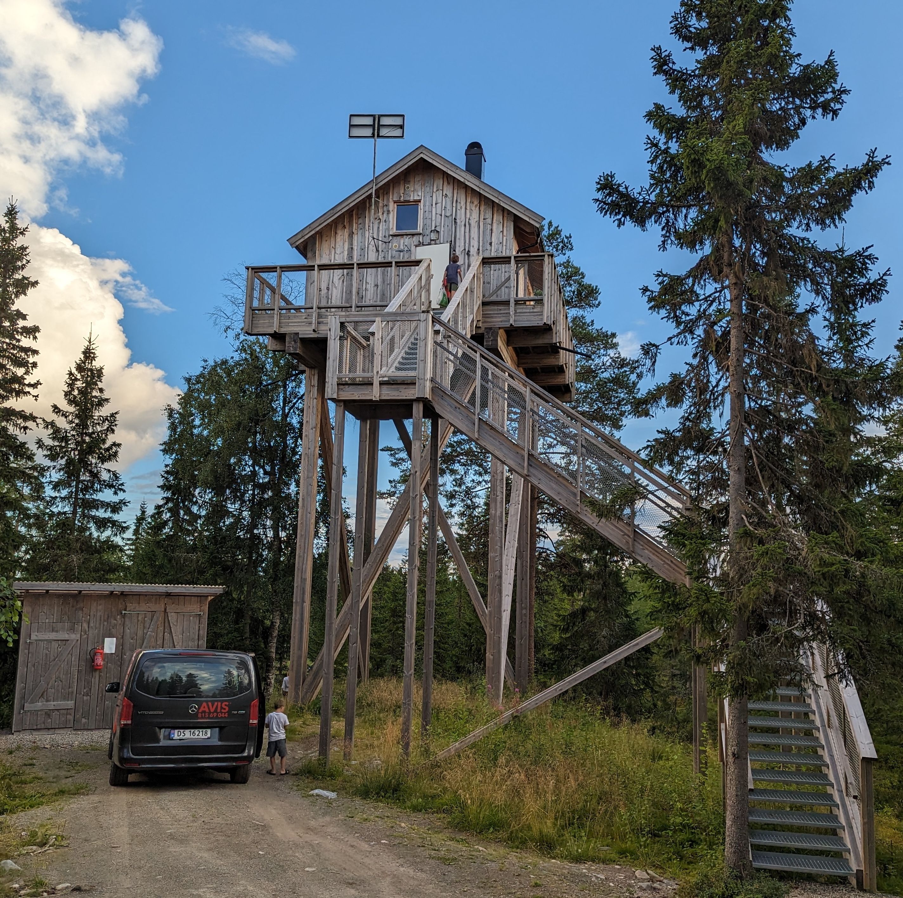

What does AI ask us to do?

> The *affordances* of the environment are what it *offers* the animal, what it *provides* or *furnishes*, either for good or ill. [...]  I mean by it something that refers to both the environment and the animal in a way that no existing term does. It implies the complementarity of the animal and the environment.
> -- [The Ecological Approach to Visual Perception](https://cs.brown.edu/courses/cs137/2017/readings/Gibson-AFF.pdf), -- James J. Gibson

Affordances, in design parlance, are the subtle hints that tell us how to interact with something. A button begs to be pressed, a handle begs to be pulled. Our tools now are ones of *thought*; we are evolving from physical cues to cognitive capabilities. AI isn't just a tool; it's a thinking "co-pilot" that amplifies our ability to understand and reason about the world around us.

> The gestalt psychologists recognized that the meaning or the value of a thing seems to be perceived just as immediately as its color. The value is clear on *the face of it*, as we say, and thus it has a physiognomic quality in the way that the emotions of a man appear on *his face*. To quote from the *[Principles of Gestalt Psychology](https://www.google.com/books/edition/Principles_Of_Gestalt_Psychology/tWxHAQAAQBAJ?hl=en&gbpv=1&printsec=frontcover)* (Koffka, 1935), "Each thing says what it is. ... a fruit says 'Eat me'; water says 'Drink me'; thunder says 'Fear me'; and woman says 'Love me' " (p. 7). These values are vivid and essential features of the experience itself. [...]  The postbox "invites" the mailing of a letter, the handle "wants to be grasped," and things "tell us what to do with them" (p. 353). Hence, they have what Koffka called "demand character."
> -- [The Ecological Approach to Visual Perception](https://cs.brown.edu/courses/cs137/2017/readings/Gibson-AFF.pdf), -- James J. Gibson

So then the question is, *what does ai say to us?*

Take geolocation from images, for instance. Armed with a [simple prompt](https://thefocus.ai/recipes/geolocation-prompt/) and an image -- or even a screenshot -- anyone can now pinpoint where a photo was taken, with a level accuracy that's way better than only a few of [the world experts](https://www.tiktok.com/@the_josemonkey) (https://josemonkey.com/ is wild!)

This is a superpower -- both mind blowing but also somewhat terrifying.  As we unlock these new capabilities, what unintended information are we sharing, and how does that reshape our sense of privacy?

This new capability is a perfect example of **the cultural evolution of affordances**. Once, a photo was just a record of what was visible in the frame. Today, that same photo contains metadata far beyond the obvious—data that an AI can mine for location, context, and identity. The shift isn’t just in what the photo shows, but in what the tools interpreting the photo can now reveal. In effect, we are living through an expansion of perceptual and cognitive range.

Here are some insights from various photos:

> - **Terrain**: Dry, rocky hills or low mountains, with exposed sedimentary rock faces and erosion., **Vegetation**: Classic of **southwestern U.S. high desert or mountainous** regions—some juniper/pinyon pine mixed with dry grasses and chaparral. **Climate Type**: Semi-arid, likely 3,000–7,000 ft elevation based on flora.

Or from another photo:

> - **Architecture:** Very North American — particularly French Canadian or Northeastern U.S. rural. - **Foliage:** Broadleaf trees dominate, consistent with New England or southern Quebec. - Old truck or farm vehicle in the bottom-left — utility rather than luxury, adds to the rural context.

Or

> **No signage** visible in the shots, but the style of road and surroundings point to southern Europe. The **karst cliffs, forested valleys, and hairpin roads** match the Supramonte region in Sardinia very closely.

Or

> **Design:** Elevated cabin style is typical of **Nordic wilderness cabins** or **fire lookout towers**.**License Plate:** French plates on the van suggest the visitors are from France, but it doesn’t necessarily indicate the cabin’s location. **Tree Type:** Dominated by spruce and fir with lichen-draped branches, classic of boreal forests (taiga).

*that was a fun airbnb*

---
The observational skills of Sherlock Holmes -- a mythical, fictional character -- are now available to everyone.  We suddenly can throw a vacation photo, or a screen shot from facebook, and fairly pinpoint the location via clues from the background.

This is relatively new (at least to me) and now the knowledge of that ability -- the **affordance** -- is unleashed into the culture.  This shift can be seen as a continuation of the broader story of technology: tools change what we can do, and then that change feeds back into what we expect and how we behave. Just as eyeglasses extended our vision, or telescopes extended our ability to see the stars, AI extends our ability to draw meaning from patterns too subtle or complex for human eyes alone. Geolocation is one such extension—it gives us new ways to recognize where we are, or where someone else might be, with profound implications.

As our tools become more capable, our expectations shift. We start assuming that certain types of inference are normal, and that changes how we communicate. A photo once shared casually now carries with it a layer of locational risk. The cultural norms around sharing begin to shift, too. What was once unremarkable—posting a picture of your backyard, for instance—might now feel like a intimate disclosure.

This is the double-edged nature of affordances: every new capability opens new possibilities, but also new vulnerabilities. Understanding this tension is critical as we develop and adopt AI tools. We must ask not just what these tools can do, but what their use implies—socially, ethically, and personally.

In that sense, the evolution of AI affordances is a cultural story as much as a technical one. It's about how we adapt, what we normalize, and how we protect ourselves in an environment where every shared image might tell more than we know.