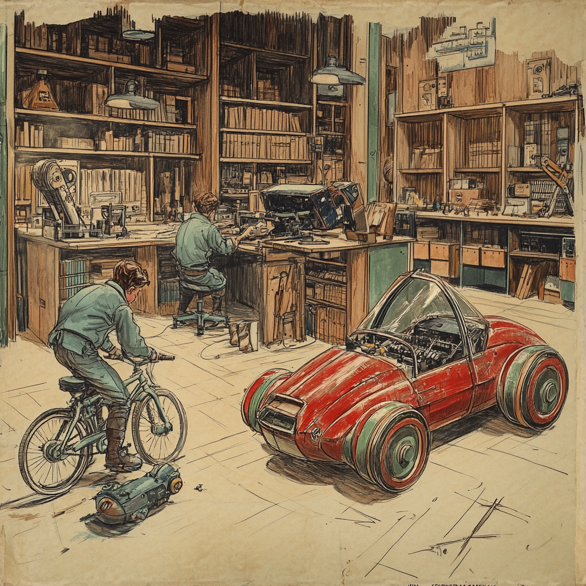

> [Computers are a bicycle for the mind.](https://www.themarginalian.org/2011/12/21/steve-jobs-bicycle-for-the-mind-1990/)

There's a Steve Job quote about how we are tool builders, and with our tools we are able to accomplish way more than we would have otherwise.  And we have tools for thought, tools to make tools (I love a good [woodworking jig](https://www.popularwoodworking.com/jigs-and-fixtures-projects/)), tools we don't understand the inner workings of.

Lets explore what these new, generative AI based tools are actually good for.  I'm very interested in how we can apply these new AI tools in useful ways.  Playing with [ChatGPT](https://chatgpt.com) or [Midjourney](https://www.midjourney.com/home) or [Elevenlabs](https://elevenlabs.io/) are mind bending, both their current demonstrable capabilities and the sparks that they fire off about the future.

What can you do with them, beyond the demo?

## Today

Lets look into how I wrote this essay, and see how it helps and how it didn't help.

First, I used [superwhisper](https://superwhisper.com/) to put my thoughts down on paper.  I had roughly an idea of what I wanted to say, but rambled out each paragraph, pausing between as I tried to organize my thoughts.  I wasn't worried about formatting, spelling, just getting all of the ideas "down on paper".

Whisper -- a [voice to text model from OpenAI](https://openai.com/index/whisper/) is interesting in that it cleans up the rambling speaking into something a bit more grammatical.  There's a bit more than simply figuring out which word goes after which, or which homonym is right, it cleans it up.

Then I copied the text into [ChatGPT](https://chatgpt.com/) , [Claude](https://claude.ai/new), and [Gemini](https://gemini.google.com/app).  I told it to rewrite it the "style of [La Rochefoucauld](https://www.goodreads.com/author/quotes/7428903.Fran_ois_de_La_Rochefoucauld)", make it more concise, use shorter more modern language.  I copied the output of one model into another.

I put them all together, and just let it sit there.  I'd organized my thoughts.  

Eventually I slept on it, threw it all out, and hammered this post out in 15 minutes.
## Yesterday 

Imagine this process in the past, the way past.  Forget about the terror of the blank page, about not knowing exactly what to write or if you had anything to say.  To even get to that point you'd need to work hard.

You'd need to get paper.  Paper was so hard to come by that it made sense to erase what was written on it before.  Whole texts have [been recovered from a palimpsest](https://spotlight.vatlib.it/palimpsests/feature/digital-recovery-of-removed-texts).

Finding nibs and inks to write with, cursive writing and blotting ink...  Ink was probably everywhere.  Then typewriters came along and we focused on words and paragraphs rather than how the letters were formed.

Typewriters graduated to word processors, and "copy and pasting" became a metaphor rather than using scissors to move text around.  Spelling checkers red-squiggled their way into grammar checkers, and a million Hemmingway imitators were unleashed upon the unsuspecting world.
## Tomorrow

Now the tools can do even more -- [Gemini DeepResearch](https://blog.google/products/gemini/google-gemini-deep-research/) will scour the internet for you to get you a list of references. It will summarize for you, and give you a list of bullet points.  Any of the models will let you expand on whatever topic, and full it up with empty, grammatically correct prose.

But writing is thinking.  The process of pushing through the ideas, seeing how the fit and flow together, false starts and sheepish backtracks are the the point.  That part remains -- all of the stuff around it goes away, and you a left with only the most difficult part of the task: figuring out what you want to say.

Looking at these tools like they will make writing go away, or illustrations, or making music, is only true if you think of words, images, or sounds as content filler.  In our ad-based economy that may be somewhat true, but unless there's kernel of something there that AI slop will be eventually be worth nothing.

So -- the process is changed.  Typing speed or spelling or even having good grammar is even less important than before.
## Accessibility 

The difference now is in accessibility.  The novice now can do things that they couldn't dream of before.  The expert can do things that they previously wouldn't bother with.

The core problem remains.  The stuff around creation, the mechanistic ritualized things are now so much easier, but the hard part -- call it creativity, call it intelligence, call it [discovering equations via visits of a goddess in your dreams](https://swarajyamag.com/culture/the-devi-in-ramanujans-dream-because-she-is-the-mind-beyond-mind) -- remains, and now can be fully focused on.

I think this will be a huge benefit to those who know what they are doing.  On the coding side, it takes me hours to accomplish what would have taken days, so I have the time and possibility to explore way more ideas than I would have previously.  And people who have never coded before can now cobble together things that would have been impossibly daunting before.

## Now what

So how is this all useful?  What do these tools do for us?

The signals that we used before to see about quality are all changing -- no longer does it take a huge amount of effort to produce something.  Was that illustration that you made deeply considered or negligently produced by midjourney?  As a casual observer, how can you tell?

For the beginner it's even easier to copy the form, to make what looks and sounds like the right thing.  If this is part of a larger process, then more people will have the opportunity to get good at things.  If it's the end result, we are going to be drowning in AI slop.

For the expert these tools help you do more faster, to surgically jump in and have a small, concentrated effort make a big effect.

For generating images, instead of focusing on drafting you focus on curation.  For generating text, its more useful to give you a variations on tons of different ideas which you then select and dig deeper on.  For coding, you can quickly generate prototypes that let you iterate quickly.  And all of these things enable a whole new way of working since you can just give it a go without a huge ceremony of starting.

These tools don't give you the answers, but they help you find them.