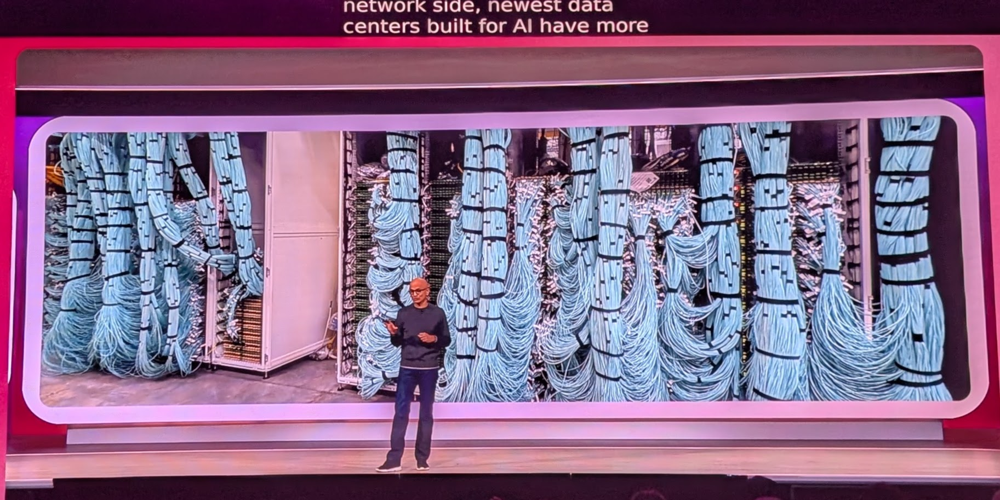
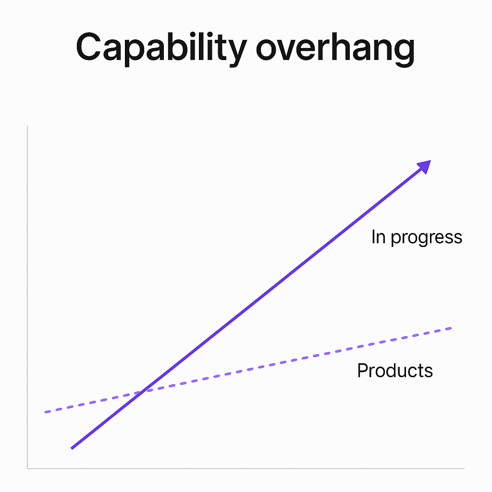

> Look at what the web has become.  Can you imagine if a company had tried to own parts of it?  Locking it in with browser features that only they controlled?  We would never have the breadth and width and amazing things that we have in the web now.
> -- Not actually a quote but they kept repeating that sentiment

Microsoft is hammering home how much they want things to be open.  They are not like the borg-ro-soft that they used to be.  This new, open agentic web is the future, they are using open protocols, putting out open protocols, and hoping that you'll deploy everything on Azure.

*azure datacenters have enough fiber each to go around the world 4.5 times*

And at the end of the keynote, I'm keyed up to deploy everything on AI Foundry.  (Haven't even signed up yet, but it answers a lot of questions about security and evaluations that are hard to answer otherwise.)

## Reasoning and the Capability Overhang

2025 may be the year of AI Agents, but its reasoning that really has unlocked all of this functionality.  Reasoning, which is like telling the models to "think real hard about this" or -- if you prefer -- to move some of the work from the pre-training period to increasing inference time activity.  This is so powerful that now they've branded a term to explain how much more awesome the models are compared to the production build on it.

*i say the productivity gains of deploying ai haven't been recognized, you say that the models are just so amazingly awesome that products haven't had time to catch up.  tomato, tomahto*

So that area between the solid line and the dotted line is our opportunity.

* models are more powerful than we are collectively using them for
* set the ambition level to 11, build for the future
* put more reasoning into everything, assume that it will be there

Reasoning is something that we tend to use sparingly.  It costs so much more, where the non-reasoning models are if not "free", significantly cheaper.  I could blow $50 on one deep coding session for example, in a major hack session.  Things that are just wrappers around some simple tools it would take months and months to go through $10.  So there's a cost trade-off now, and the compute providers are advocating *not worrying about that cost*, since it will soon come down..
## Agents and MCP everywhere

What is an agent?  In client conversations, we use the word agent to mean, roughly, "a model and prompt and a bunch of ways that we throw stuff together".  (Similar to the [Pydantic, Agent is a Container of these things](https://ai.pydantic.dev/agents/) definition.) Or ["An **agent** is something that acts in an environment; it does something. Agents include worms, dogs, thermostats, airplanes, robots, humans, companies, and countries."](https://artint.info/3e/html/ArtInt3e.Ch1.S1.html) 

In the Microsoft parlance an agent is "something that you assign tasks to", shifting the idea from "what is it" to "why would I care about it".  I like this reframing.  There's 3 levels that they are rocking:

* Level 1: Ask a question, Model Answers
* Level 2: Assign a task, AI executes
* Level 3: Assign a task, AI coordinations with other AIs to complete the task

And the the open agentic web is the vision of how Microsoft thinks we'll get there.

## How it works

[MCP](https://modelcontextprotocol.io/introduction) *(Anthropic)* is how make services available to agents.
[A2A](https://google.github.io/A2A/)  *(Google)* is how Agents interact with each other.
[NLWeb](https://github.com/microsoft/NLWeb) *(Microsoft)* is how agents discover each other.

So if you want to participate into this new open agentic web, you basically

* Implement a MCP server with specific tools that understand your business services
* Use NLWeb to add authorization and also security and (sort of) discoverability
* Expose more complex services by calling other agents over A2A.

## NLWeb

[Natural Language Web](https://github.com/microsoft/NLWeb) is a fancy way of saying:

* Websites should have an `/ask` endpoint that you can hit that lets you run a query
* Websites should have an `/mcp` endpoint that you can hit that lets you plug them into a model

So what does this mean?  The `ask` endpoint means that you need to run the model, so it'll cost you money, but on the other hand you can control the agent's prompt.  For `mcp` you don't need to bear the cost of the model, so that's nice.

We'll see how they all get adopted.
## Finally, fashion

These Indian-American's are crushing it.  Satya Nadella, Jay Parikh.  Looking sleek, fit and just a whole lot of warrior energy.  There's no receding hairline, its a immaculately shaved bald head.  There were a series of people coming up during the keynote to do the demos, again mainly Indian -- with clear yet pronounced accents of being raised abroad -- everyone fit, trim and completely put together.  You got the sense that they had a very structured day, very deliberately and organized which was reflected in their appearance.

In the beginning there was some ruckus with shouting and yelling in the audience.  Satya didn't hesitate or get distracted.  In the second keynote there was some more brief yelling, and Jay calmly paused for a half a minute and then continued unwavered.

Fashion wise, excepting the women who were colorful, the men tended to be in simple cut clothes, natural fabrics, dark jeans.  Back sneakers with white soles.  The uniform of the new era.

## Repos

* [NLWEB](https://github.com/microsoft/NLWeb?tab=readme-ov-file)
* [TypeAgent](https://github.com/microsoft/TypeAgent)
## Release notes

- [Introducing NLWeb: Bringing conversational interfaces directly to the web](https://news.microsoft.com/source/features/company-news/introducing-nlweb-bringing-conversational-interfaces-directly-to-the-web/)
- [What is Foundry Local](https://learn.microsoft.com/en-us/azure/ai-foundry/foundry-local/what-is-foundry-local)
- [GitHub Copilot coding agent in public preview](https://github.blog/changelog/2025-05-19-github-copilot-coding-agent-in-public-preview/)
- [The Windows Subsystem for Linux is now open source](https://blogs.windows.com/windowsdeveloper/2025/05/19/the-windows-subsystem-for-linux-is-now-open-source/)
- [Azure AI Foundry - the AI app & agent factory](https://azure.microsoft.com/en-us/products/ai-foundry)
