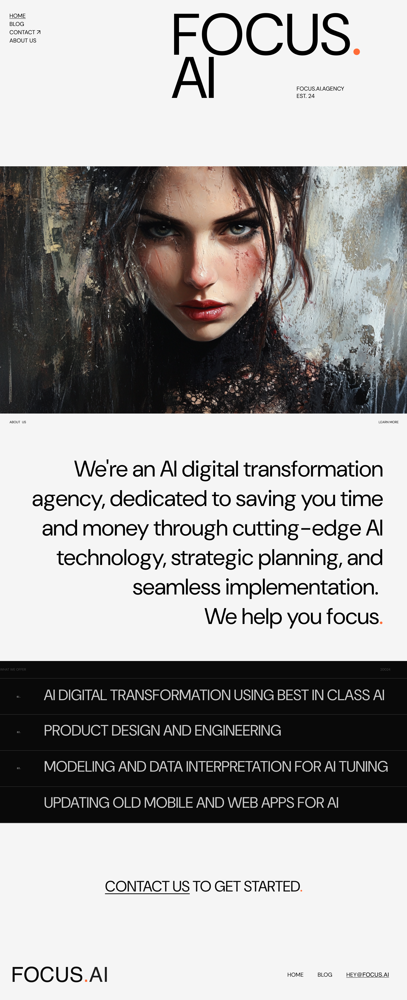
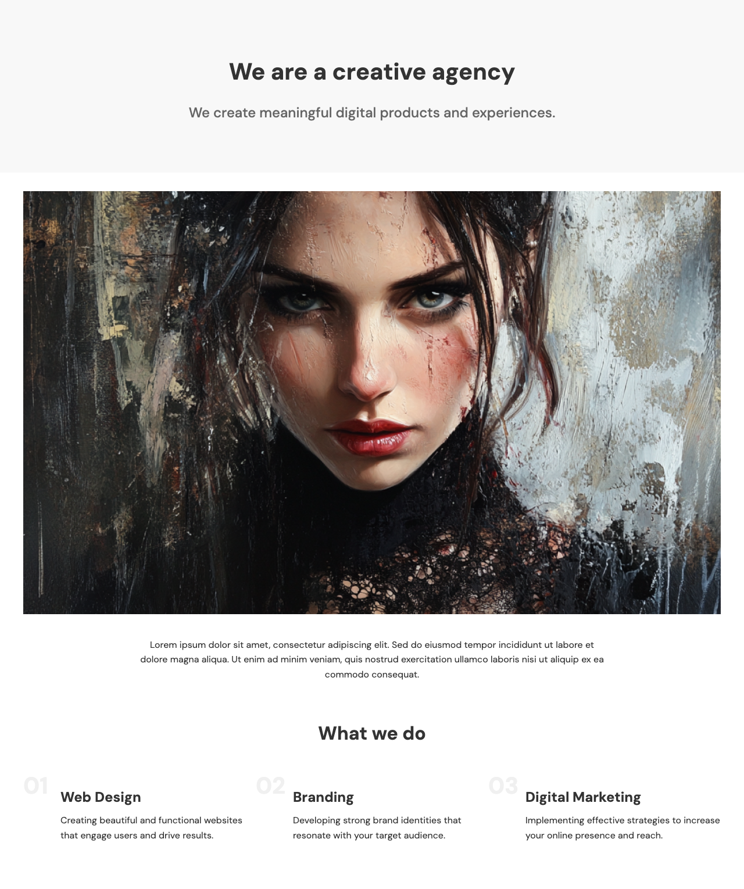
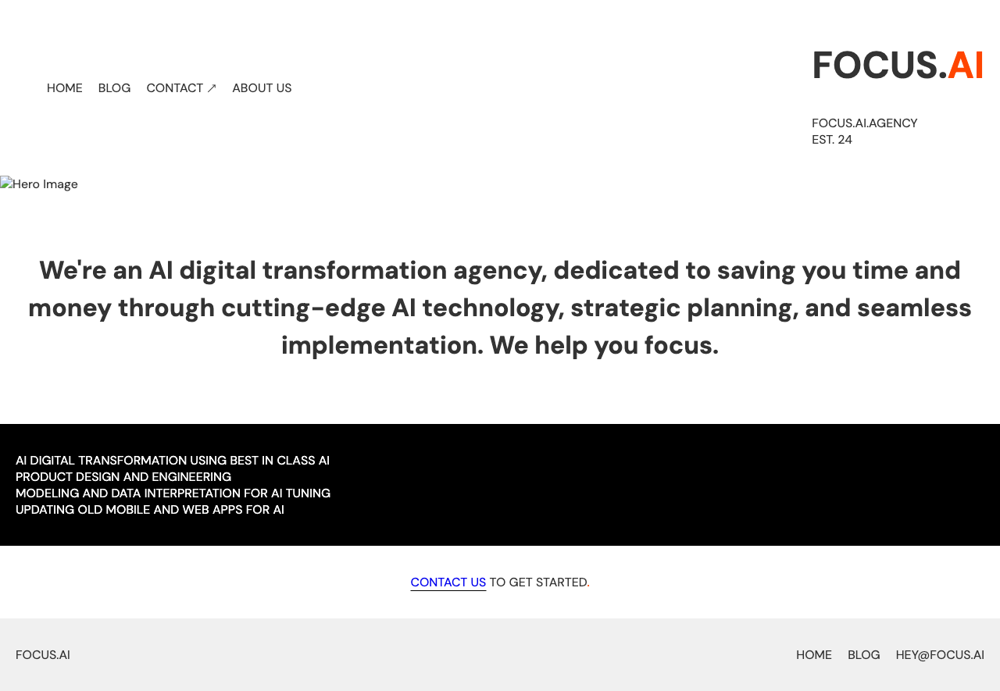
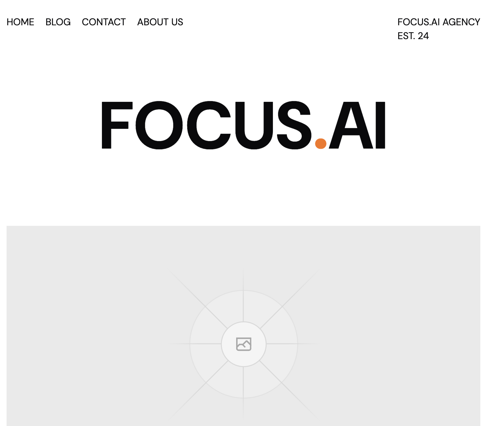
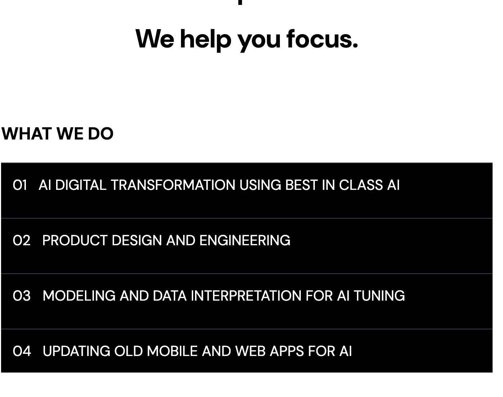
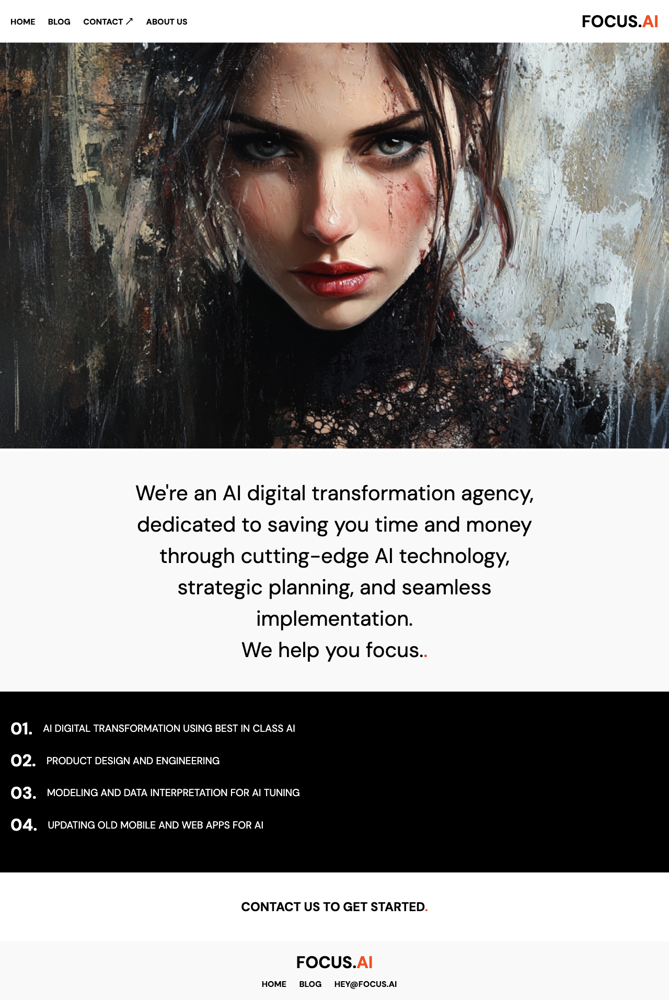
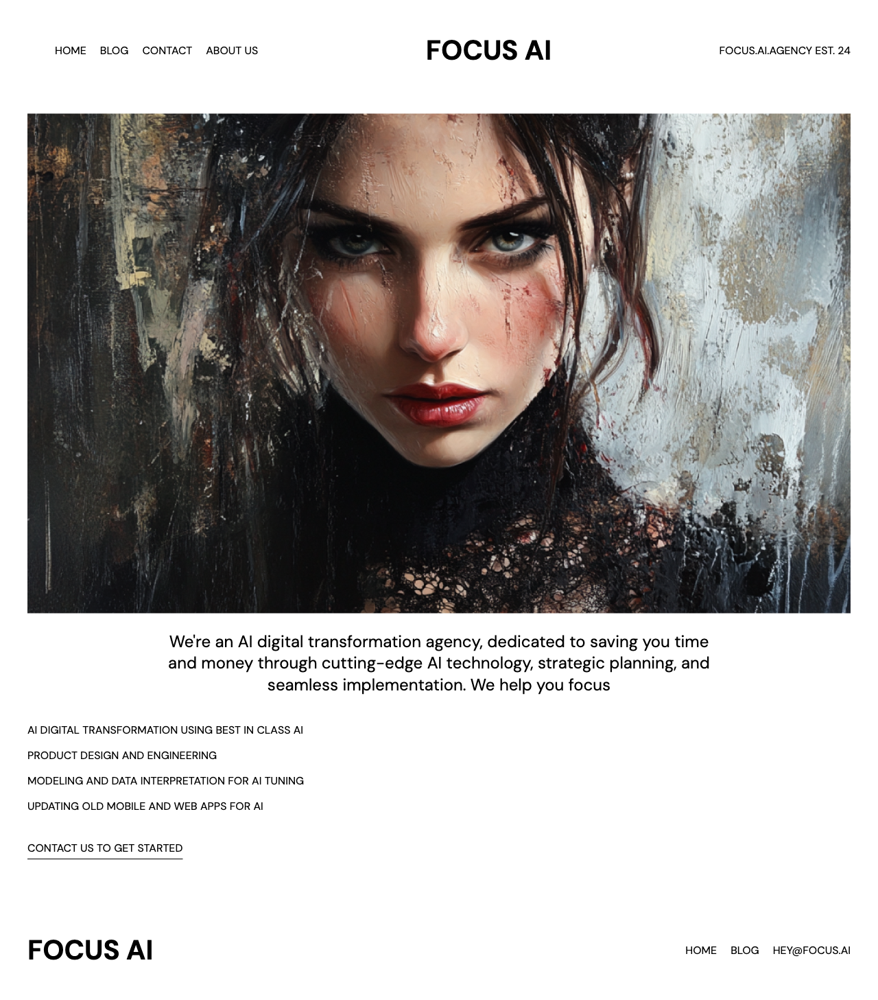

OK lets have a shoot out!  I'm going to figma, selecting a section and
exporting to a =png** file.  Lets see what using a few different coding
tools will produce.  Which one do we like the look of better, and
which gets us going faster?  Here we go!

## The design

This might look familiar to you:


## Straight Cursor

```
cd $(mktemp -d)
  cp ~/Downloads/Focus.agency\ home\ -\ 1st\ Page.png ~/Downloads/image1.png .
  cursor .
  ```

Then open up the composer:

>  Generate an html and css file that implments the design.  For the
image, use image1.png.  Be sure to pay extra attention to the layout
of the headers, the alignment of the text in the main body, and the
numbers and ordering of the what we do section.  The font is dm sans
#+end_quote


I mean... what is the point of that?

***Skip.***

## aider

Create a new work directory:

```
  cd $(mktemp -d)
  cp ~/Downloads/landing.png
```

Install aider

```
python -m pip install -U aider-chat
```
  
I'm going to use openai, so lets set that api key:

```
export OPENAI_API_KEY=whateveryourapikeyis
```

Lets create a few blank files

```
touch index.html styles.css
```

```
aider
```


Lets add the landing page

```
/add landing.png index.html styles.css
```

And tell it to make generate some html and css:


> Take landing.png and cut it up index.html and styles.css.  Be
especially sure to match the styles of all parts of the design.
The font you shoudl use is DM Sans


We can take a look at it using

```
npx live-server
```



```
replace the main image with image1.png.  the header on the left should
be stacked, the main copy about what we are is takes up too much
space, and the list is in the wrong font.
```

All in all... meh.

## v0

###  Slicing up the design

Open up [[https://v0.dev]] and upload your image.  Here are the prompts
that I used

> Implement this design, following the layout, fonts and spacing very
closely. The font is "dm sans".



> Fix the top naviation so that it matches the design both by having the
nav be vertically stacked and the header text being on the right with
the est text below it. The background color of the list of things
shoudl be inverted.

Getting a little better, lets try some more

> The what we do section doesn't have the what we do header, and also
there are not numbers next to it. Also, the main image goes to the
edge of the screen



### Building it

Lets first go to 

First, let's create a workarea.

```
cd $(mktemp -d)
```

Then create an app:

```
  npx create-next-app@latest appname
```

Then we import the design.  We copy the npm command from the header
in v0, and then run it in the =appname/= directory.

```
  npx shadcn@latest add "https://v0.dev/chat/b/b_UYLXzBn..."
```

Then open it up in cursor

```
  cursor .
```

If we start up the server `npm run dev` we can see that it's loading
the default page.

Open up the new `page.tsx` file that was generated by v0, and then
open the composer.

> Use the page in the components directory as the main landing page, and
strip out all of the unused default stuff.  Also make sure we are
using that dm sands font!

I got an error, so I just pasted it in the chat

> Syntax error:
/private/var/folders/ws/9kxrvtxx26b_z3s3wr69g2c40000gn/T/tmp.w9zTiYpbLO/appname/app/globals.css
The `border-border` class does not exist. If `border-border` is a
custom class, make sure it is defined within a `@layer` directive.

Now it's loading.


Then I create a `design` folder.  In figma, select the design you want
and export it as png into that folder.

Lets copy over the image.

```
  appname % mkdir public
  appname % cp ~/Downloads/image1.png public 
```

And then ask it to replace it:

> use image1.png instead of the placeholder


I actually saw the image in my browser, but using now that I see the
automated screenshot its not there.  Anyway, lets keep going.

##  OpenAI GPT 4o with canvas

Open up [[https://chatgpt.com/]].  Select `4o-canvas`.  Drag the design file
over, and then give it the same prompt:

> Generate an html and css file that implments the design.  For the
image, use image1.png.  Be sure to pay extra attention to the layout
of the headers, the alignment of the text in the main body, and the
numbers and ordering of the what we do section.  The font is dm sans

The response is certainly fast, and it is a nice way to click and copy
which is cool.  But it looks like this:


> The header on the top should be stacked vertically.  Focus.ai on the
top is the wrong size, it needs to be much bigger and the established
text isn't there.  The text explaining who we are should be aligned to
the right.  The list of things that we do should be aligned but with a
center margin, and the numbers are way too big.

It looks like it only did the css file, so lets select the html and say

> can you update the html also?


So... basically not really.

## Claude

Go to claude.  Upload the two images.  Give it the same prompts:

> Generate an html and css file that implments the design.  For the
image, use image1.png.  Be sure to pay extra attention to the layout
of the headers, the alignment of the text in the main body, and the
numbers and ordering of the what we do section.  The font is dm sans



> the nav in the header should be stacked vertically, and main
focus.ai text should be way bigger and aligned differently.  The image
should take up the fill width of the page.  the paragraph of text
should be bigger and aligned to the right, and the list of things that
we do should be black.


## Conclusion

Good demo, but overall no one is losing their jobs anytime soon.

straight cursor - surprsingly bad

aider - This feels the most fun in a running through the cli sort of
way.

v0 - This felt like you could iterate on in the best, but you are
stuck in the NextJS universe for better or worse.

openai - it only updates one file at a time?  wut?

Claude - artifacts are much nicer to deal with than canvas in this
release.


Originally published https://willschenk.com/howto/2024/slicing_up_a_design_from_figma/