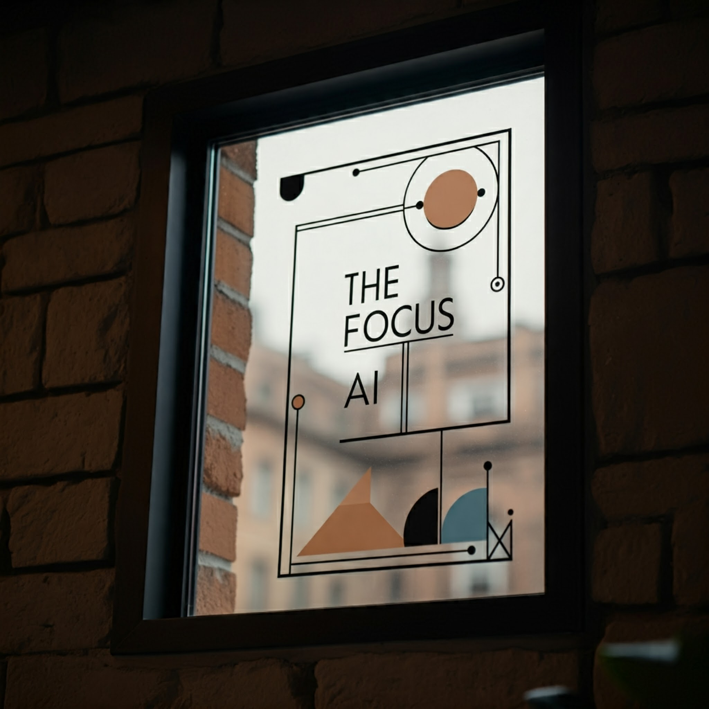
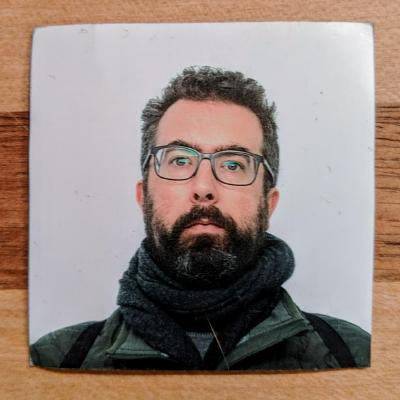

I'm back! Let me tell you about The Focus AI.

In 2010 I cofounded a software development company that did a lot of new product development for mobile.  The smart phone revolution was in full swing, and the world was getting the internet in their pocket.  It was very exciting times, we tried out all sorts of things, some worked and some didn't, but it represented a moment when there was a shift to how we interacted with knowledge, information, and each other.

In Jan 2022 I stepped back from the company and my cofounder and I sold it later that year.  I took a professional break from with the world of technology, moved to the woods, spent a lot of time focusing on enjoying my family, and started up a [brick and mortar food market](https://cornwallmarket.com).

During this time the world of generative ai hit the scene.  In addition to being a very close reader of Ksenia's [Turing Post](https://www.turingpost.com/), I've been playing around with all of the new transformed based tools (and writing up some [labnotes on the blog](https://www.turingpost.com/)) and I'm pushing it to the next level and moving in full time.  

It's very exciting to get past the demos and figure out what the technology can do -- some of surprising at how dumb it is, and some of it surprising at how amazing it is. (e.g. Embeddings)

My main thesis is that more than anything we are in a human computer interface shift.  Things that were hard are now accessible; experts can leverage their knowledge to move at incredible speeds.  This is a shift comparable to Windows 95 dragging the text-based DOS world into the graphical one -- we have moved into the language era.

Lets figure out what this means in the pragmatic world, not just the things that these amazing demos hint at.  I've been working with clients to actually apply this technology in the real world, and in addition to the things that I just find interesting.

Looking through the things I've written about over these last few months, 
* ai-assisted coding
* agents and tool calling 
* especially using small, local and private models
* automation with no and low-code tools
* data exploration and visualization
* running things directly in the browser
* low-tooling fast builds

Things that only experts could do before are now accessible to a wider range of people.  And once you go deep into something -- once you become and expert yourself -- you can explore things so quickly that it opens up whole new areas to explore.

Things that used to take weeks take minutes, and it changes the cost-benefit analysis of so many things.  Perhaps you wouldn't waste a 4 days exploring a possibility, but you certainly could spend 45 minutes going down the rabbit hole.  And maybe you'd find something there.

I've been working with clients to help deploy this technology in a productive, money saving and money making way.  And I'm ready to join the conversation on how we can make it work for more people.

One thing that I can say for sure is that this time, there definitely is a "there there".   Come join in what I'm exploring and I'd love to hear more about what you are working on.

This is a photo of a photo.