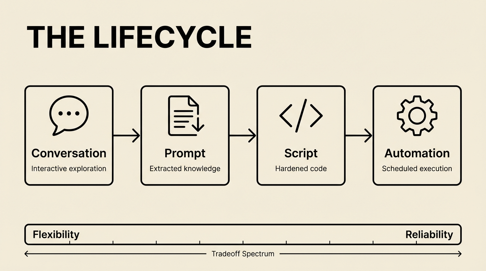
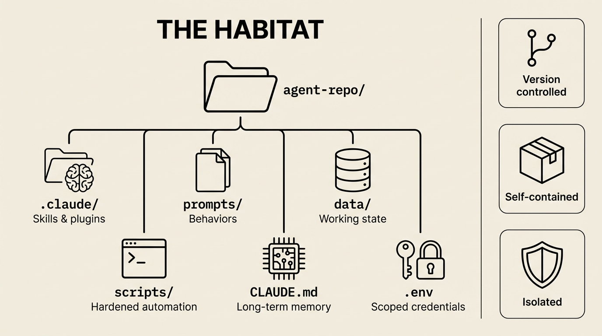
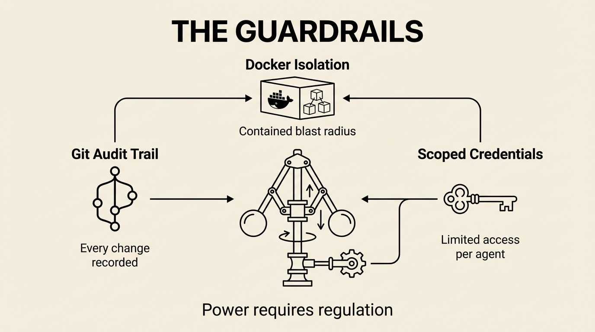

The [Data Flywheel](/posts/data-flywheel-pattern) showed how data flows through these systems — GitHub commits become weekly reports, Oura metrics become infographics, tweets become daily digests. But in every case, someone was sitting at a terminal typing commands. `/sync-with-github`. `/daily`. "Pull down the latest tweets."

What happens when you aren't there?

That's the question I've been working on for the past few weeks. How do you take something that works when you're driving it and make it run on its own? The answer turns out to be architectural: you need to think about agents differently. Not as conversations, but as habitats.

An agent isn't just automation with LLM calls. The difference is that an agent carries state, accumulates memory, and makes bounded decisions under uncertainty — and the repo is where all of that lives.

## The Lifecycle

Every agent I've built has followed the same maturity path. It starts as a conversation and ends as a cron job. The journey between those two points is where the interesting decisions happen.



**Stage 1: The conversation.** You're in Claude Code, figuring things out interactively. "Pull down tweets from my AI Engineers list." Back and forth — debugging rate limits, figuring out pagination, learning the API's quirks. This is exploration. You're paying for Opus and you don't care because you need the reasoning power.

**Stage 2: The prompt.** Once it's working, you extract the approach into a file. `prompts/fetch-tweets.md` captures everything: which endpoints, how to handle pagination, what to do when rate limits hit. Any future session can run this without the conversation. The knowledge lives in the repo now, not in a chat window.

```markdown
## Fetch Tweets

1. Load list members from `data/lists/ai-engineers.json`
2. For each member, fetch recent tweets via search API
3. After each API call, check `x-rate-limit-remaining` header
4. When remaining drops below 10, stop and process what you have
5. Save raw responses to `data/tweets/{username}/{tweet_id}.json`
6. Prioritize accounts with highest historical engagement
```

**Stage 3: The optimization.** You notice this prompt burns through your usage. The fetch part doesn't need Opus — it's mechanical. Wrap the deterministic parts in a shell script. Switch the model to Sonnet or Haiku. Keep the conversation mode only for the parts that need judgment: deciding what's important, clustering themes, writing the digest.

**Stage 4: The automation.** The shell script runs on a schedule. Claude gets called for the smart parts. The whole thing executes without you touching it.

Each stage trades flexibility for reliability and cost. A conversation can handle anything; a shell script handles one thing perfectly. The goal is to push as far toward automation as the task allows — but keep the conversation mode available for the parts that genuinely need intelligence.

## The Habitat

Here's the architectural insight that makes everything else click: **an agent is a git repo.** Not metaphorically. The repo literally IS the agent.



```
twitter-feed/
  .claude/           # Skills, marketplace plugins
  prompts/           # The agent's playbooks
  data/              # Working state (tweets, summaries)
  scripts/           # Hardened automation (fetch.sh, analyze.sh)
  CLAUDE.md          # The agent's long-term memory
  .env               # Scoped credentials (just Twitter API)
```

`CLAUDE.md` is memory — accumulated instructions, learned behaviors, edge cases discovered over time. `prompts/` are the agent's behaviors — what it knows how to do. `data/` is working state. `scripts/` are the parts that graduated from prompt to code. `.env` holds credentials scoped to exactly the APIs this agent needs.

Git gives you everything else for free. Version history: what changed and when. Rollback: undo something that broke. Audit trail: did the agent modify its own behavior? Check the diff.

I have half a dozen of these habitats now. A [Twitter feed](https://github.com/The-Focus-AI) that tracks curated lists and produces daily digests. A YouTube feed that downloads transcripts and generates summaries. A newsletter feed that pulls from Gmail and clusters by topic. An [operations tracker](/case-studies/ai-back-office) that synthesizes GitHub commits, meeting transcripts, and invoices into morning briefings. Each one is a self-contained repo with its own skills, its own credentials, its own accumulated knowledge.

The credential isolation matters. Each `.env` is scoped to one service. The Twitter agent has Twitter API keys. The newsletter agent has Gmail access. Neither can see the other's credentials. If something goes wrong — prompt injection, value drift (the agent's behavior diverging from your intent over time), whatever — the blast radius is contained.

When it's time to run these in production, Docker makes the isolation physical. The agent checks out its repo, spins up a container, does its work, and pushes results back to git. It cannot touch the host machine. It cannot access other agents' secrets. The container is the boundary.

We have this running in beta now — using Docker and [Dagger](https://dagger.io) to create repeatable, isolated environments for each habitat. Dagger is particularly good here because it lets you define the environment programmatically: which base image, which tools to install, which credentials to mount. The habitat config becomes code, not a manual setup checklist. Spin up a habitat, run the agent, tear it down. Reproducible every time.

You don't deploy agents. You deploy repos.

## Sharp Edges

Skills are text files. The agent can read and edit them. This is more flexible than MCP servers, which are compiled and locked away — but it introduces real risks.



A skill that works today can get subtly changed by an agent that thinks it's "improving" something. I've watched an agent fix a date formatting issue in a Google Sheets skill by rewriting the date parser — which then broke a different part of the skill that relied on the original format. Git caught it (the diff was obvious), but if nobody reviews the diff, the corruption accumulates.

Prompt injection is the scarier version. If an agent reads external content — a tweet, an email, a web page — and that content contains instructions, the agent might act on them. An attacker doesn't need to compromise the agent directly. They just need to plant text in a data source the agent consumes.

The mitigations are the same ones that make the habitat work: Docker isolation limits what an agent can access. Scoped credentials mean a compromised agent can only damage one service. Git provides an audit trail of every change. But these are safety nets, not guarantees.

The honest answer is that self-modifying agents are powerful and dangerous in roughly equal measure. I use them because the productivity gain is massive, and the git audit trail catches most problems. But I don't pretend it's solved.

## The Stack

Here's how it all fits together:

```
conversation → prompt → script → skill     (lifecycle)
git repo + tools + memory + credentials     (habitat)
docker/dagger + scoped .env + git audit     (isolation)
```

The lifecycle tells you how an agent matures. The habitat tells you how it's structured. The isolation layer tells you how to run it safely.

Start with one agent in a repo. Get it working interactively. Extract the prompt. Containerize it. That's the whole thing.

The patterns are the same whether you're tracking tweets or running a consulting firm's back office. An agent is a repo. The repo is the habitat. The habitat is self-contained. And if you need to understand what happened, `git log` will tell you.

This is how the data flywheel runs without you at the wheel.

What happens when you have a dozen of these habitats running? How do you coordinate them, monitor their sessions, and extract organizational knowledge from their logs? That's the next post.
