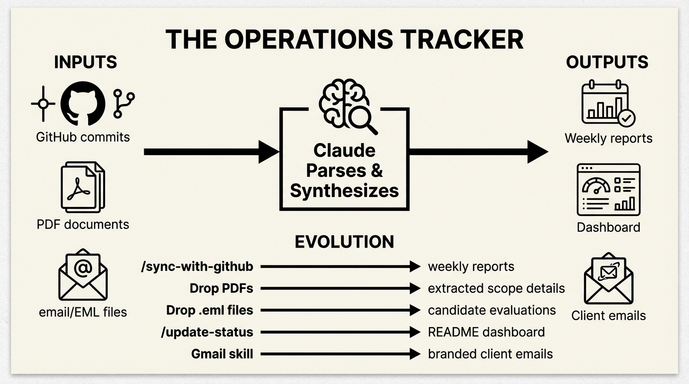
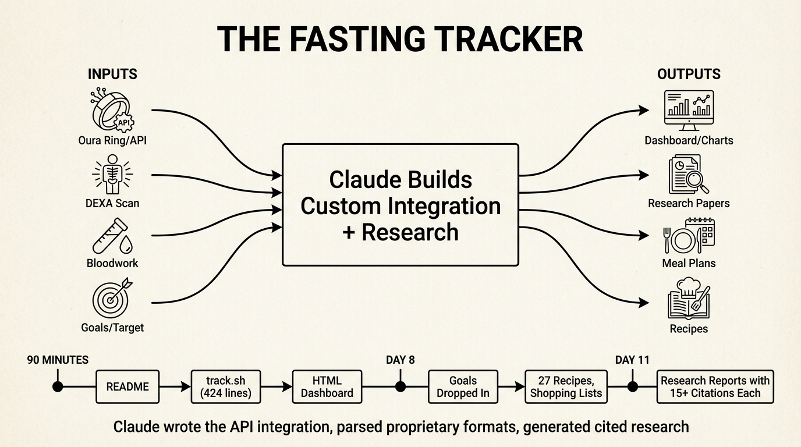
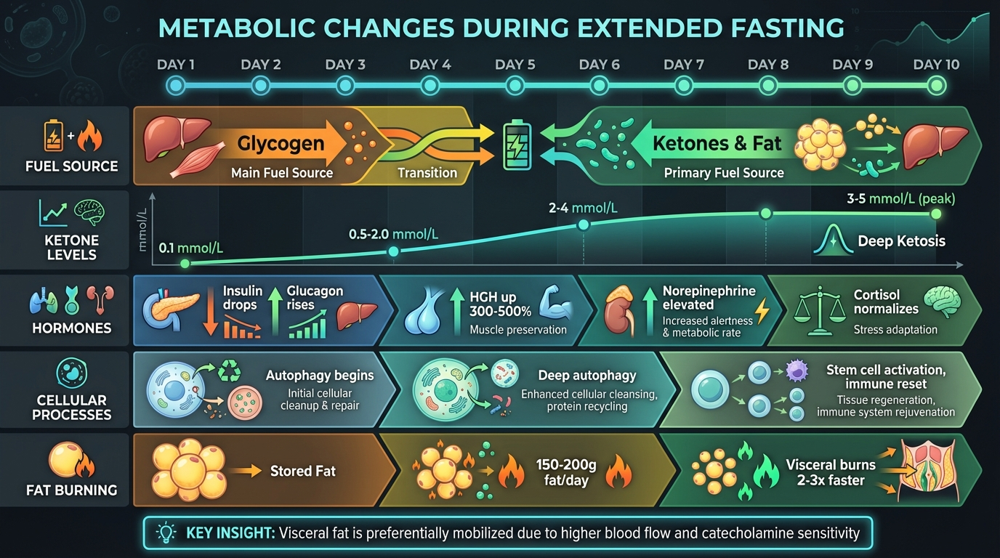
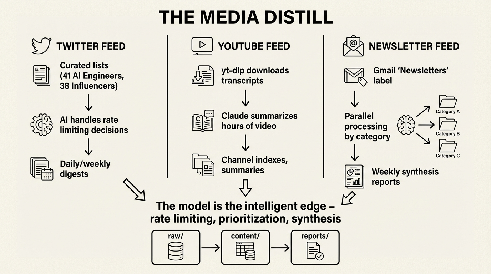
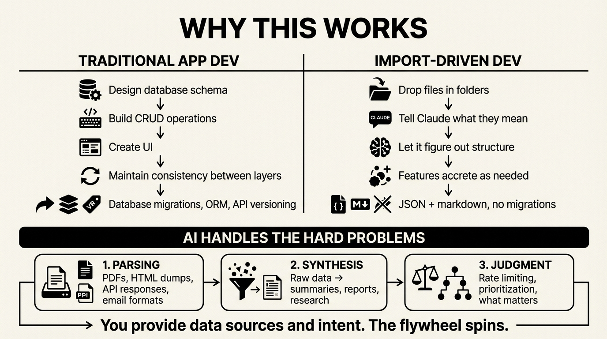

Claude Code -- and the others like Gemini CLI or Codex or Cursor -- is way more than vibe-coding.  There's a new style of application or systems that I've been building over the last few weeks, all using a similar, LLM at the heart of the flow, pattern.  One manages company operations, client projects, hiring pipelines, and invoices. One tracks a 11-day water fast (and the weeks after of refeeding) with body composition analysis and meal planning. One synthesizes content from Twitter, YouTube, and newsletters into weekly digests.

They look nothing alike, but they work the same way: data flows in, gets processed by an organically grown set of prompts and skills, and flows out transformed. I'm calling it **the data flywheel**.

The pattern: drop data into a folder. Let Claude parse it. Build views on top. The outputs become inputs for the next cycle.

## The Operations Tracker



November 2025. I needed to track consulting projects across multiple clients, a hiring pipeline, and invoices. The first approach was simple: tell Claude "I need to track my consulting projects" and let it scaffold the structure.

The result: 35 files organized into `projects/clients/`, `projects/labs/`, `hiring/`, with Claude Code commands to operate on them. No database. No API. Just markdown files and prompts.

The first real automation was `/sync-with-github`. I explained to Claude what I was looking for, and it figured out how to do that with the tools that it has available -- and the prompt it ended up with uses standard `gh` CLI tools—nothing custom:

```markdown
For each project with recent activity (pushed in last 14 days):

**Spin up a sub-agent** to:
1. Fetch git commit messages:
   gh api repos/The-Focus-AI/{repo}/commits --jq '.[0:20] | .[] | .commit.message'
2. Summarize what changed, current status, any blockers

**Store the analysis** in the project's folder:
- File name: `{YYYY}-W{week-number}.md`
```

Running `/sync-with-github` pulls commits from every repo in the organization, maps them to projects, and generates weekly reports. The Arcline client folder now has `2025-W46.md`, `2025-W49.md`, `2025-W52.md`, `2026-W02.md`, `2026-W03.md`—each auto-generated from actual git activity.

Here's what a weekly report looks like:

```markdown
# Arcline - Week 02 (Jan 6-10, 2026)

## Activity Summary

### arcline-core (main branch) - 10 commits this week

**Jan 10**
- Add LLM prompt coverage tests (8 new tests, 42 gemini tests passing)
- Add backfill enhancements with comprehensive error handling tests

**Jan 9**
- Add job heartbeat and staleness detection system
- Fixed gaps in event pipeline

## Status
**Highly Active** - Major infrastructure improvements in production.
```

That's not written by hand. Claude reads the commits and synthesizes them.

Then I started dropping in other data sources.

**PDF scopes**: Client contracts go in `scopes/`. I dropped in `Arcline 25_08_13.pdf`, `Vetted Network 25-06-16.pdf`, `Ridgeline Assessment.pdf`. Claude reads these and extracts architecture, phases, pricing, deliverables. The main project files get enriched automatically -- including project milestones, invoice schedules, all of it.

**Email applications**: When I posted a junior developer job, I quickly got too many replies.  So I plugged in our custom [google-skill](https://github.com/The-Focus-AI/google-skill) (more on that later) and let it pull down the EML files of the applications directory.  I dropped them into `hiring/applications/`. Claude reads each email, researches the candidate (LinkedIn, GitHub, portfolio), evaluates them against the requirements, and generates a structured assessment. 48 candidates processed this way. Each `.eml` becomes a `.md` with skills matrix, strengths, concerns, and a yes/no recommendation.

**The dashboard**: I realized I was running `/sync-with-github` and then manually checking files to understand status. So Claude built an aggregation layer. `README.md` became a dashboard—generated from all the underlying markdown files. The `/update-status` command regenerates it:

```markdown
### 1. Gather Data

Read these files:
- `invoices.md` - Outstanding and paid invoices
- `projects/clients/*.md` - All client project files
- `tasks.md` - Current tasks

**Weekly activity reports:**
- `projects/clients/*/YYYY-W*.md` - Most recent weekly report per client
```

Now when I open the repo, I see current status immediately—generated from underlying data.  Or I have it mailed to me each moring.

**Adding Gmail**: As needs grew, I added the `google-skill` plugin for email automation. `/email-status` sends a weekly digest with inline infographics. `/client-update` creates Gmail drafts for each client with branded HTML:

```bash
npx tsx scripts/gmail.ts draft \
  --to="{contact_email}" \
  --subject="{Client Name} Weekly Status - Week of {dates}" \
  --html="$(cat .claude/tmp/{client}-status-email.html)"
```

The trajectory: **structure → import commands → dashboard aggregation → communication automation**. By January there were 10 commands. The data flywheel: GitHub commits flow in, get synthesized into weekly reports, aggregate into dashboards, flow out as client emails.

## The Fasting Tracker



January 3rd, 4:49 PM. I started a 11-day water fast and wanted to track it, look up various health related questions, and plan how to properly to a refeed. Different domain, same pattern—but this one shows what happens when Claude builds custom integrations.

The first commit was just a README. Nine minutes later, the second commit added `track.sh`—a 424-line bash script that Claude wrote to pull from the Oura API. It authenticates via 1Password, hits six endpoints (sleep summary, sleep detail, readiness, activity, stress), and writes everything into `data.json`.

18 minutes after that, there's an HTML dashboard. By 6:11 PM—90 minutes from first commit—I had weight charts, Oura metrics as line graphs, a 10-day phase guide, and auto-refresh.

The app grew by dropping in data:

**DEXA scans**: I dropped in body composition images. Claude extracted the data and highlighted visceral fat as the key metric to track.

**Bloodwork**: I dropped in HTML exports from Function Health. Claude parsed the mess and pulled out relevant markers.

**Research**: I wanted to understand what I'd done to my body. Claude produced four scientific reports with 15+ citations each—metabolic changes, mental journey, fast-refeed cycles, refeeding protocols. The reports cite Cahill, Owen, and actual studies:

```markdown
# The Science of Metabolic Changes During Extended Water Fasting

*Sources: 15+*

## Phase 1: Glycogen Depletion (Hours 0-24)

The infographic claims ~100g liver glycogen. Research confirms:
"Liver glycogen provides 700-900 calories of glucose or energy,
an amount that will last 10-14 hours in individuals who are
not exercising" [1].

### Water Binding Ratio

The claim of 3-4g water per gram glycogen is supported by the
classic Olsson & Saltin 1970 study: "Body weight increased 2.4 kg
during this period... **3-4 g of water is bound with each gram of
glycogen**" [3].
```



**Meal planning**: The fast was ending. I dropped in my goals (90kg → 80kg by May, 1800 cal/day, 150g protein). Claude generated 27 recipes, shopping lists, and Sunday prep checklists. A single commit added 3,800 lines.

By day 12: 5,544 lines of HTML across 5 pages, 10 research reports, 27 recipes, daily infographics, and a meal prep system that schedules two ovens, a slow cooker, and an air fryer.

The trajectory: **custom API integration → data visualization → research synthesis → action planning**. Claude didn't just orchestrate existing tools—it wrote the Oura integration, parsed proprietary formats, and generated cited research.

## The Media Distill



The third system applies the pattern to content aggregation at scale. Multiple feeds—Twitter, YouTube, newsletters—each pulling from different sources, all converging on synthesized reports.

**Twitter** shows the model as intelligent rate limiter. The feed tracks two curated lists: AI Engineers (41 accounts) and AI Influencers (38 accounts). The interesting part isn't the API calls—it's how Claude handles constraints.

Twitter's API has aggressive rate limits. Rather than coding retry logic, the prompts make Claude the decision-maker:

```markdown
## Rate Limit Strategy

- Run 4-5 parallel searches
- Monitor remaining quota in responses
- When limit drops below 10, pause and process what you have
- Prioritize high-engagement tweets first to maximize value within limits
```

The model reads API responses, decides when to pause, what to prioritize, when to continue. Pagination isn't a loop—it's a conversation. The shell scripts handle saving; the intelligence is in the prompts.

Analysis is also prompt-driven. `prompts/analyze-today.md` declares what to load and how to synthesize:

```markdown
1. Load all tweet JSON files from `tweets/*/` directories
2. Load reply data from `tweets/{username}/{tweet_id}/replies.json`
3. Filter to tweets with `created_at` within the last 24 hours
4. Cluster tweets into thematic groups
5. Extract key points, debates, engagement metrics
```

The output: daily and weekly digests with clustered themes, quoted tweets, engagement metrics, and proper attribution.

**YouTube** uses `yt-dlp` to download transcripts without authentication. Each video becomes a markdown file with metadata and full transcript. Channel indexes aggregate everything. The model turns hours of video into scannable summaries -- and also be able to pull out interesting quotes.

**Newsletters** pulls from Gmail's "Newsletters" label. TypeScript scripts fetch emails; Claude agents process them in parallel by category (tech-ai, business, culture). Weekly synthesis reports link back to original sources.

All three feeds follow the same architecture:

```
raw/           # Untransformed API responses
  {partition}/
    {id}.json

content/       # Normalized markdown
  {category}/
    {source}/
      {date}-{slug}.md

reports/       # Generated synthesis
  {date}-{type}.md
```

The trajectory: **API integration → normalization → synthesis → distribution**. Each feed is a flywheel: content flows in from APIs, gets structured into markdown, gets synthesized into reports, flows out as email digests.

## The Data Flywheel


All three systems work the same way:

| | Operations | Fasting | Media Distill |
|---|---|---|---|
| **Input** | GitHub API, PDFs, emails | Oura API, DEXA, bloodwork | Twitter API, YouTube, Gmail |
| **Processing** | Prompts + CLI tools | Custom integration + research | Skills + AI rate limiting |
| **Storage** | Markdown files | JSON + HTML | JSON + markdown |
| **Output** | Dashboard, client emails | Infographics, meal plans | Daily/weekly digests |

The human provides data sources. The AI handles parsing, structuring, synthesis. The outputs become context for the next cycle.

**Operations flywheel:**
```
GitHub commits → weekly reports → dashboard → client emails
      ↑                                            ↓
      └──────── feedback from clients ─────────────┘
```

**Fasting flywheel:**
```
Oura API → daily metrics → trends → research → meal adjustments
    ↑                                               ↓
    └────────── body responds to meals ─────────────┘
```

**Media flywheel:**
```
APIs → raw content → synthesis → weekly digest → reading decisions
  ↑                                                    ↓
  └──────── curate sources based on value ─────────────┘
```

Each spin of the flywheel improves the system. Sources get curated. Synthesis gets sharper. Outputs get more useful.

## Why This Works



Traditional app development: design database schema, build CRUD operations, create UI, maintain consistency between layers.

Import-driven development: drop files in folders, tell Claude what they mean, let it figure out the structure.

The 424-line Oura script wasn't designed. I said "get my Oura data" and Claude wrote it. When I wanted sleep log entries, Claude added 80 more lines. Features accrete.

There's no database migration. No ORM. No API versioning. The data lives in JSON and markdown files. The views are static HTML or generated markdown. When the structure needs to change, Claude changes it.

The AI handles three hard problems:
1. **Parsing** - PDFs, HTML dumps, API responses, email formats
2. **Synthesis** - Turning raw data into summaries, reports, research
3. **Judgment** - Rate limiting decisions, prioritization, what matters

You provide the data sources and the intent. The flywheel spins.

## Starting Your Own

Pick something you want to track. Find a data source. Tell Claude to import it.

"I want to track my workouts using my Garmin data."
"I want to track my reading using Goodreads exports."
"I want to synthesize industry news from my RSS feeds."
"I want to track my projects using GitHub activity."

The first import creates the structure. The second import reveals what's missing. By the fifth import, you have a system.

Document the import process in CLAUDE.md so future sessions know how to do it. Build commands that automate the imports. Add views as you need them.

The app emerges from the data. You don't design it. You grow it.

The flywheel starts slow. Each spin adds momentum.
