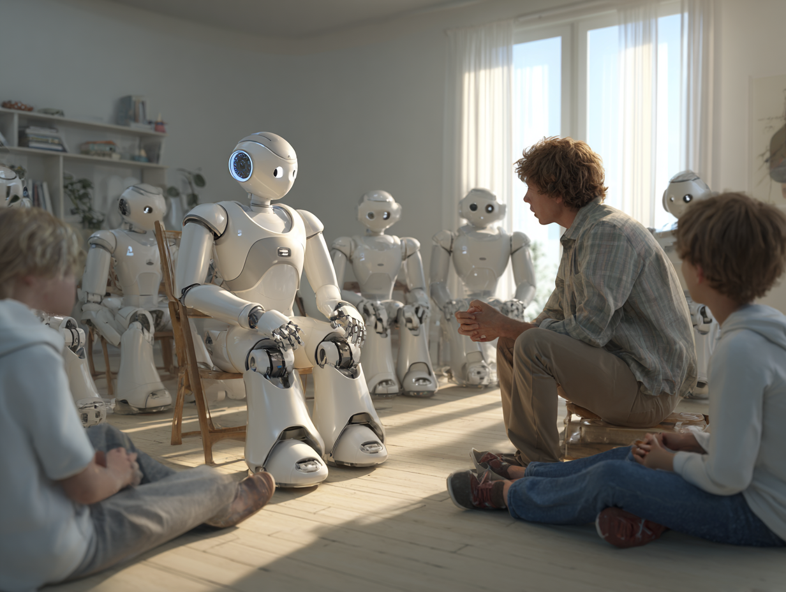
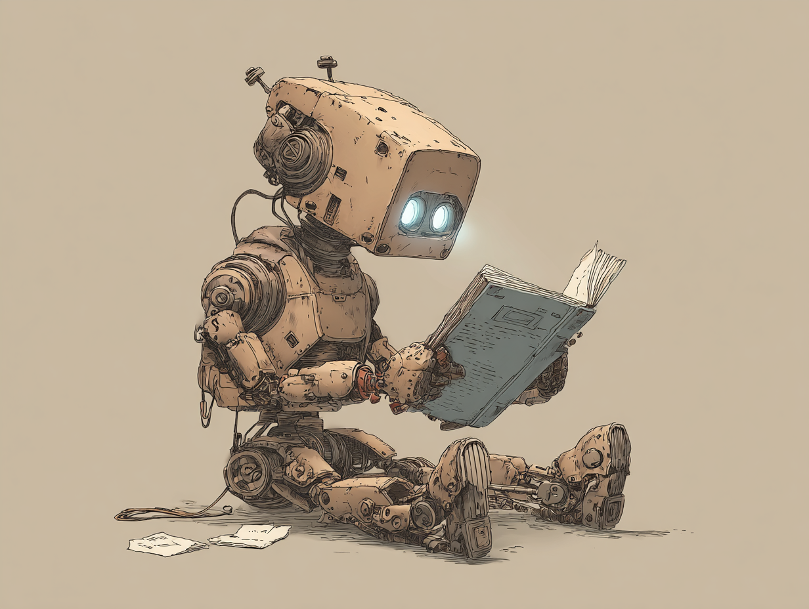

Agents are things you assign tasks to.

Compliant, infinitely patient knowledge workers.

There are moments of brilliance, moments of shocking stupidity, and moments where I suspect them of [malicious compliance](https://en.wikipedia.org/wiki/Malicious_compliance) there just trying to thwart me *by doing exactly what I'm telling them to do.*

Who should you hire?

We've reviewed 15 agents in detail to help you figure out which one of them are worth looking at, what a relationship with them would be like, and what sort of joy you would experience working with them.

[Download the report](/reports/)

They fall into roughly 4 categories:

* **IDE Agents**: [Copilot](https://github.com/features/copilot), [Cursor](https://cursor.com), [RooCode](https://roocode.com/), [Windsurf](https://windsurf.com/)
* **CLI Agents**: [aider](https://aider.chat/), [Claude Code](https://www.anthropic.com/claude-code), [Codex CLI](https://openai.com/codex/), [Goose](https://block.github.io/goose/)
* **Full-Stack Agents**: [Codex Agent](https://chatgpt.com/codex/onboarding), [Copilot Agent](https://github.com/features/copilot), [Cursor Agent](https://cursor.com), [Jules](https://jules.google.com/), [Replit](https://replit.com/),[Windsurf](https://windsurf.com/)
* **Hybrid Platforms**: [v0](https://v0.dev), [Warp](https://www.warp.dev/) (CLI-as-agent)

We go through how to install/access each one, what happens when you trigger it, how you'll feel during the process, and what the results will look like.
# What to know about software agents

## 1. Don't be passive aggressive with your agents

There will come a time where you still start writing in capital letters to your agents, perhaps pounding on the keyboard and holding down the exclamation key.  This will sometimes work, but resist the urge.  When it goes off the rails, step back, take a deep breath, roll back to a previous checkpoint back when things were good, and adjust your prompt by giving it a bit more context, asking it to review the existing code, and think through a plan with you.

*a calm and emotionally intelligent conversation between a fairly realistic and attentive humanoid robot and a teacher, with a bunch of other robots around resembling a drug intervention*
## 2. Long runs aren't impressive

"Claude went ran for 7 hours working on refactoring the code base."  This is not the brag you think it is.  It took Jules 6 minutes to complete a task that took Copilot agent 30 minutes.  The result was not 5 times better; it just took 5 times longer.  Cool from a technical perspective that the agent could stay on task, I take this to mean that its 5x stupider.  It would have been even better if it took 30 seconds.

*a person on a bicycle going by a person walking with a large backpack, Frederic forest, fine lines, designed with one or two lines , simplified, draft, scrap book, essentialistische only*

## 3. Match the implicit Software Development Lifecycle

Are you writing a one off script?  Are you running an experiment?  Are you growing a product from an MVP?  Are you battle hardening a production system in a way that would make an SRE proud?

Each of these tasks have a different set of tooling and development styles; one isn't better than the other, it depends upon what you do.  Do you prefer dynamic typing or static typing?  Well, that depends on if you are trying to move quickly or if you are trying to maintain a long term.

*a scene in the maine fall a row boat, a larger sail boat, and a battle ship*

## 4. Drop the ceremony

Agents that are more enterprise focused build with a lot more ceremony that's needed, and as a result you need to nudge them to keep things simply over and over.  

I don't need a build system and a modular multi-file code structure when inlining everything works just as well -- **especially because future me is going to use an agent to clean up the mess.**

*A traditional Japanese tea ceremony setup, but one person is using a mason jar and sitting cross-legged in jeans, joyful and respectful tone, gentle satire of formality, soft ambient lighting, warm colors, fusion of tradition and casualness,*

## 5. Technical debt is different now

If technical debt is a measurement of implied additional future work to change or maintain the system, and the cost of doing work is great decreased with the agents, current debt is reduced by adding in coding agents.  

Congratulations!  Yesterday's code suddenly got way better! 

*a black and white motivational poster than says "lets make better mistakes tomorrow"*
## 6. Coding Rules Everything Around Me

Rules are how we deal with guiding the agents over different runs.

Document how you want code written in the same repo as the code.

We've put infrastructure definition in code, now it's time to put development practices in the repo as well.  All of these agents are tuned with rules.  Cursor has a `.rules` directory, Claude has it's `CLAUDE.md` (read through [Claude Code Best Practices](https://www.anthropic.com/engineering/claude-code-best-practices) to learn a whole lot) and the Github Copliot agent expect you to add a whole bunch rules.

These rules can apply to specific files, or across the repo, but should document prefered ways to do things, architectural patterns, and other things.  We are going to shift to writing these and moving them around.

Technical debt means something different when agents can refactor.

*a robot reading a manual about itself. Entranced by what it is capable of.*

# This is what we know now

We'll see where we are at the end of the summer!