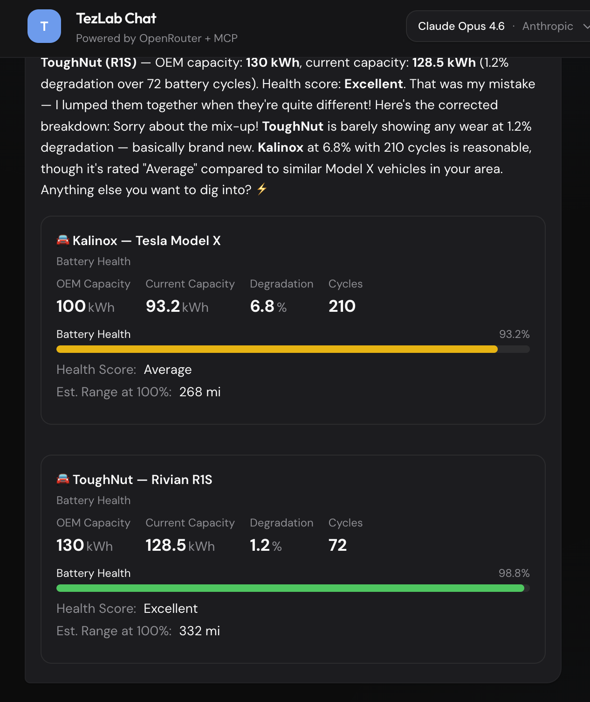
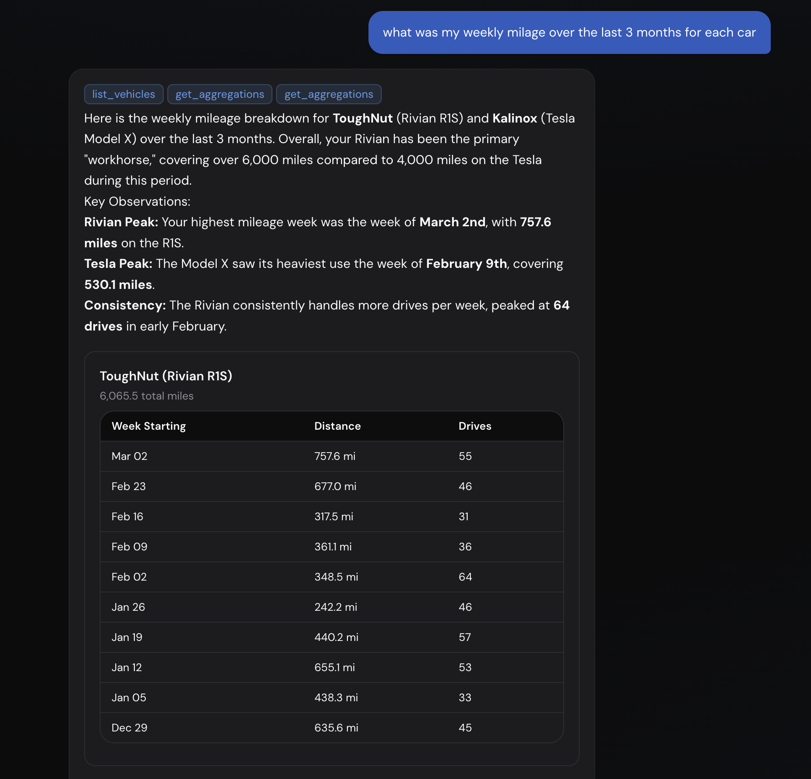

<!-- Replace the two post images with the right Desktop screenshots: (1) a chat or product UI where the model has generated structured UI—e.g. cards, charts, map, table in the reply; (2) tool use in action—e.g. chat with tool calls visible, or eval output showing which models called which tools. Save them as giving-models-ui-example.png and giving-models-tools-example.png in src/content/assets/posts/ and use the paths below. -->

We're used to models that *answer*. You ask, they reply in text. The next step is giving them the ability to **make their own**: their own choices about what to do next, and their own ways of showing you the result.

That means two things. First, **they decide what to call**—which tools, in what order, with what arguments. Second, **they decide what to show**—which cards, charts, and blocks to compose into a reply. Both depend on the same idea: give them a **constrained vocabulary**. Not "do anything," but "here’s what you can do; here’s what you can render." Then they can create.

---

## Making their own interface

The right screenshot here is one where **the model has composed the UI**: a chat reply that includes cards, a chart, a table, a map, or a timeline—not a static app screen. For example, a TezLab (or similar) chat where the user asked "Summarize my last week" and the assistant’s reply is a mix of text and generated blocks (metrics, bar chart, list). That’s the model making its own interface.

*Example: the model composes cards, charts, and gauges from data inside the conversation.*

What’s going on under the hood isn’t a fixed template. The model has access to **data** (drives, charges, aggregations) and a **vocabulary of UI components**: Card, Metric, BarChart, Sparkline, Gauge, Table, Timeline, Map, and so on. Each component has a schema—props, optional children. The model outputs **instructions** (e.g. JSON Patch: "add a Card, add a BarChart with these categories and values") and the app turns those instructions into real React (or whatever you use). So the model **makes its own** report: it chooses what to show and how to lay it out, within the guardrails you defined.

That’s generative UI. The model doesn’t write code or HTML. It chooses from a catalog and fills in the props. You keep control of styling, behavior, and safety.

---

## Making their own decisions

The other half is **tool use**. Give the same model a set of tools—list vehicles, get drives, get charges, get aggregations—and it has to *decide* what to call and in what order to answer something like "Summarize my last 10 days of driving."

The right screenshot here shows **tool use in action**: either (a) a chat UI where you can see the model calling tools (e.g. "get_drives", "get_charges") and then answering from that data, or (b) an eval output (terminal or dashboard) where each row is a model and you see which tools it called and whether it succeeded. So the reader sees models *making their own* choice of actions.

*Example: models choosing which tools to call and in what order.*

Some models nail it—they list vehicles, fetch drives, fetch charges, and aggregate without being told the exact sequence. Others call the wrong tools or none at all. The point isn’t to shame the low scorers; it’s that **making their own** here means: given a schema of tools and a user goal, the model chooses the actions. No hard-coded flow. You define the vocabulary (tool names, parameters, descriptions); the model composes the plan.

So we have two sides of the same idea:

1. **Making their own interface** — vocabulary of UI components + data → model composes the report or dashboard.
2. **Making their own decisions** — vocabulary of tools + user intent → model composes the tool chain.

In both cases, the **vocabulary** is the contract. Tools have parameter schemas and descriptions. Components have props and slots. The model stays inside that contract, so you get creativity without arbitrary code or arbitrary API calls.

---

## Why it matters for products

If your product is "ask in natural language, get an answer," you’re only using half of what models can do. The rest is:

- **Act** — call your APIs, your MCP server, your data layer, in an order the model decides.
- **Present** — render the answer as structured UI (tables, charts, maps, timelines), not just a wall of text.

That’s what "giving models the ability to make their own" is about. Not "let the model do whatever it wants," but "give it a clear vocabulary of actions and of views, then let it choose what to do and what to show." The screenshots above are two snapshots from that world: one where the model composes a weekly report from real data and a component catalog, and one where many models are evaluated on how well they compose a tool-use plan. Both are the same pattern. Define the vocabulary. Let the model make its own.
