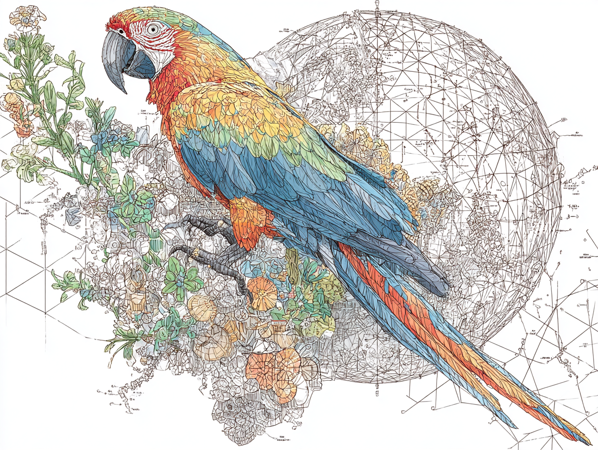
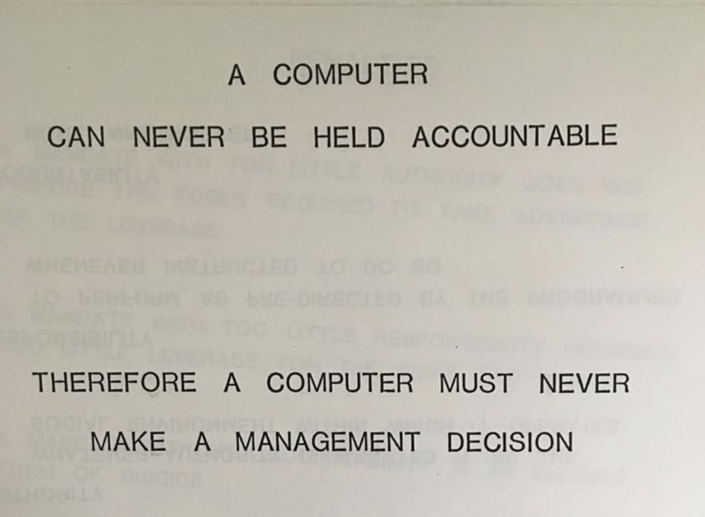

Imagine two men on a train -- or perhaps just walking; the memory varies -- one is [Piero Sraffa](https://en.wikipedia.org/wiki/Piero_Sraffa) and deep in conversation he flips off [Ludwig Wittgenstein](https://en.wikipedia.org/wiki/Ludwig_Wittgenstein), fingertips sweeping outward beneath the chin—the gesture we’d recognize as a *fuggettaboutit* blow-off.  *Ma che dici!*

In the (likely apocryphal) story this is the moment when Wittgenstein -- still committed to the austere architecture of the [Tractatus Logico-Philosophicus](https://people.umass.edu/klement/tlp/tlp.pdf) -- has his conversion, and True Thought can only be from within the world, not looking on detached.

The Tractatus held that every proposition shares its logical form with the reality it depicts: the same multiplicity of elements, the same crystalline structure. Language is a logical picture—nothing more, nothing less.

Sraffa -- an economist, not a philosopher by trade but sharp enough to hear the machinery grinding -- loses patience. He flicks his fingers outward beneath his chin: contempt, dismissal, fuggettaboutit -- perfectly intelligible to anyone raised in the old Italian world, or to anyone who has seen The Godfather.

Then the question:  “What is the logical form of *that*?”

A gesture that means something because people share practices and expectations. Wittgenstein later said the exchange left him feeling like a tree stripped of branches. The *Tractatus* was beautiful ice; this was the rough ground beneath it.

The moment -- whether it happened on a train or not -- helped push him toward the dismantling that became the [*Philosophical Investigations*](https://archive.org/details/philosophicalinvestigations_201911). He abandoned the search for underlying logical form. Meaning is not reference to a hidden structure or private picture. Meaning is use: the role a word plays in the language-games we actually play.

Ordering at a counter. Telling a bad joke. Praying. Lying. Describing pain.

These games hang together only within a “form of life”: embodied, social, corrigible, entangled with the world we bump against. There is no deeper essence waiting to be mapped.

⸻

### The Parrot Paper Reads Like Early Wittgenstein in Disguise

Jump to 2021. Emily Bender and colleagues — including the pseudonymous Shmargaret Shmitchell, I'd love to know the back story on that — publish "[On the Dangers of Stochastic Parrots](https://dl.acm.org/doi/10.1145/3442188.3445922)."

As Margaret Mitchell [later clarified](https://medium.com/@margarmitchell/no-ai-is-not-a-stochastic-parrot-a99e57766bed), the metaphor was meant specifically for large language models, not for AI systems in general.

Their claim: large language models do not understand. They recombine patterns from vast text corpora. No access to speaker intent, no model of a listener’s mind, no causal tether to the non-linguistic world. Just form, stitched together statistically.  (Also they stole a bunch of stuff.)

This is the old weak vs strong AI debate about intelligence, echoing John Searle’s [Chinese Room](https://rintintin.colorado.edu/~vancecd/phil201/Searle.pdf). The outputs may be correct -- the slips of paper emerging from the room are flawless Mandarin, more on that later -- but so what?

Behavioral indistinguishability, the argument goes, is not enough for mindedness if the causal story is wrong.

In the thought experiment, the man inside follows rules he does not understand. The room produces meaning-shaped artifacts without any constituent part meaning anything. Syntax, however elaborate, does not produce semantics.

The Stochastic Parrots paper’s force lies in its refusal of anthropomorphic comfort. It refuses to credit the system with meaning when all it has is correlation—albeit at planetary scale. The risks follow naturally: biases frozen in data, energy profligacy, fluent bullshit mistaken for knowledge.

But notice the premise beneath the critique. The paper assumes genuine meaning requires reference-some grounding in the world, some pairing of linguistic form with lived experience.

That assumption is strikingly Tractarian. Language must picture reality or it is not really language at all.

Late Wittgenstein would regard this as precisely the confusion his later work tried to dissolve. Meaning does not require a hidden anchor in the speaker -- or the machine. If an utterance functions successfully within a language-game -- if it answers coherently, follows instructions, elicits the expected reactions—then within that game it has meaning.

Demanding an occult “reference to meaning” inside the system risks repeating the bewitchment that made early Wittgenstein insist every proposition mirror reality’s logical skeleton.

⸻

### The Room That Passes Every Test and Understands Nothing

Searle approaches the issue differently. His Chinese Room does not deny that the outputs are correct. The Mandarin is flawless.

The point is narrower: correct behavior does not guarantee understanding. The man inside follows rules he does not comprehend; the room produces meaning-like outputs without genuine understanding anywhere inside it.

Syntax, however elaborate, does not secrete semantics.

Here Searle and late Wittgenstein partly converge. Both reject the idea that correct outputs settle the matter. Wittgenstein says meaning requires participation in a form of life. Searle says understanding requires the right kind of causal process -- one that, in us, arises from biological systems evolved to couple organism and environment.

Where they diverge is on what would suffice. Searle suspects biology may possess causal powers computation cannot replicate. Wittgenstein refuses the speculation. He would simply point to practice and say: look, don’t think.

Behavioral indistinguishability is not sufficient if the causal story is missing. Whether that story must be biological -- or could be engineered in silicon through interaction and feedback -- remains open.

What is not open is the shortcut: no amount of next-token prediction, however fluent, settles the question by fiat.

⸻

### Embodiment Changes the Score, Not the Game

As Margaret Mitchell later pointed out, the “stochastic parrot” critique was meant specifically for large language models, not for AI systems in general. Fair enough. AI is a broader field: robots perceive, agents act, systems interact with the world.

But the philosophical tension remains.

Large language models do not actually play our language-games. They simulate the strings we produce while playing them.

They have no history of correction. No community that can shame them, forgive them, fire them, or trust them again. Nothing is at stake in what they say.

When Sraffa’s gesture lands, it lands because two humans share a dense background of expectations and consequences. A flick of the chin -- *ma che dici* -- works because everyone involved has spent a lifetime learning when such things matter.

A language model can describe the gesture perfectly. But it has never been trained by the rough ground that gives it force.

Humans are stochastic too. Our next sentence depends on everything we have seen and lived through. But we are stochastic inside a form of life—corrected by others, vulnerable to consequences, responsible for what we say.

The machine is stochastic outside one.  The danger isn’t that the machine lacks some secret inner understanding. The danger is our willingness to treat fluent simulation as participation.

Sraffa’s gesture worked because two bodies shared a world.
