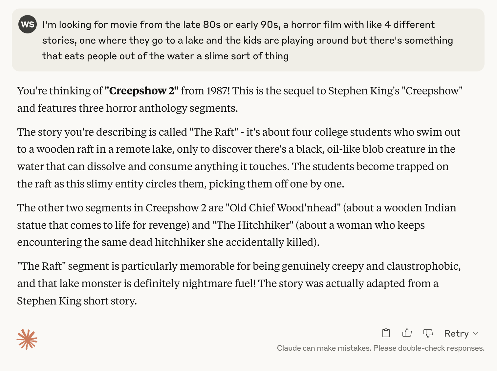

One fun usecase is to use the models extensive knowledge to find movies or books that are like something that you liked.  Looking for a movie recommendation?

>What are other movies like Knives Out?

That was a big hit in our family, and the kids loved it.  (We saw the second one, but it wasn't as marvelous.). It finds some gems, and you can also follow up with asking it what is similar to specific aspects to it.

Simple, but powerful in the "what do you want to have for dinner sort of way."

Sort of remember the movie?  Describe it and see what comes up:

This was an amazing trip down memory lane by the way, the car of the raft scene always stuck out in my mind and reminds me of listening to Van Halen.

