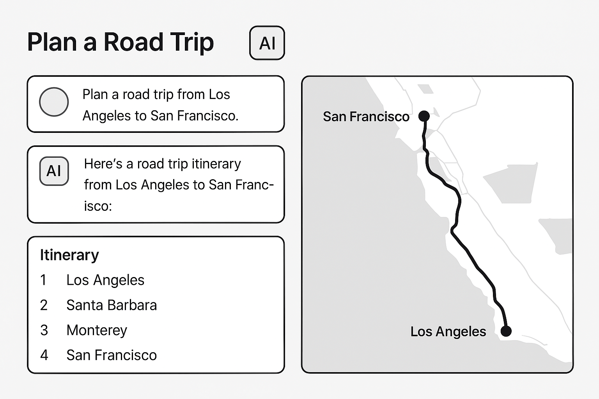

Here's a couple fun little tricks. Let's first go into Chrome, open up the dev tools. And did you know that Chrome has a command palette?

Do `CMD-SHIFT-P` and capture a full screenshot.  Drag that over into a new ChatGPT window, and then prompt it something like:

> You are a user experience designer that is building some wireframes for an application. Attached is the screenshot of the homepage of this application. And you are working on a pitch deck for a new AI driven experience based on this same functionality. I want to see an image that is 16 by 9 ratio that shows a high fidelity wireframe mock-up of a user asking about planning a road trip from one spot to another and then the AI returning a map and itinerary of where you want to go. Make sure that this output image is in the correct output format and that it's a web design artifact.

