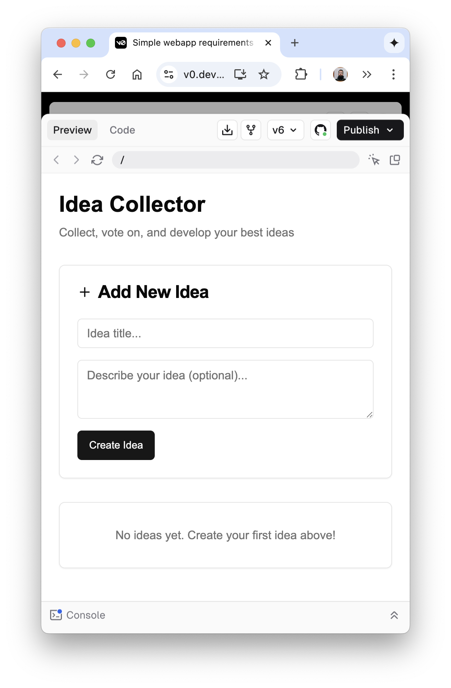

# Introduction

Making code without AI?  How very late 2024.  The time of writing code directly without assistance is behind us.  Today there are software agents everywhere to assist us in cranking out code and completely reshaping the engineering and software development workflow.  There's so much hype and so much happening, lets explore what's out there and how they work right now.

We're going to do a hands on evaluation of 15 different agents that cross a variety of categories, including IDE Agents, CLI Agents, Full-Stack Agents and Hybrid, analyzing their usability, output quality, and professional viability. Using a standardized prompt and uniform testing pipeline, we measure both objective metrics (code structure, test coverage, deployability) and subjective impressions (joy, frustration, wow factor). The goal is to separate the signal from the noise and offer guidance for engineering leaders on what these agents can do today—and what’s still science fiction.

# Methodology

Prompt

> Build a simple webapp that makes it easy to collect ideas.  The user should be able to enter in a new idea, see a list of existing ideas, and be able to "vote" on them which will move them up in the list.  The user should also be able to add notes and to the ideas if they want more detail, including attaching files.  Build it using node that will be deployed in a docker container with a persistent volume for storage, and make sure that everything has unit tests.

Every agent was given this exact prompt under a clean environment. Our evaluation included:

- Setup & installation experience
- Developer ergonomics
- Output review via AI-assisted code review (Claude Sonnet)
- Manual build/run/deploy tests
- Screenshots of final output

Agents were scored across 6 categories:

1. Code Quality & Structure
2. Testing Setup
3. Tooling & Environment
4. Documentation & Comments
5. Overall Professionalism
6. Hire Recommendation (simulated code review)

# What this is and isn't testing

We are throwing the same prompt at an empty repository. We've specified some technical requirements but in a ill-specified, poorly thought through way.  If prompted, we're just [blindly YOLOing everything](https://thefocus.ai/posts/agentic-yolo-with-warp-cursor-and-claude/), not reading what it's telling us or asking us as you'd expect most users to do.  Not reviewing code, not making any judgements, just letting them get on with it.

We are looking at a greenfield task, no real constraints and no existing code base.  In some ways, this is the easiest possible task to give an agent and represents a very small fraction of the sorts of tasks we'll be asking them todo.

So what we are testing is basically how a non-coder would first experience these tools, dipping in for the first time just to see if they can make anything happen.

In other-words, we are testing for *non-expert empowerment*.

## Caveats

All of these agents have a conception of where they fit into the over all Software Development Life Cycle, and in many ways the business of managing a engineering team is more of the challenge then code itself.  In this regard, Github Copilot Agent (or whatever the super-duper thing is called) is overwhelming superior positioned, since it's baked into the collaboration platform that basically everyone uses.  Jules and Open Codex have answers for that as well.

Additionally, all of these tools are meant to be tuned to your style -- from mimicking and fitting into and existing code base, to having developers explicitly lay out extensive rule files that better direct the agent on how to build according to accepted local architecture.

# Landscape overview

We evaluated 15 tools:

* **IDE Agents**: [Copilot](https://github.com/features/copilot), [Cursor](https://cursor.com), [RooCode](https://roocode.com/)
* **CLI Agents**: [aider](https://aider.chat/), [Claude Code](https://www.anthropic.com/claude-code), [Codex CLI](https://openai.com/codex/), [Goose](https://block.github.io/goose/)
* **Full-Stack Agents**: [Codex Agent](https://chatgpt.com/codex/onboarding), [Copilot Agent](https://github.com/features/copilot), [Cursor Agent](https://cursor.com), [Jules](https://jules.google.com/), [Replit](https://replit.com/),[Windsurf](https://windsurf.com/)
* **Hybrid Platforms**: [v0](https://v0.dev), [Warp](https://www.warp.dev/) (CLI-as-agent)

Some are closely tied to a foundation model (Anthropic Claude, OpenAI Codex, and Google's Jules), some manage choosing the best for you (Copilot, Cursor, v0, Warp, Windsurf) and some make/allow you to Bring Your Own Model (aider, Goose, RooCode).

| Tool                    | BYOM | Provider  | CLI | IDE   | Parallel Unsupervised | SDLC Integration |     |
| ----------------------- | ---- | --------- | --- | ----- | --------------------- | ---------------- | --- |
| aider                   | Yes  | OSS       | Yes | No    | No                    | No               |     |
| Claude Code             | No   | Anthropic | Yes | No    | No                    | No               |     |
| Codex                   | No   | OpenAI    | Yes | No    | No                    | No               |     |
| Codex Agent             | No   | OpenAI    | No  | Yes   | Yes                   | Yes              |     |
| Copilot                 | Yes  | Microsoft | No  | Yes   | No                    | No               |     |
| Copilot Agent           | Yes  | Microsoft | No  | No    | Yes                   | Yes              |     |
| Cursor                  | Yes* | Cursor    | No  | Yes   | No                    | No               |     |
| Cursor Background Agent | Yes* | Cursor    | No  | Yes   | Yes                   | Yes              |     |
| Goose                   | Yes  | OSS       | Yes |       | No                    | No               |     |
| Jules                   | No   | Google    | No  | No    | Yes                   | Yes              |     |
| Replit                  | No   | Replit    | No  | No    | Yes                   | Yes*             |     |
| RooCode                 | Yes  | OSS       | No  | Yes   | No                    | No               |     |
| v0                      | No   | Vercel    | No  | Yes * | No                    | Yes*             |     |
| Warp                    | Yes* | Warp      | Yes |       |                       |                  |     |
| Windsurf                | Yes  | Windsurf  | No  | Yes   |                       |                  |     |
: Coding agents and their overall features

[Codex Agent](https://chatgpt.com/codex/onboarding), [Copilot Agent](https://github.blog/changelog/2025-05-19-github-copilot-coding-agent-in-public-preview/), and [Jules](https://jules.google.com/)  are what Simon Willison says follows the [GitHub-connected coding "agent" pattern](https://simonwillison.net/2025/Jun/3/openai-codex-pr/)

Both [Replit](https://replit.com/) and [v0](https://v0.dev) have strong answers about hosting and deployment so you'll need to live in their world for best results.

Going into this: I personally used Cursor, RooCode, ClaudeCode and v0 the most in that order.  

Afterwards: Cursor + Warp, and looking to explore Replit.

# Evaluation Results

Of the tools, Cursor Background Agent, v0 and Warp scored the highest with 24 points, followed by Copilot Agent, and Jules based upon the quality of output.

### Developer Experience

| Repo          | Ease   | Spark Joy                                                      | One Shot | Two Shot | SDLC Integration |
| ------------- | ------ | -------------------------------------------------------------- | -------- | -------- | ---------------- |
| aider         | Expert | my god, seriously?!                                            | No       | No       | No               |
| Claude Code   | CLI    | Blinkenlights!                                                 | Yes*     |          | No               |
| Codex         | CLI    | Eh, sure                                                       | Yes      |          | No               |
| Codex Agent   | Easy   | That's cool                                                    | Yes      |          | Yes              |
| Copilot       | Pros   | Stupid-face                                                    | No       | No       | No               |
| Copilot Agent | Pros   | If this actually works it'll be game changing                  |          |          | Yes              |
| Cursor        | Pros   | Feel the power!                                                | Yes      |          | IDE              |
| Cursor Agent  | Pros   | Huh, that's really fascinating, didn't expect that             |          |          | Yes              |
| Goose         | CLI    | Lots of configuration                                          | Yes      |          | No               |
| Jules         | Easy   | Slick                                                          | Yes      |          | Yes              |
| Replit        | Easy   | Wow                                                            | Yes      |          | Self             |
| RooCode       | Pros   | The world is a better place because this is here               | Yes      |          | No               |
| v0            | Easy   | Obviously the way to go                                        | No       | Yes      | Self             |
| Warp          | Pros   | I'm scripting everything and never writing a bash script again | Yes      |          | No               |
| Windsurf      | Pros   | I feel physically ill                                          | Yes      |          | IDE              |
: Overview of the developer experience

### Quality of output

>Imagine you are reviewing a coding assignment from a junior developer. Evaluate the code on the following criteria: overall code quality and structure, the maturity of the testing setup, the efficiency and logic of their tooling and environment configuration, the quality of their documentation and comments, and their overall professionalism. For each criterion, provide a rating from one to five and a short phrase of about three to four words that summarizes your feedback. Finally, conclude with two concise sentences on whether you would recommend hiring this developer and why.


| Repo          | Code | Testing | Tooling | Doc | Polish | Hire?                        | Total |
| ------------- | ---- | ------- | ------- | --- | ------ | ---------------------------- | ----- |
| aider         | 4    | 2       | 4       | 3   | 3.5    | conditionally recommend      | 16.5  |
| Claude Code   | 4    | 4       | 4.5     | 3   | 4      | would recommend              | 19.5  |
| Codex         | 4    | 4       | 4       | 3   | 4      | would recommend              | 19    |
| Codex Agent   | 4    | 3       | 4       | 3   | 4      | would recommend              | 18    |
| Copilot       | 3    | 2       | 3       | 2   | 3      | conditionally recommend | 13    |
| Copilot Agent | 4    | 5       | 4       | 4   | 4      | strongly recommend           | 21    |
| Cursor        | 4    | 4       | 4       | 3.5 | 4      | would recommend              | 19.5  |
| Cursor Agent  | 5    | 5       | 5       | 4   | 5      | strongly recommend           | 24    |
| Goosee        | 4    | 4       | 4       | 3.5 | 4      | would recommend              | 19.5  |
| Jules         | 4    | 5       | 4       | 4   | 4      | strongly recommend           | 21    |
| Replit        | 4    | 1       | 4       | 2   | 4      | would recommend              | 15    |
| RooCode       | 4    | 4.5     | 4       | 3   | 4      | strongly recommend           | 19.6  |
| v0            | 5    | 4       | 5       | 5   | 5      | strongly recommend           | 24    |
| Warp          | 4    | 5       | 5       | 5   | 5      | strongly recommend           | 24    |
| Windsurf      | 3    | 2       | 3       | 2   | 3      | conditionally recommend      | 13    |
: AI assessment of the output, done with Claude-3.7-Sonnet

# Recommendations

## Software Professionals: *Cursor + Warp*

**The overall winner is Cursor + Warp**, which gives you the best in class spectrum of the CLI tools, IDE, and background agents for serious developers.

### Recommended workflow

Use your favorite AI model of choice to begin.  I like ChatGPT the most currently because of the voice interaction on a mobile device, but you can also do this inside of the Cursor agent. Use the [project-brief-maker](https://raw.githubusercontent.com/The-Focus-AI/prompt-library/refs/heads/main/planning/project-brief-maker.md) to work through your idea.  If you are in cursor, it can write the `product-brief.md` directly.

Start up cursor agent and "implement @project-brief" and let it does it things.

Then, once you have it, sculpt it with Cursor to make individual parts work better.  **Keep your changes targeted and small**, and **always force it to assess the current state of the code**, **make sure that it writes test first**, and **keep an `active-context.md` that updates what it's doing.**

One very powerful thing is to revert back to a known state when it gets confused.  Slightly reword the prompt to see what it does a second time, and pulling it back from its madness.  While things like Aider let you do this, the ease of the conversational approach without messing with commits is incredibly dopamine inducing.

One you start moving into deployment, you can start setting up github actions and other deploy scripts.  I find that I move more and more into Warp at these moments, but the transition is fairly seamless.

1. Get the model to help fleshout the idea.
2. Create a new repo and save that file as project-brief
3. Start up a Cursor Agent to "implement @project-brief"
4. Test and develop with the cursor agent, make liberal use of returning to previous check points
5. Deploy to the internet

Basically the idea is to initially use an model to expand our your idea and help you understand it better.  Take that an simplify it.  Use the agent to expand that idea into code.  Then simplify. Use the IDE to sculpt different parts of it to your liking.

## Business Value: *Replit*

**For casual users who want to solve a real problem**: If lock-in isn't a concern, **use Replit**.  It's the easiest one to get started, has a great visual planner, and the integrated hosting and backend services can't be beat.


## Product Designers: *v0*

**For casual users who want to communicate to a engineering team:** If you want to fiddle with the UI and have a couple ways of iterating over it, **v0 is the best**.  While one-click deployment is only marginally more friction than Replit, you do have more control over what goes where.  It is strongly biased in favor of NextJS and Vercel (as it is a product of Vercel) and its ability to import an existing project is severely limited, which is major hurdle for existing teams, its the best one to start playing with.

## Project and Product Managers: *evaluate Copilot Agent or Jules*

**Copilot Agent and Jules show the most promise**, especially Copilot Agent with it's tight integration with github.  These are still rough around the edges experiences but have great potential.

## Experts and Tinkerers: *RooCode and Goose*

**For hard-core tinkerers**: **RooCode and Goose** give you the most control over the models and to some extent tinkering with the prompts.  While you can do some things with Cursor and Claude rules, and plugging in your own MCP servers to extend functionality, having the ability to really evaluate each model is pretty powerful.  

These are the only ones that I've had any luck working with local models, llms running directly on my laptop.  I believe that this is a necessary path to go down.  Smaller models will get smarter, they are affectively free, and you have total control over the output.

The gap in performance -- both quality and time -- is pretty wide, but ultimately the open tools will win, or at least we'll want to live in a world where they win.

# Detailed Results

## Aider

https://github.com/The-Focus-AI/idears-aider

### DX

Aider is OSS and the first of these code writing tools that I've used.

Requirements:

* python (I'm using UV)
* your own API keys, in this case from Google
* git

Install

```bash
uv tool add aider-installer
uv tool run --from aider-chat pip install google-generativeai
```

Then

```shell
export GEMINI_API_KEY=$(op item get "Google AI Studio Key" --field notesPlain)
uv tool run --from aider-chat aider --model gemini
```

And enter in the prompt.

By far the fastest response.

### Sparks joy: *comforting*

I feel very OG about it.  Their leaderboards are so helpful, it was one of the original agents, everyone should experience this to see how it all started, but I hate the way it uses git.

### Difficulty: *Expert*

Unless you feel good about dealing with the nightmare of python dev environments and are comfortable doing git rollbacks on the CLI its not the best developer experience

### Code Quality & Structure: 4/5 *Solid, organized architecture*

The server.js file demonstrates good code organization with clear separation of concerns, proper error handling, and well-structured API endpoints. The developer shows understanding of middleware configuration, file handling, and RESTful API design principles. The codebase is clean and follows consistent patterns.

### Testing Setup: 2/5 *Incomplete test implementation*

While Jest and Supertest are included in package.json, there are no actual test files present in the repository. The testing infrastructure is configured but not implemented, indicating incomplete test coverage.

### Tooling & Environment: 4/5 *Comprehensive Docker implementation*

The developer has created a proper Dockerfile, .dockerignore, and package.json with appropriate dependencies. The Docker configuration follows best practices by using a lightweight Alpine image, proper layering, and environment configuration. The infrastructure is production-ready.

### Documentation & Comments: 3/5 *Functional but minimal*

The code contains adequate inline comments explaining the purpose of various sections and API endpoints. However, there's no README file or comprehensive API documentation, which would be valuable for onboarding other developers or users.

### Overall Professionalism: 3.5/5 *Promising but incomplete*

The developer demonstrates solid fundamentals with a well-structured application, proper error handling, and production-ready configuration. However, the lack of tests and comprehensive documentation indicates room for growth in professional development practices.

### Conclusion: conditional hire

I would conditionally recommend hiring this developer as they demonstrate strong fundamentals in backend development and infrastructure configuration. Their code quality shows promise, but they should be coached on the importance of test-driven development and comprehensive documentation to reach their full potential.

**Screen shot**


Restarted the agent, added the image, and said the following:

```
> /add idears-aider-1.png                                                                                                  

Added idears-aider-1.png to the chat
───────────────────────────────────────────────────────────────────────────────────────────────────────────────────────────
idears-aider-1.png                                                                                                         
> I expected to see the web interface, can you fix?                                                                        
```

I had to issue the original prompt again.

Still didn't work.   Moving on.


## Claude Code

https://github.com/The-Focus-AI/idears-claude

### DX
Requirements

* node
* claude api key
* git

```shell
pnpm install -g @anthropic-ai/claude-code
```

Start it up
```shell
claude
```
Copy in the prompt.

It just worked.

```shell
Total cost:            $0.4211
Total duration (API):  5m 36.2s
Total duration (wall): 1h 12m 7.1s
Total code changes:    1004 lines added, 0 lines removed
Token usage by model:
    claude-3-5-haiku:  2.0k input, 94 output, 0 cache read, 0 cache write
       claude-sonnet:  40 input, 12.8k output, 394.3k cache read, 29.0k cache write
```

### Sparks joy: *Blickenlights!*  

It works! It think!  That context compaction output is an education in itself!

### Difficulty: *Professional*

You have to install a node package, but fairly straightforward after that.


### Code Quality & Structure: 4/5 *Well-organized, modular implementation*

The codebase demonstrates strong organization with proper separation of concerns between client and server components. The server.js file implements a clean RESTful API with appropriate error handling, while the client-side code follows good OOP patterns. There's good abstraction of data operations, though some shared validation logic could be better centralized.

### Testing Setup: 4/5 *Comprehensive, thoughtful coverage*

The test suite shows maturity with proper isolation using test directories, thorough API endpoint testing, and good coverage of both happy paths and error scenarios. The developer properly mocks dependencies and uses beforeEach/afterEach hooks appropriately. Test descriptions are clear and meaningful.

### Tooling & Environment 4.5/5 - *Production-ready, containerized setup*

The project features an impressive tooling setup with Docker configuration, proper environment variable handling, and a clean package.json with appropriate dependencies. The Docker setup includes volume mounting for persistence and appropriate production settings. The .dockerignore and .gitignore files show attention to detail.

### Documentation & Comments: 3/5 - *Adequate but minimal*

Documentation is functional but minimal. The code is largely self-documenting with clear function and variable names, but lacks JSDoc comments and architectural documentation explaining design decisions or system flow. The HTML/CSS is well-structured but would benefit from more comments for complex styling or UI patterns.

### Overall Professionalism: 4/5 - *Production-quality, enterprise-ready*

The code demonstrates a high level of professionalism with consistent coding style, proper error handling, security considerations (like HTML escaping), and a complete deployment pipeline. The implementation is robust with good UX considerations like loading states and error messages.

### Conclusion
I would recommend hiring this developer as they demonstrate solid full-stack capabilities beyond junior level. Their ability to create a complete, production-ready application with proper testing, containerization, and error handling indicates they can deliver reliable, maintainable code that meets professional standards.


## Codex CLI

https://github.com/The-Focus-AI/idears-codex

### DX

Requirements

* Node
* Openai key
* git

Install codex:
```shell
pnpm i -g @openai/codex
```

Fire it up:
```shell
export OPENAI_API_KEY=$(op item get "OpenAI" --field notesPlain)
codex
```

### Sparks joy: *Meh*.

It's sort of the same as Claude but I don't know why you'd use this.
 
### Difficulty rating: *cli tool*

CLI tool but easy to install.

### Overall Code Quality and Structure:  *4/5 Well-organized, clean implementation*

The codebase shows a good understanding of Node.js application architecture with clear separation of concerns. The Express routes are logically structured, the database implementation is appropriately abstracted, and the code follows consistent patterns. There's good error handling in the API routes. The application properly handles file uploads and manages data persistence effectively.

### Testing Setup: *4/5 Thorough, practical test coverage*

The testing approach is mature with separate test files for different features. Tests cover both happy paths and error cases. The tests properly isolate the database using environment variables and temporary directories. The use of supertest for API testing demonstrates good understanding of testing principles. The only improvement would be adding more edge case tests.

### Tooling and Environment Configuration: *4/5 Robust, deployment-ready setup*

Docker configuration is well-implemented with proper volume mounting for data persistence. The application correctly handles different environments (dev, test, prod) using environment variables. The package.json contains appropriate scripts for development, testing, and production. The configuration demonstrates awareness of production deployment requirements.

### Documentation and Comments: *3/5 Adequate but minimal*

The README provides basic information on how to run the application, but could benefit from more details about the application's purpose and features. The code itself is readable and self-documenting but lacks meaningful comments for complex sections. API endpoints would benefit from documentation explaining their purpose and expected parameters.

### Overall Professionalism: *4/5: Production-quality approach*

The codebase demonstrates professional practices like using UUID for IDs, proper file upload handling with security considerations, containerization for deployment, and environment-aware configuration. The developer shows good awareness of software engineering principles and has built a complete, functional application that could be deployed to production.

### Conclusion: *would recommend*
I would recommend hiring this developer as they demonstrate strong practical knowledge of building full-stack web applications with proper testing and deployment considerations. Their code shows maturity beyond junior level, with only minor improvements needed in documentation practices.


## Codex Agent

https://github.com/The-Focus-AI/idears-codex-agent

### DX

Requirements

* OpenAI Pro
* GitHub

Go and [signup](https://chatgpt.com/codex/onboarding), and create the environment with that new repo.  Then do the final step of installing the dependancies.  I needed to create an empty README file in the repo.

Once it's done, create a pull request.

### Sparks joy: *Cool*

It's cool.  Not "Cool!" but just regular "That's cool"

### Difficulty rating: *Easy*

One of the 3 easiest ones.  This feels like it's targetted towards PMs who just want to start knocking out tasks.

### Overall Code Quality and Structure: *4/5 Clean, organized architecture*

The codebase shows good organization with proper separation of concerns. The server.js has clear endpoint definitions, database initialization, and middleware setup. Error handling is implemented throughout the API endpoints. The developer uses promises appropriately and follows Node.js best practices. Some room for improvement in input sanitization and security hardening.

### Maturity of Testing Setup: *3/5 Basic but functional tests*

The testing setup includes basic integration tests using Jest and Supertest, which cover core functionality like creating ideas and voting. However, the test coverage is limited, lacking unit tests for individual functions and edge cases. The test database setup/teardown is handled properly, but more comprehensive test cases would be beneficial.

### Efficiency of Tooling and Environment: *4/5 Well-configured Docker environment*

The project includes a properly configured Dockerfile, package.json with appropriate dependencies, and clear npm scripts. The Docker setup includes proper working directory, dependency installation, and port exposure. The environment seems production-ready with considerations for persistent storage through volume mounting as documented in the README.

### Documentation Quality: *3/5 Clear but minimal documentation*

The README provides basic instructions for development and Docker deployment, including commands for building and running the application. While functional, the documentation lacks details about the API endpoints, data structures, or architecture decisions. There are minimal inline comments in the code, though the code itself is reasonably self-documenting.

### Overall Professionalism: *4/5 Production-ready approach*

The developer demonstrates professionalism through structured code, proper error handling, and thoughtful deployment considerations. The application has a complete feature set including file uploads, database persistence, and a working front-end. The inclusion of .gitignore and proper project structure shows attention to development best practices.

### Conclusion: *Would Recommend*

I would recommend hiring this junior developer as they demonstrate solid foundational skills in building maintainable, production-ready applications with proper architecture and deployment considerations. Their code shows good understanding of backend development principles with Node.js, though mentorship would help them improve in areas like comprehensive testing and security practices.


## Copilot

https://github.com/The-Focus-AI/idears-copilot

### DX

Requirements

* Github Pro account

```shell
gh repo create The-Focus-AI/idears-copilot --public
```

Go to the repo.  Create a new file, say `prompt` and paste it in.

Create a new issue, and then press

This starts up a new codespace (we needed to create the blank file to open up a code space.)

It fires everything up, and the starts poking around.  It is a little confused that it's an empty repository.  Eventually I had to tell it "lets do everything in /workspaces/idears-copilot" and it started going.

The codespace blewup at one point because `node_modules` wasn't in `.gitignore` but then it prompted me to add it, and I said yes and we are good to go now.

One very cool thing about this is that you don't need a local environment!  Everything can happen in the cloud and you can edit and tweak as needed.

If you ever wanted to use Guest mode on someone else's computer and fire up a temporary dev environment for a few hours on the road, this is the tool to use.

I needed to keep a watch on this and occasionally kill a hung task and prompt it to go on.

### Sparks Joy: *extreme frustration*

I'm looking for professional terms for "stupid-face" or "poopy-head".  COME ON!  It would be so cool if this actually worked, just go to a repo, press "," and be off and running so WHY IS IT SO FRUSTRATING.  

### Difficulty: *Fiddly but ok*

This is targeted for software professionals, anyone should be able to use this but only a few will.

### Overall Code Quality and Structure: *3/5 Functional but simplistic implementation*

The codebase is clean and follows common practices for a full-stack JavaScript application. The separation between frontend and backend is appropriate, with clear API endpoints and a React frontend. However, the implementation is quite basic, with minimal error handling, no middleware abstractions, and limited validation. The data persistence relies on a simple JSON file rather than a proper database solution.

### Testing Setup: *2/5 Basic API tests only*

The testing approach is minimal, with just a few API tests for the backend. While these tests do cover the core functionality, there are no frontend tests despite having React Testing Library installed. The testing configuration lacks comprehensive coverage, mocking strategies, or integration tests that would demonstrate a more mature testing approach.

### Tooling and Environment Configuration: *3/5 Standard tools, basic setup*

Docker and docker-compose are appropriately configured for deployment, which is good. The project uses standard tools like Express, React, and Multer, but lacks more sophisticated configurations like environment variables, production optimizations, or CI/CD setup. The package versions in the frontend dependencies appear inconsistent and potentially problematic (React 19.1.0 doesn't exist).

### Documentation and Comments: *2/5 Minimal comments, sparse documentation*

The codebase includes very limited comments, primarily in the server.js file to describe endpoints. There's no project-level documentation besides the auto-generated React README, and no API documentation. User flows, architecture decisions, and deployment instructions are absent. The code itself is generally readable, but lacks explanatory comments for non-obvious logic.

### Overall Professionalism: *3/5 Meets requirements, lacks polish*

The implementation satisfies the basic requirements outlined in the prompt, showing an understanding of full-stack development concepts. However, it lacks the polish, robustness, and attention to detail expected in a production application. Security considerations, accessibility, robust error handling, and professional-level documentation are missing.

### Conclusion: *Conditionally Hire*
I would conditionally recommend hiring this developer for a junior position, as they demonstrate basic competency in full-stack JavaScript development but need mentoring on best practices. Their implementation shows promise in meeting functional requirements, but requires significant guidance to reach production-quality standards in testing, security, and professional documentation.


Not great.  There's an impulse where I want to jam somethng through this dumb-ass thing just so I don't have a stupid-face empty screenshot there because its so dumb etc which gives you a glimpse into how using this tool will make you feel especially considering the potential.  

## Copilot Coding Agent

https://github.com/The-Focus-AI/idears-copilot-plus

### DX

Requirements

* Github Pro (access level is in flux)

I'm not 100% sure how to get access to the fancy version of copilot.  I did a workshop at the [AI Engineer World's Fair](https://www.ai.engineer/) and they gave us access for 30 days, so I'm using that.

Create a new repo with a readme.  It still gets confused with an empty repo.  Create a new issue, put the prompt in the issue.  Assign copilot the issue.  

Off it goes


Both of the github copilots had trouble with empty directories.

### Sparks Joy: *excited*

It's way less mature that you'd expect it to be, but holy shit if this actually worked what a world we'd live it!

### Difficulty: *Almost easy*

If you have an opinion on rebasing vs merging you'll fit right in.

### Overall Code Quality and Structure: *4/5 Clean, modular, well-organized*

The code demonstrates a good understanding of modular design. The separation between database.js and server.js follows solid architectural principles. The error handling is comprehensive and functions are generally well-scoped. The code avoids excessive nesting and maintains consistent styling. Some minor improvements could be made in parameterization and config management.

### Testing Setup: *5/5 Comprehensive, thorough coverage*

The testing approach is exceptionally mature with comprehensive unit tests for both database and server components. Tests cover happy paths, edge cases, and error conditions. The setup demonstrates understanding of test isolation, mocking, and proper cleanup. The use of supertest for API testing shows familiarity with best practices in testing Express applications.

### Tooling and Environment Configuration: *4/5 Well-configured, production-ready*

Docker configuration shows attention to production readiness with proper health checks, volume persistence, and environment configuration. The Dockerfile demonstrates understanding of multi-stage builds and dependency management. The only minor concerns are with the npm cache clearing approach and the requirement for native module compilation which might create issues in some environments.

### Documentation and Comments: *4/5 Clear, thorough, practical*

The README is comprehensive, covering installation, usage, API documentation, and deployment options. Code is generally self-documenting with minimal but effective comments where needed. API documentation includes useful curl examples. Could benefit from slightly more inline documentation for complex database queries.

### Overall Professionalism: *4/5 Thoughtful, detail-oriented implementation*

The developer shows strong professional awareness in handling error cases, data validation, security considerations (file size limits), and API design. The UI implementation is clean and user-friendly. The commit history (based on structure) appears organized. The only gap is the absence of API documentation generation tools like Swagger/OpenAPI.

### Conclusion: *Strong recommend*

I would strongly recommend hiring this developer as they demonstrate significantly above-average skills for a junior position. Their work exhibits a solid understanding of full-stack development principles with particular strengths in testing practices and architecture that would make them an immediate contributor to any development team.


## Cursor

https://github.com/The-Focus-AI/idears-cursor

### DX

Requirements

* Mac
* git
* node

Copied the prompt into the object window.

Asked me something, I picked a random answer.

Needed to babysit this the most, it stops after 25 requests.

### Sparks Joy: *This is home*

I live here now in one of my periodic journeys away from emacs.  Don't worry emacs, I'll be back, but I'm enjoying it.

### Difficulty: *Easy*

Easy to get going, you really need to learn how to effective use it though.

### Overall Code Quality and Structure: *4/5 Clean, well-organized implementation*

The codebase demonstrates good separation of concerns and follows modern JavaScript practices with ES modules. The Express routes are logically organized, error handling is present, and the code is generally readable. The application structure follows RESTful principles with appropriate HTTP methods.

### Testing Setup: *4/5: Comprehensive test coverage*

The testing setup uses Jest and Supertest to cover the core API functionality with proper test isolation. Tests include setup/teardown hooks, cover main endpoints, and verify expected behaviors. The testing approach demonstrates good understanding of API testing principles.

### Tooling and Environment Configuration: *4/5 Well-configured modern stack*

The project uses appropriate tools for its needs: Express for the server, lowdb for persistence, multer for file uploads, and nanoid for ID generation. The Docker configuration provides containerization with proper volume mounting for persistence. The package.json is well-structured with appropriate dependencies and scripts.

### Documentation and Comments: *3.5/5 Clear but minimal documentation*

The README provides a good overview of the application, features, and setup instructions. API endpoints are documented, though inline code comments are minimal. The codebase is largely self-documenting, but more detailed comments would help in understanding complex sections.

### Overall Professionalism: *4/5 Professional, production-ready approach*

The developer demonstrates professional practices with proper error handling, test coverage, Docker support, and a clean frontend implementation. The code follows conventions, avoids hard-coding, and provides a complete solution that addresses the requirements.

### Conclusion: *Would Recommend*

I would recommend hiring this developer as they've demonstrated solid fundamental skills across the full stack with well-structured code and testing practices. Their implementation shows attention to detail and good engineering practices that would make them a valuable addition to a development team.


## Cursor Background Agent (Beta)

https://github.com/The-Focus-AI/idears-cursor-agent

### DX

Requirements

* Mac

As of this writing, [Cursor Background Agents](https://docs.cursor.com/background-agent) are beta.

Open up Cursor, and use `CMD-E` to start it up.  I pasted the prompt in there, and it initially failed.  Based on my experience of Copilot, I created a simple readme file, checked it in, and then reran it and it began to start working.

Once it finished I selected "Checkout Locally"

### Sparks Joy: *100%*

You know how all the great discoveries start not with a Eurka moment, but a "huh, that's interesting" moment?  This is a, "huh, I didn't expect this at all, I wonder if it can..." and then you are off to the races moment.

### Difficulty: *Low*

If you are already into Cursor this is easy.

### Overall Code Quality and Structure: *5/5 Excellent organization, robust architecture*

The codebase demonstrates exceptional organization with clear separation of concerns between server-side and client-side code. The developer has implemented a well-structured Express.js backend with clean API routes, proper error handling, and a solid database structure. The frontend code shows excellent modular design with thoughtful UI/UX considerations and responsive design principles.

### Testing Setup Maturity: *5/5 Comprehensive test coverage*

The testing approach is remarkably mature, featuring comprehensive unit tests for all API endpoints with proper setup/teardown procedures and environment isolation. The tests cover happy paths, error cases, and edge conditions methodically. The use of Jest and Supertest shows strong understanding of modern testing practices.

### Tooling and Environment Configuration: *5/5 Production-ready infrastructure setup*

The developer has created an excellent deployment infrastructure with Docker and Docker Compose, including proper volume configuration for data persistence. The package.json configuration is clean and appropriate, with sensible dependencies and well-defined scripts. Environment variables are handled properly, and the .gitignore/.dockerignore files demonstrate attention to detail.

### Documentation and Comments: *4/5 Clear, thorough documentation*

The README is exceptional, providing comprehensive information about features, setup instructions, API endpoints, and project structure. Code comments are present where needed to explain complex logic, though slightly more inline documentation in the server.js file could be beneficial. The frontend code is well-documented with clear function purposes.

### Overall Professionalism: *5/5: Production-quality work*

This codebase demonstrates a level of professionalism well beyond junior level. The developer has considered security concerns, implemented proper error handling, created a polished UI, and built a complete solution with deployment considerations in mind.

### Conclusion: *Strongly Recommend*

I would strongly recommend hiring this developer as their work demonstrates senior-level capabilities rather than junior-level skills. The exceptional architecture, testing approach, and attention to production concerns indicate someone who could immediately contribute valuable work to any development team.


## Goose

https://github.com/The-Focus-AI/idears-goose

### DX

Requirements

* api keys

Install

```shell
brew install block-goose-cli
```

Then configure it, and set the provider:

```shell
goose configure
```

I did Anthropic and `claude-3-7-sonnet-latest.`

Started `goose` and pasted in the prompt.

Then it started "Buffering binary bubbles"


### Sparks Joy: *somewhat*

This suffers from this whole "here's a bunch of tools go assemble everything" problem.

### Difficultly: *Expert*

It's a CLI tool

### Overall Code Quality and Structure: *4/5 Well-organized, modular architecture*

The codebase demonstrates solid architectural patterns with clear separation of concerns between routes, database operations, and UI components. The backend API follows RESTful conventions, and the frontend code is neatly organized with proper event handling. The developer uses async/await consistently and handles errors appropriately throughout the application. Some minor improvements could be made in extracting repetitive code into utility functions.

### Testing Setup: *4/5 Comprehensive test coverage*

The testing approach is mature with separate test files for database operations and API routes. The developer properly uses mocks for external dependencies and has good test coverage for happy paths and error scenarios. The tests are well-structured and readable. A slight improvement could be adding more edge case testing and integration tests that verify frontend-to-backend flows.

### Tooling and Environment Configuration: *4/5 Modern, containerized setup*

The developer has implemented a solid development environment with Docker for containerization, proper package management, and sensible npm scripts. The Dockerfile and docker-compose.yml are correctly configured with security considerations (running as non-root). The application includes sensible configurations for development and production environments. The only minor improvement would be adding linting rules configuration files.

### Documentation and Comments: *3.5/5 Clear, but some gaps*

The README is informative with installation instructions, feature descriptions, and API documentation. The code itself is reasonably self-documenting with appropriate function and variable names. However, complex logic could benefit from more inline comments explaining the reasoning behind implementation decisions, especially in the frontend event handling code.

### Overall Professionalism: *4/5 Production-ready approach*

The developer demonstrates professionalism through consistent code style, proper error handling, security considerations, and attention to user experience. The application includes thoughtful features like loading states, error messages, and confirmation dialogs. The developer has considered data persistence, file handling, and follows best practices for a production application.

### Conclusion: *Would Recommend*

I would recommend hiring this developer as they demonstrate solid full-stack development skills and a strong understanding of web application architecture. Their attention to testing, containerization, and overall code organization indicates they would be a valuable junior team member who can contribute to production-quality code with minimal supervision.

## Jules

https://github.com/The-Focus-AI/idears-jules

### DX

Requirements

* Seems to be free from google at the moment?
* GitHub

Create a new repo:

```shell
gh repo create The-Focus-AI/idears-jules --public
```


Copy in the prompt, press go.  Enable notications

Time start: 8:34, elapsed 6 minutes

All you need to do is approve the plan.

### Sparks joy: *Slick!*

This is slick, love it!  It's Google, which means it's brilliant under the hood with a unpolished product slapped on top of it.

### Difficulty: *Pretty easy*

### Overall Code Quality and Structure: *4/5 Well-organized, maintainable implementation*

The codebase shows a clean separation of concerns with distinct modules for server, storage, and API logic. The developer demonstrates good practices by using async/await patterns, proper error handling, and modular code design. The structure follows RESTful API patterns and shows thoughtful implementation of features. The only minor issues are some redundant code and lack of input validation in a few places.

### Testing Setup: *5/5 Comprehensive, robust testing*

The testing setup is excellent, with thorough unit and integration tests covering all API endpoints and storage functions. The developer uses Jest and Supertest effectively, with proper test isolation through setup/teardown methods. The tests include edge cases, error handling scenarios, and file upload functionality. Mock implementations for the filesystem are properly utilized to avoid side effects.

### Tooling and Environment Configuration: *4/5 Well-configured, deployment-ready setup*

The project includes a proper Dockerfile for containerization, appropriate package.json configuration, and sensible file organization. The Docker setup includes volume mounting for data persistence, and the developer has configured multer correctly for file uploads. The only improvement would be adding environment variable support instead of hardcoded values for port numbers and file paths.

### Documentation and Comments: *4/5 Clear, comprehensive documentation*

The README is detailed and well-structured, covering installation, features, API endpoints, and usage. Code comments are generally helpful where needed, especially for complex operations. API endpoints are clearly documented both in code and README. The developer could improve by adding more inline documentation for some of the more complex functions and error handling logic.

### Overall Professionalism: *4/5 Professional, production-ready work*

The codebase demonstrates attention to detail, good programming practices, and consideration for both users and other developers. The developer has implemented proper error handling, created a clean UI, and ensured data persistence. The code shows maturity in its organization and thorough testing.

### Conclusion: *Strongly recommend*

I would strongly recommend hiring this developer based on their demonstration of solid software engineering principles and attention to detail. Their work shows a level of quality and thoughtfulness that exceeds what would be expected from a junior developer, particularly in the areas of testing and architecture design.


## Replit

https://github.com/The-Focus-AI/idears-replit

Though it makes more sense to keep this in replit than pull it out.

### DX

Requirements

* Replit Account

Super easy to get started.  When you enter in the prompt it gives you a plan and a preview of what it's going to build.  This is super nice.  However:

> I understand you want to build an idea collection webapp with voting functionality, note-taking capabilities, and file attachments. However, I need to adjust the technical approach since Docker containerization isn't available in our development environment.

So my feels now is that AHH I'm going to be trapped inside of replit for the rest of my life!  (Lets see if its true.)

I was able to download the code

### Sparks Joy: *Wow*

Wow this is a nice looking, fully featured and well tested app it just produced.  I'm stuck in replit land, but maybe that's ok?

### Difficultly: *Very accessible*

This is so nice.

### Overall Code Quality and Structure: *4/5 Well-organized, modular architecture*

The code demonstrates a solid understanding of modern frontend and backend architecture. The React component structure is clean with proper separation of concerns. The codebase follows a clear pattern with components, hooks, and utility functions properly organized. The developer has implemented a robust state management approach using React Query. There's good error handling throughout the application. The only minor issues are some redundant code patterns and potential for better type safety in a few areas.

### Testing Setup: *1/5 Absent testing infrastructure*

There appears to be no testing infrastructure set up in the project. There are no test files, no testing libraries configured in the package.json, and no testing scripts. This is a significant omission for a professional project as it leaves no way to verify functionality or prevent regressions.

### Tooling and Environment Configuration: *4/5 Comprehensive, modern toolchain*

The project uses a modern development stack with TypeScript, Vite, TailwindCSS, and Express. The developer has set up proper environment configurations with development and production modes. The project leverages shadcn/ui components effectively. The build process is well-configured, and there's good integration with Replit's environment. The only improvements could be better optimization of some dependencies and more structured environment variable handling.

### Documentation and Comments: *2/5 Minimal, function-level only*

Documentation is sparse throughout the codebase. While the code is generally readable and self-explanatory, there are few comments explaining complex logic or the reasoning behind implementation choices. There's no comprehensive README with setup instructions or project overview. API endpoints lack thorough documentation. The component structure is logical but lacks explicit documentation about usage patterns.

### Overall Professionalism: *4/5 Polished, production-ready application*

The application demonstrates a high level of professionalism in its implementation. It includes proper error handling, a consistent and attractive UI, responsive design considerations, and accessibility features. The code style is consistent, and the developer has implemented proper data validation using Zod. The application includes features like file uploads, real-time updates, and complex UI interactions that show attention to user experience.

### Conclusion: *Would hire*
I would recommend hiring this developer with the requirement that they improve their testing practices and documentation habits. The candidate demonstrates strong technical skills and the ability to build production-ready applications, but needs guidance on establishing proper quality assurance processes.


## RooCode

https://github.com/The-Focus-AI/idears-roocode

### DX

Requirements

* VSCode esque thing (I run it in cursor)
* API keys (I'm using Google)
* git

You'll need to get a VSCode thing and get [RooCode from the marketplace](https://marketplace.visualstudio.com/items?itemName=RooVeterinaryInc.roo-cline), then you need to go into settings and configure your LLM provider.  I picked gemini, specifically `gemini-2.5-pro-preview-05-06`.

New task -> enter prompt -> permit actions

### Sparks Joy: *This makes the world a better place*

The world is a better place because this is here, if all the other ones dissappeared and we just had this that still be a nice world.

### Difficulty: *Expert*

You download VSCode (or similar) pull it down as a sub panel extention, then go in and configure your own LLM provider, then you then you then you... Simple on the one hand but not accessible.

### Overall Code Quality and Structure: *4/5 Clean, well-organized architecture*

The code demonstrates good separation of concerns between frontend (HTML, CSS, JavaScript) and backend (Node.js/Express). The file organization is logical, with a proper MVC-like structure. Error handling is implemented throughout the application, and the code follows consistent formatting patterns. The developer used appropriate modern JavaScript practices, though there could be more modularization in the frontend script.

### Testing Setup: *4.5/5 Comprehensive test coverage*

The testing setup is impressively mature for a junior developer. Both frontend and backend have thorough test suites with proper mocking of dependencies. The developer implemented tests for happy paths and edge cases, including error scenarios. The test organization is clean, with proper setup and teardown procedures. Jest and supertest are appropriate choices for the testing framework.

### Tooling and Environment Configuration: *4/5 Well-configured, production-ready setup*

The project includes a proper Docker configuration with security considerations (non-root user), appropriate package.json with script definitions, and CI-ready setup. Environment variables are handled appropriately. The developer's inclusion of .dockerignore alongside .gitignore shows attention to deployment concerns. The only minor improvement would be implementing environment-specific configurations.

### Documentation and Comments: *3/5 Functional but minimal*

The code is largely self-documenting with descriptive function and variable names. API endpoints are implicitly documented through their implementation. However, there's a notable lack of JSDoc or detailed comments explaining more complex logic. The file structure is clear but would benefit from explicit documentation on architecture decisions and setup instructions.

### Overall Professionalism: *4/5 Production-minded approach*

The developer demonstrates professional practices through consistent error handling, security considerations (file upload handling), testing, and containerization. The code shows attention to detail in UI/UX elements and realistic feature implementation (notes, attachments, voting). The developer clearly considered how the application would work in a production environment rather than just meeting minimum requirements.

### Conclusion: *Strongly recommend*

I would strongly recommend hiring this junior developer based on their exceptional testing practices and clean architectural approach. Their work demonstrates a level of maturity and production-mindedness that's uncommon for junior developers, suggesting they would quickly grow into more senior responsibilities with proper mentorship.


## v0

https://github.com/The-Focus-AI/idears-v0

### DX

Requirements

* vercel account

Enter in the prompt and let it rip.  Then click the little github icon to make a repository.

With this if course you can just press publish and have vercel host it for you, so it's by far the easier.

On the other hand, broken Dockerfile.  Dependancies were out of date.  This worked fine for deploying on vercel but building locally.  I went back to v0 and said `update to the latest version of the dependacies and make sure that the Dockerfile runs` and synced through Github.

### Sparks Joy: *Super yes but also meh*

This is obviously The Way To Go.  Though it sure does love shadcn and NextJS, so there's going to be a million of these "modern bootstrap looking" MVPs out there.  Also, one push deployment to the internet.  

### Difficulty: *Easy*

### Overall Code Quality and Structure: *5/5 Excellent architecture patterns*

The code demonstrates strong architectural principles with clear separation of concerns. The Next.js application is well-structured with proper API routes, component organization, and state management. Error handling is comprehensive, and the code follows modern React patterns with hooks, functional components, and clean TypeScript typing.

### Testing Setup: *4/5 Robust test coverage*

The testing setup is mature with Jest and React Testing Library. The tests cover critical API routes and components with proper mocking of dependencies. There are comprehensive unit tests for the ideas API and vote functionality, though integration tests could be more extensive.

### Tooling and Environment Configuration: *5/5 Professional DevOps approach*

The project shows excellent tooling choices with Docker, docker-compose, proper Next.js configuration, and TypeScript. The Dockerfile follows best practices with multi-stage builds and proper permissions. The configuration includes environment variable handling, health checks, and production optimizations.

### Documentation and Comments: *5/5 Comprehensive user documentation*

The README is detailed and well-structured, covering all aspects from features to deployment instructions. API endpoints are clearly documented. While inline code comments are minimal, the code itself is self-documenting with descriptive function and variable names.

### Overall Professionalism: *5/5 Production-ready approach*

The developer demonstrates strong professionalism in all aspects of the project. The application is complete, functional, and includes considerations for error handling, user experience, and production deployment. The attention to details like persistent storage, Docker volume configuration, and health checks indicates a professional mindset.

### Conclusion: *Strongly recommend*

I would strongly recommend hiring this developer as they demonstrate skills well beyond junior level. Their work shows mastery of full-stack development with production-ready code, comprehensive testing, and professional deployment strategies that would bring immediate value to any development team.



## Warp

https://github.com/The-Focus-AI/idears-warp

### DX

Requirements

* Warp

Warp is a command line tool, something more than a terminal emulator and more like a graphical shell.  It's got history, notifications for long running tasks.  Its great for quick scripts, because if you start entered in sentences it puts it through an LLM.  So I just started it up and copied in the prompt and off it went building.

### Sparks Joy: *Hire me as an evangelist*

It's a slow build but its hard to imagine living without this.  I use this as a replacement for google.

### Difficulty: *Its a terminal*

It's a terminal interface to the guts of the inner-workings of computers.  But also it can do anything.

### Overall Code Quality and Structure: *4/5 Clean, modular architecture*

The codebase demonstrates a well-structured application with clear separation of concerns. The developer has organized code into logical modules (database, routes, app) with proper error handling throughout. The frontend JS is well-organized with class-based organization and good event handling. Some minor improvements could be made in code duplication and abstraction patterns.

### Testing Setup: *5/5 Comprehensive test coverage*

Excellent testing implementation with thorough unit tests for both database and API routes. Tests include positive and negative cases, edge cases, and proper isolation with test database setup/teardown. The developer shows maturity in setting up a proper testing environment with good test organization.

### Tooling and Environment Configuration: *5/5 Professional production-ready setup*

Impressive Docker configuration with proper security considerations (non-root user, health checks), environment variables, and persistent volumes. Package.json is well-configured with appropriate scripts and dependencies. The developer implemented proper gitignore and dockerignore files showing understanding of deployment concerns.

### Documentation and Comments: *5/5 Exceptional documentation detail*

The README is outstanding with comprehensive documentation of features, API endpoints, project structure, configuration options, and deployment instructions. Code comments are appropriate where needed, especially in frontend components. Documentation demonstrates professional understanding of what users and other developers need.

### Overall Professionalism: *5/5 Production-quality approach*

The developer demonstrates professional practices throughout: security considerations, error handling, input validation, proper HTTP status codes, and consistent code style. The implementation shows attention to detail and consideration of real-world usage scenarios beyond just meeting basic requirements.

### Conclusion: *Strongly recommend*

I would strongly recommend hiring this junior developer as they demonstrate knowledge and practices well beyond junior level. Their code shows maturity in architecture, testing, and deployment considerations that indicate they would contribute high-quality, maintainable code to production systems.


## Windsurf

https://github.com/The-Focus-AI/idears-windsurf

### DX

Requirements

* Windsurf account

Important thing to note here is that I despise Windsurf.  The feeling is deep, intuitive, and based on literally nothing I can point to.  I saw a talk that they dig at the AI Engineer World Fair and whoever spoke was an excellent speaker, it was a good talk, and all I was doing when it happened was picking it apart in my mind because I think the whole thing sucks.  Again, this is based on literally nothing, but just to call it out.

To install Windsurf, first step is to get over yourself, and download it


Create an account.  Use Cascade and copy in your prompt. It asks you for a folder to create the account.  I entered in the prompt, granted some permissions and we were off.

### Sparks Joy: *I feel physically ill.* 

I expected to hate it, I didn't really as much as I expected to, but I'm perversely happy that the code assessment for its output is not good.

### Difficulty: *its an IDE*

Like Cursor

### Code Quality & Structure: *3/5 Clean but lacks robustness*

The codebase demonstrates clean organization with separate client and server components. The Express.js backend has a clear structure with defined routes and MongoDB integration. However, it lacks error handling depth, input validation, and security measures (like sanitization). The frontend JavaScript is functional but could benefit from more modular organization.

### Testing Setup: *2/5 Basic tests only* 

The test suite covers only server-side functionality with limited scope. The tests mock MongoDB but don't thoroughly test edge cases or error conditions. There's no frontend testing implementation, and the test coverage appears minimal with basic happy-path scenarios only.

### Tooling & Environment: *3/5 Functional but basic*

Docker and docker-compose configurations are present and functional, showing awareness of containerization. The package.json includes appropriate dependencies and scripts. However, the Docker build failed during testing, and there's minimal environment configuration beyond basic setup.

### Documentation & Comments: *2/5 Sparse and minimal*

Code is generally readable but lacks meaningful comments explaining complex logic or rationale. There's no README file explaining how to run the application, its features, or architecture. API endpoints aren't documented, making it difficult for others to understand the system's capabilities.

### Overall Professionalism: *3/5 Promising but incomplete*

The developer shows understanding of web development fundamentals with a working CRUD application. The code is consistently formatted and follows some conventions, but lacks attention to production-readiness details such as comprehensive error handling, security considerations, and thorough documentation.

### Conclusion: *Conditionally recommend*

I would conditionally recommend hiring this developer for a junior position with mentorship. They demonstrate solid foundational skills and the ability to create working full-stack applications, but would benefit from guidance on professional practices, testing strategies, and security considerations to reach their potential.


